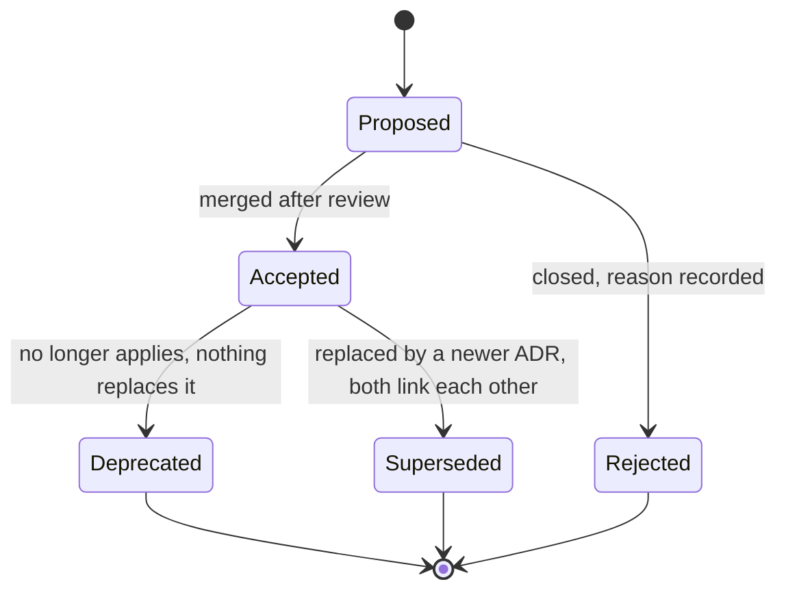

# Architecture decision records

**What this is:** the thirteen decisions that shape the engine, one file each, plus the process for adding a fourteenth.
**Who it is for:** anyone who wants to know *why* before changing *what* — and reviewers checking that the code still matches the decision.

## Why these exist

The specification, [docs/zadanie.md §B.4](../zadanie.md#b4-architektonické-rozhodnutia-adr) (summarised in [§0.3](../zadanie.md#03-kľúčové-technické-rozhodnutia-zhrnutie)), took thirteen decisions and gave the numbers behind them. The files here carry that substance into English, in a fixed format, with one honest deviation: the specification recommended AGPL-3.0 + CLA and the owner chose MIT ([ADR-0011](0011-license-mit.md)). Nothing else departs from the specification; where the implementation has not yet been verified, the ADR says so.

Numbering: the specification writes `ADR-001`; this directory writes `ADR-0001` (four digits, so the list sorts past 999). They are the same decisions.

## Index

| ADR | Decision | Status |
|---|---|---|
| [0001](0001-runtime-dotnet-10-lts.md) | Runtime: .NET 10 LTS (supported to 14 Nov 2028) | Accepted |
| [0002](0002-minimal-apis-vertical-slices.md) | Minimal APIs + vertical slices; OpenAPI 3.1 with Scalar | Accepted |
| [0003](0003-postgresql-as-primary-store.md) | PostgreSQL 18 as the only mandatory store; no NoSQL in the core | Accepted |
| [0004](0004-split-data-access-efcore-and-dapper.md) | EF Core 10 for the control plane, Dapper/Npgsql for the hot path | Accepted |
| [0005](0005-hybridcache-and-valkey.md) | HybridCache (L1) + Valkey (L2) | Accepted |
| [0006](0006-analytics-postgres-partitions-clickhouse-optional.md) | Partitioned PostgreSQL click stream by default, ClickHouse opt-in | Accepted |
| [0007](0007-slug-generation-keyed-feistel-base62.md) | Slug = 47-bit sequence → keyed Feistel permutation → base62, 8 chars | Accepted |
| [0008](0008-deferred-deep-linking-strategies.md) | Deterministic attribution first; probabilistic only opt-in with consent | Accepted |
| [0009](0009-http-response-shape-never-301.md) | Response shape by client class; never `301`; at most one hop | Accepted |
| [0010](0010-modular-monolith-two-deployment-units.md) | Modular monolith, two deployment units, one database | Accepted |
| [0011](0011-license-mit.md) | Licence: MIT — **deviates from the specification** (AGPL-3.0 + CLA) | Accepted, deviation |
| [0012](0012-native-aot-deferred-to-v2.md) | Native AOT not in v1; edge kept AOT-ready | Accepted, deferred |
| [0013](0013-crypto-agility-from-day-one.md) | Crypto agility from the first commit; `alg` + `kid` on every signed artefact | Accepted |

## Format

Every record uses the MADR-derived layout in [0000-template.md](0000-template.md):

| Section | What goes there |
|---|---|
| **Status** | One of the states below, plus the ADR it supersedes or is superseded by |
| **Date** | When the decision was taken (in the specification) and when it was recorded here |
| **Context** | The forces: the workload, the constraint, the number that made the choice |
| **Decision** | What was decided, stated so a reader can tell whether a piece of code complies; tables where the specification uses them |
| **Consequences** | Positive and negative, what it costs to reverse, and how the repository shows the decision is in force |
| **Alternatives considered** | Each with the reason it lost — a rejected alternative without a reason is not a record |
| **References** | The exact `zadanie.md` section, the code that implements it, the external facts relied on |

## Status lifecycle

- **Proposed** — a pull request exists. The record is written before the code, not after.
- **Accepted** — merged. Qualifiers are allowed and must be visible in the index: *deviation* (departs from the specification, trade-off recorded), *deferred* (accepted but scheduled for a later version).
- **Deprecated** — no longer applies and nothing replaces it. The file stays.
- **Superseded** — replaced by a newer record. Both files link each other. Never edit an accepted decision into a different one; write a new file.
- **Rejected** — kept so the same idea is not re-litigated from scratch.

## Adding a record

1. Copy `0000-template.md` to the next free number: `NNNN-short-kebab-title.md`.
2. Fill every section. If an alternative was not seriously considered, say so rather than inventing one.
3. Link the `zadanie.md` section the decision touches, and the code it constrains.
4. Add the row to the index above with status **Proposed**.
5. Open the pull request against `develop` ([CONTRIBUTING.md](../../CONTRIBUTING.md)). The ADR and the code that implements it may travel together; the ADR is reviewed first.

A change that alters public behaviour — the wire format, the URL shape, a security property, a licence — needs an ADR. A refactor that keeps every documented property does not.
