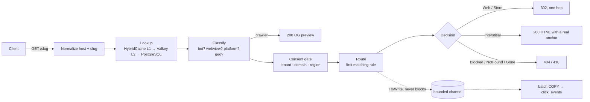

# Architecture

**What this is:** the shape of the engine — three product layers, two deployment units, and what happens between a click and a response.
**Who it is for:** engineers about to change it, and reviewers checking that a change lands in the right unit.

The reasoning behind each shape is in [../adr](../adr); this directory describes the result. The specification sections everything derives from are [§B.1–§B.8](../zadanie.md#b1-architektonické-princípy) and [§C.1](../zadanie.md#c1-štruktúra-riešenia).

## In this directory

| Document | What it answers |
|---|---|
| [context.md](context.md) | Who talks to the system, and where the trust boundaries are (C4 context and container views, [§B.2](../zadanie.md#b2-kontextový-diagram), [§E.2.1](../zadanie.md#e21-dôveryhodnostné-hranice)) |
| [request-flows.md](request-flows.md) | The four flows of [§B.6](../zadanie.md#b6-tok-requestu): resolve, Android deferred, iOS deferred, direct open — with the latency budget |
| [data-model.md](data-model.md) | Entities, the control-plane DDL, the partitioned click stream ([§B.5](../zadanie.md#b5-dátový-model)) |
| [routing-rules.md](routing-rules.md) · [routing-rules.schema.json](routing-rules.schema.json) | The rule language stored in `links.routing_rules`, its validator and a JSON Schema |
| [observability.md](observability.md) | Metrics, spans, and which metrics page someone ([§C.6](../zadanie.md#c6-pozorovateľnosť)) |
| [performance.md](performance.md) | NFR targets, the load profile and the chaos matrix ([§A.5](../zadanie.md#a5-nefunkčné-požiadavky), [§D.5](../zadanie.md#d5-záťažový-profil), [§D.6](../zadanie.md#d6-chaos-a-odolnosť)) |

## Three product layers

The root README lists seven things the product does; architecturally they are three layers with different clients, different latency budgets and different authentication.

| Layer | Client | Budget | Authentication | What lives here |
|---|---|---|---|---|
| **1. Link resolution** (data plane) | any browser, crawler or webview hitting `https://link.example/{slug}` | p50 ≤ 8 ms, p99 ≤ 50 ms server-side ([NFR-01](../zadanie.md#a5-nefunkčné-požiadavky)) | none — public | slug lookup behind a stampede-safe cache, client classification, consent gate, rule evaluation, `302` / interstitial / OG preview, QR, `/.well-known/*` per domain, telemetry emission |
| **2. Attribution** (SDK plane) | the customer's app through the Android, iOS or web SDK | seconds are fine; correctness is not negotiable | SDK key — `resolve` and `events` only, never configuration ([TB2](context.md#trust-boundaries)) | `POST /v1/resolve`, `POST /v1/events`, install matching (S0–S4, [ADR-0008](../adr/0008-deferred-deep-linking-strategies.md)), `confidence` and `evidence` |
| **3. Management, analytics and integrations** (control plane) | operators and marketers through the console or `/api/v1`, external systems through webhooks | interactive | operator session (OIDC) or tenant API key | links, domains, apps, tenants, keys; domain verification; event ingest and rollups; dashboard with the deterministic / probabilistic / unmatched split; signed webhooks; abuse workflow; audit log |

Layer 1 never calls layer 2 or 3 synchronously. The only thing that crosses from the hot path to the rest is a click event dropped into a bounded channel — and it is dropped on the floor rather than delaying the response when the channel is full ([NFR-06](../zadanie.md#a5-nefunkčné-požiadavky)).

## Two deployment units

One solution, one database, two processes ([ADR-0010](../adr/0010-modular-monolith-two-deployment-units.md)). Component IDs are the specification's ([§B.3](../zadanie.md#b3-komponenty)).

| Unit | Port | Public routes | Components | Scaling |
|---|---|---|---|---|
| **`dle-edge`** | `:8080` | `GET /{slug}`, `GET /{slug}/qr`, `/.well-known/apple-app-site-association`, `/.well-known/assetlinks.json` | C-01 Edge Resolver · C-02 Well-Known Server (must be on the link domain itself) · C-03 Interstitial Renderer | stateless, N replicas; HPA in Helm |
| **`dle-control`** | `:8081` | `/api/v1/*`, `/v1/resolve`, `/v1/events`, `/scalar/v1`, `/.well-known/jwks.json`, `/admin/` | C-04 Control Plane API · C-05 Admin UI (static SPA) · C-06 Attribution Service (separate rate limit and authentication) · C-07 Domain Verifier · C-08 Event Ingest · C-09 Rollup Worker · C-10 Webhook Dispatcher · C-11 Abuse & Reputation · C-12 Key Management | by operator count; 1 replica in Profile A, 2 in Profile B |

The six background workers (C-07…C-12) run inside the control process with leader election over a PostgreSQL advisory lock — no extra coordination system. C-13, the SDKs, live under `sdk/`.

Both units read the same PostgreSQL; the edge additionally uses Valkey as its L2 cache ([ADR-0005](../adr/0005-hybridcache-and-valkey.md)). How they are put on a box or a cluster (Profile A Compose, Profile B Helm, [§B.8](../zadanie.md#b8-topológia-nasadenia)) is in [../../deploy/README.md](../../deploy/README.md).

## The solution

Twelve `.csproj` files plus the two front-ends; the specification's layout ([§C.1](../zadanie.md#c1-štruktúra-riešenia)) is followed.

| Project | Role | Referenced by |
|---|---|---|
| `Dle.Domain` | entities, value objects, routing engine, classifier, attribution matcher, problem codes — **no dependencies** | everything |
| `Dle.Crypto` | `ISigner`/`IVerifier`, JWKS, key rotation, provider abstraction ([ADR-0013](../adr/0013-crypto-agility-from-day-one.md)) | both hosts |
| `Dle.Persistence` | EF Core `DbContext`, configurations, **migrations — the schema's single source of truth** | control |
| `Dle.Persistence.Fast` | Dapper hot-path queries, `NpgsqlBinaryImporter` batch writer ([ADR-0004](../adr/0004-split-data-access-efcore-and-dapper.md)) | edge, control |
| `Dle.Analytics.Postgres` · `Dle.Analytics.ClickHouse` | `IClickAnalyticsStore` implementations ([ADR-0006](../adr/0006-analytics-postgres-partitions-clickhouse-optional.md)) | control |
| `Dle.Edge` | data-plane host: `Resolution/` (Normalize → Lookup → Classify → Consent → Route → Respond), `Clients/`, `Rendering/`, `WellKnown/`, `Telemetry/` | — |
| `Dle.Control` | control-plane host: `Features/{Links,Domains,Attribution,Analytics,Abuse,…}` vertical slices, `Workers/` | — |
| `Dle.Admin.Web` | React/Vite console, built and copied into the control host | control |
| `tests/Dle.UnitTests` · `Dle.ContractTests` · `Dle.SecurityTests` · `Dle.IntegrationTests` | 1 419 · 75 · 850 passing; 97 integration tests written, need Docker | — |
| `sdk/android` · `sdk/ios` · `sdk/web` | the three SDKs; web verified (145 tests, 8.85 kB gzip), Android and iOS not yet compiled | — |

## Request flow overview

Cache hit: about 5.5 ms p50 out of an 8 ms budget. The full sequence diagrams, the budget line by line, and the two deferred flows are in [request-flows.md](request-flows.md).

## Invariants that hold everywhere

- A link is **never** answered with `301` ([ADR-0009](../adr/0009-http-response-shape-never-301.md)); at most one redirect hop.
- `/.well-known/*` is **never** redirected ([§A.2.1](../zadanie.md#a21-apple-universal-links)); it is served by the edge on the link domain itself.
- **No outbound call to a third party on the resolve path**, GeoIP included — MaxMind data is a memory-mapped file updated by a background job ([NFR-14](../zadanie.md#a5-nefunkčné-požiadavky)); the Helm NetworkPolicy enforces no egress from the edge.
- Wire JSON is `snake_case`; errors are RFC 9457 with types from [`ProblemCodes.cs`](../../src/Dle.Domain/Contracts/ProblemCodes.cs); rate limits are those of [§E.9](../zadanie.md#e9-rate-limity-a-kvóty--konkrétne-hodnoty), with a separate budget for 404s.
- Every signed artefact carries `alg` and `kid` ([ADR-0013](../adr/0013-crypto-agility-from-day-one.md)).
- Routing rules are **data, not code**: deterministic, first match wins, exactly one default rule, last ([routing-rules.md](routing-rules.md)).

## What is and is not verified

The .NET solution builds with `-warnaserror` at 0/0 and both hosts start; unit, contract and security suites pass on the build machine. The integration suite, the migration against a live PostgreSQL, the Android and iOS SDK builds, the k6 profile and the 8-device manual matrix have **not** been exercised here. Each document in this directory says which of its claims fall on which side of that line.
