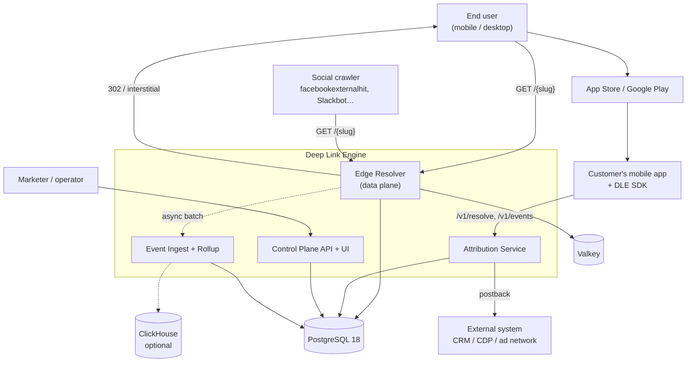
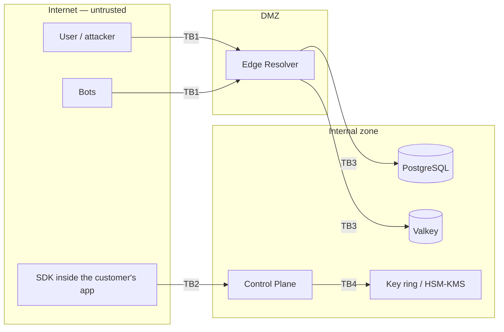

# Context and containers

**What this is:** the C4 context and container views — who talks to the engine, what runs where, and where the trust boundaries fall. [§B.2](../zadanie.md#b2-kontextový-diagram) and [§E.2.1](../zadanie.md#e21-dôveryhodnostné-hranice) in English.
**Who it is for:** security reviewers and operators placing the units in their network; anyone who needs the one-page picture before reading the flows.

## System context ([§B.2](../zadanie.md#b2-kontextový-diagram))

| Actor | Enters through | Gets |
|---|---|---|
| End user | `GET /{slug}` on the edge | a `302`, an interstitial, or — when the app is installed — nothing from us at all, because the OS opens the app directly ([request-flows.md](request-flows.md#4-direct-open--the-most-common-case-and-the-one-that-gets-forgotten-b64)) |
| Social crawler | the same URL | `200` HTML with Open Graph tags, never a redirect |
| Customer's app + SDK | `/v1/resolve`, `/v1/events` on the control host, with an SDK key | the deferred context, `match_type`, `confidence` — no link context on a direct open, and deferred matching is limited today ([request-flows.md](request-flows.md)) |
| Marketer / operator | the console at `/admin/` (a pasted API key; it has no OIDC sign-in) or `/api/v1` (tenant API key). The OIDC tenant claim is not mapped and there is no bootstrap key, so a fresh install has no working first credential ([Known gaps](../../README.md#known-gaps)) | CRUD, reports, the honest attribution split |
| External system | a webhook URL it registered | signed postbacks (`DLE-Signature` with HMAC + Ed25519 and a `kid`, [ADR-0013](../adr/0013-crypto-agility-from-day-one.md)) |
| App Store / Google Play | the store URL in a `302`, with `ct`/`pt` (Apple) or `referrer` (Play) | the click context that the SDK reads back after install |

Nothing outside the box is called synchronously by the edge. Outbound traffic comes from the control process only: webhook delivery, the domain verifier's checks of the operator's own domains, and — when configured — URL-reputation lookups (URLhaus), the GeoIP database download and OIDC discovery.

## Containers

The runtime is Caddy (TLS, HTTP/2 and HTTP/3) in front of two application processes, one database, one cache, and optionally ClickHouse. This is the root README's diagram, annotated with what crosses each line:

| Container | Image / process | Listens | Talks to | State |
|---|---|---|---|---|
| Caddy | `caddy` | 443 (public) | routes `/{slug}`, `/.well-known/*` to the edge; `/api/*`, `/v1/*`, `/admin/*`, `/scalar/*` to control | certificates only |
| `dle-edge` | `Dle.Edge` | 8080 | Valkey (L2 cache), PostgreSQL (one query on a miss), the bounded channel that feeds the batch writer | none — stateless, N replicas |
| `dle-control` | `Dle.Control` | 8081 | PostgreSQL (EF Core), webhook endpoints (outbound), the operator's domains (verifier, outbound) | leader lock in PostgreSQL |
| PostgreSQL 18 | `postgres:18` | 5432 (internal) | — | everything |
| Valkey 8 | `valkey:8` | 6379 (internal) | — | cache (the iOS deferred context the design parks here is not implemented) |
| ClickHouse | optional, experimental | internal | fed from PostgreSQL | analytics mirror — not wired end to end; do not enable ([ADR-0006](../adr/0006-analytics-postgres-partitions-clickhouse-optional.md), status note) |

Profile A (Compose) runs 2 edge replicas and 1 control on 2 vCPU / 4 GB / 20 GB for ~1 000 req/s; Profile B (Helm) runs the edge under an HPA (3–20 pods), 2 control pods, PostgreSQL with read replicas the edge reads from, a 3-shard Valkey cluster, and an OTel collector ([§B.8](../zadanie.md#b8-topológia-nasadenia)); the chart does not ship the collector, it exports to one over OTLP when an endpoint is set. The concrete files are in [../../deploy/README.md](../../deploy/README.md).

## Trust boundaries ([§E.2.1](../zadanie.md#e21-dôveryhodnostné-hranice))

| Boundary | Between | What holds it |
|---|---|---|
| **TB1** | the internet and the edge | no authentication by design; rate limits per [§E.9](../zadanie.md#e9-rate-limity-a-kvóty--konkrétne-hodnoty) with a **separate budget for 404s** so scanners cannot enumerate slugs; identical responses for non-existent and unauthorised links; only `http`/`https` targets, at most one hop, never `301`; abuse blocklists on targets ([§E.3](../zadanie.md#e3-ochrana-proti-zneužitiu-redirektora)) |
| **TB2** | the SDK on the user's device and the control plane | **the most underestimated boundary.** The SDK key can be extracted from any APK or IPA, so it **must have no write permission to configuration** — only `resolve` and `events`, both rate-limited and validated server-side. The SDKs read no clipboard and no advertising ID ([§E.7](../zadanie.md#e7-bezpečnostné-požiadavky-na-mobilné-sdk)) |
| **TB3** | the edge in the DMZ and the stores | the edge has one read query and one cache namespace; it never writes configuration. In Helm a NetworkPolicy allows the edge to reach only PostgreSQL and Valkey — the no-egress rule of [NFR-14](../zadanie.md#a5-nefunkčné-požiadavky) |
| **TB4** | the control plane and the key ring | as designed: signing keys are generated and rotated by C-12, private keys never leave the internal zone, and the public halves are published at `/.well-known/jwks.json`. **As of 2026-09-24 this boundary does not hold:** signing-key rotation is not implemented, and the edge in the DMZ receives the master secret, from which the control plane's webhook signing key and the key that wraps webhook secrets also derive ([ADR-0013](../adr/0013-crypto-agility-from-day-one.md), status note) |

The full STRIDE register is [§E.2.2](../zadanie.md#e22-register-hrozieb); the compliance view (consent modes, IP hashing with a daily-rotated salt, no third party on the resolve path) is in [../compliance](../compliance). The daily salt is derived from a long-lived secret (the master secret, unless `Dle:Crypto:IpHashSecret` overrides it), so whoever holds that secret can recompute every past salt: rotation does not make the hashes unlinkable for the operator.

## What is verified

Both hosts start with their route tables; the 404/410/302 behaviour on TB1 and the SDK-key scope on TB2 are exercised by the security suite through `WebApplicationFactory`. As of 2026-09-24 CI renders the Helm chart and installs it into a throw-away kind cluster, but nothing asserts that the NetworkPolicy is enforced. The Caddy routing is not exercised in CI: the Compose job runs the development override and scans the edge directly.
