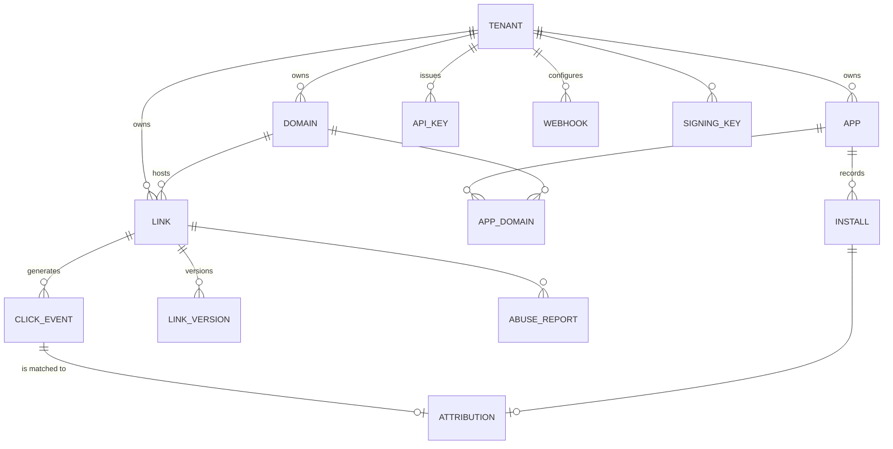

# Data model

**What this is:** the entities, the control-plane tables that matter, the partitioned click stream, and where the routing rules live — [§B.5](../zadanie.md#b5-dátový-model) in English, with the two notes that decide production performance.
**Who it is for:** anyone writing a migration, a Dapper query or a report; DBAs sizing and tuning the instance.

The **EF Core migration in `src/Dle.Persistence` is the single source of truth** for the schema ([ADR-0004](../adr/0004-split-data-access-efcore-and-dapper.md)). The DDL below is the specification's sketch that the migration implements; where the two differ, the migration wins and this page is out of date. Honest status: the migration is generated and reviewed, and has **not** been applied to a live PostgreSQL on the build machine; the raw SQL in it (the `uuidv7()` shim for PG 16/17, the partitions, `pg_partman`) has been read, not executed.

## Entities ([§B.5.1](../zadanie.md#b51-prehľad-entít))



Everything hangs off the tenant. A domain hosts links; an app is bound to domains through `APP_DOMAIN` (that binding is what generates the AASA and `assetlinks.json` per host). A click may be matched to at most one attribution, an install has at most one attribution, and a link keeps its versions and its abuse reports.

## Control plane — key tables ([§B.5.2](../zadanie.md#b52-control-plane--kľúčové-tabuľky-náčrt-ddl))

```sql
-- Extensions (first in the migration; need CREATE EXTENSION rights)
CREATE EXTENSION IF NOT EXISTS citext;      -- case-insensitive slugs and hostnames
CREATE EXTENSION IF NOT EXISTS pg_partman;  -- click-stream partition management

-- Tenants and identity ----------------------------------------------------
CREATE TABLE tenants (
    id            uuid PRIMARY KEY DEFAULT uuidv7(),
    slug          citext NOT NULL UNIQUE,
    name          text   NOT NULL,
    status        text   NOT NULL DEFAULT 'active',          -- active|suspended|deleted
    consent_mode  text   NOT NULL DEFAULT 'aggregate_only',  -- full|aggregate_only|off
    settings      jsonb  NOT NULL DEFAULT '{}',
    created_at    timestamptz NOT NULL DEFAULT now()
);

-- Domains -----------------------------------------------------------------
CREATE TABLE domains (
    id                uuid PRIMARY KEY DEFAULT uuidv7(),
    tenant_id         uuid NOT NULL REFERENCES tenants(id),
    host              citext NOT NULL UNIQUE,              -- link.customer.sk
    is_default        boolean NOT NULL DEFAULT false,
    tls_status        text NOT NULL DEFAULT 'pending',
    aasa_status       text NOT NULL DEFAULT 'pending',     -- pending|ok|failed
    assetlinks_status text NOT NULL DEFAULT 'pending',
    last_verified_at  timestamptz,
    verification_log  jsonb NOT NULL DEFAULT '[]',
    created_at        timestamptz NOT NULL DEFAULT now()
);

-- Apps --------------------------------------------------------------------
CREATE TABLE apps (
    id                uuid PRIMARY KEY DEFAULT uuidv7(),
    tenant_id         uuid NOT NULL REFERENCES tenants(id),
    platform          text NOT NULL,                       -- ios|android
    bundle_id         text NOT NULL,                       -- com.example.app
    team_id           text,                                -- iOS: ABCDE12345
    cert_fingerprints text[] NOT NULL DEFAULT '{}',        -- Android SHA-256 (Play App Signing key!)
    store_id          text,                                -- id123456789 / package
    custom_scheme     text,
    min_app_version   text,
    appclip_bundle_id text,
    UNIQUE (tenant_id, platform, bundle_id)
);

-- Links -------------------------------------------------------------------
CREATE TABLE links (
    id             bigint PRIMARY KEY,                     -- Snowflake
    tenant_id      uuid   NOT NULL REFERENCES tenants(id),
    domain_id      uuid   NOT NULL REFERENCES domains(id),
    slug           citext NOT NULL,
    title          text,
    target_url     text   NOT NULL,                        -- web fallback
    deeplink_path  text,                                   -- /product/123
    routing_rules  jsonb  NOT NULL DEFAULT '[]',           -- see routing-rules.md
    og_meta        jsonb  NOT NULL DEFAULT '{}',
    utm            jsonb  NOT NULL DEFAULT '{}',
    campaign_id    uuid,
    tags           text[] NOT NULL DEFAULT '{}',
    is_active      boolean NOT NULL DEFAULT true,
    starts_at      timestamptz,
    expires_at     timestamptz,
    expired_url    text,
    quarantined_at timestamptz,                            -- abuse
    created_by     uuid,
    created_at     timestamptz NOT NULL DEFAULT now(),
    updated_at     timestamptz NOT NULL DEFAULT now(),
    CONSTRAINT uq_links_domain_slug UNIQUE (domain_id, slug)
);
```

Notes on the columns that carry design decisions:

- `links.id` is a 64-bit Snowflake; the public `slug` is generated separately by a keyed Feistel permutation and is exactly 8 characters when generated ([ADR-0007](../adr/0007-slug-generation-keyed-feistel-base62.md)). `citext` makes it case-insensitive; NFKC normalisation happens before it is stored (the homoglyph defence the test suite found switched off under `InvariantGlobalization`, since fixed).
- `apps.cert_fingerprints` must hold the **Play App Signing** certificate's SHA-256, not the upload key's. Getting this wrong breaks App Links silently; the domain verifier (C-07) exists to catch it.
- `tenants.consent_mode` is the product-level privacy switch of [§E.6.2](../zadanie.md#e62-tri-režimy-prevádzky-produktová-funkcia-nie-prepínač-v-kóde); `aggregate_only` is the default.
- `quarantined_at` is why a quarantined link answers `410 Gone`, not `404` — abuse handling quarantines rather than deletes.

### The covering index

```sql
-- The hot-path index: covering, so the resolve reads from the index alone.
-- DELIBERATELY without WHERE: the resolve query has no predicate on quarantined_at,
-- so the planner would not use a partial index — and quarantined links must be
-- found too, to answer 410 instead of 404 (TC-103).
CREATE INDEX ix_links_resolve
    ON links (domain_id, slug)
    INCLUDE (target_url, deeplink_path, routing_rules, og_meta,
             is_active, starts_at, expires_at, quarantined_at, tenant_id);
```

**Planner note.** `INCLUDE` makes the index covering, but an *Index Only Scan* works only while the visibility map is well maintained. Set

```sql
ALTER TABLE links SET (autovacuum_vacuum_scale_factor = 0.02);
```

and verify in a test with `EXPLAIN (ANALYZE, BUFFERS)` that the index-only scan is actually chosen — otherwise the latency budget of [request-flows.md](request-flows.md#latency-budget-cache-hit) does not hold. That `EXPLAIN` check belongs in the integration suite, which has not run on the build machine.

## The partitioned click stream ([§B.5.3](../zadanie.md#b53-data-plane--eventy-partitionované))

```sql
CREATE TABLE click_events (
    id             uuid        NOT NULL DEFAULT uuidv7(),
    occurred_at    timestamptz NOT NULL,
    tenant_id      uuid        NOT NULL,
    link_id        bigint      NOT NULL,
    click_id       text        NOT NULL,          -- public; travels in the install referrer
    ip_hash        bytea,                          -- HMAC(IP, daily salt) — never the raw IP
    ip_prefix      inet,                           -- /24 v4, /48 v6, only when consent=full
    ua_family      text,
    os_family      text,
    os_version     text,
    device_class   text,                           -- phone|tablet|desktop|bot|unknown
    country        char(2),
    region         text,
    language       text,
    referrer_host  text,
    channel        text,                           -- in_app_fb|in_app_ig|browser|crawler|…
    decision       text        NOT NULL,           -- app_open|store_ios|store_android|web|interstitial|blocked
    ab_bucket      smallint,
    consent_mode   text        NOT NULL,
    is_bot         boolean     NOT NULL DEFAULT false,
    latency_ms     smallint,
    extra          jsonb       NOT NULL DEFAULT '{}',
    PRIMARY KEY (occurred_at, id)
) PARTITION BY RANGE (occurred_at);

-- pg_partman: daily partitions, pre-created 7 days ahead, retention 180 days
CREATE INDEX ix_click_events_brin    ON click_events USING brin (occurred_at);
CREATE INDEX ix_click_events_clickid ON click_events (click_id);
CREATE INDEX ix_click_events_link    ON click_events (link_id, occurred_at DESC);
```

- Written in batches with `COPY` (`NpgsqlBinaryImporter`) from the edge's bounded channel, never row by row ([ADR-0003](../adr/0003-postgresql-as-primary-store.md)).
- `uuidv7()` keeps inserts sequential in the B-tree and makes the BRIN index on `occurred_at` tiny; on PG 16/17 the migration installs a shim function.
- **Lookups by `click_id` must carry a time predicate** or they scan every partition's index. The `click_id` embeds its own timestamp for exactly this reason — see [request-flows.md](request-flows.md#partition-pruning-click_id-embeds-its-timestamp).
- Retention is a `pg_partman` setting; when the data grows past what PostgreSQL reports over comfortably (~50 M events/month), the same stream can be mirrored to ClickHouse ([ADR-0006](../adr/0006-analytics-postgres-partitions-clickhouse-optional.md)).

```sql
CREATE TABLE installs (
    id              uuid PRIMARY KEY DEFAULT uuidv7(),
    tenant_id       uuid NOT NULL,
    app_id          uuid NOT NULL REFERENCES apps(id),
    install_id      text NOT NULL,                 -- SDK-generated, per installation
    first_open_at   timestamptz NOT NULL,
    raw_referrer    text,
    platform        text NOT NULL,
    app_version     text,
    UNIQUE (app_id, install_id)
);

CREATE TABLE attributions (
    id             uuid PRIMARY KEY DEFAULT uuidv7(),
    tenant_id      uuid NOT NULL,
    install_id     uuid NOT NULL REFERENCES installs(id),
    click_id       text,
    link_id        bigint,
    match_type     text NOT NULL,   -- install_referrer|login|claim_code|probabilistic|direct_open|none
    confidence     numeric(3,2) NOT NULL,   -- 1.00 for deterministic
    matched_at     timestamptz NOT NULL DEFAULT now(),
    window_seconds int,
    evidence       jsonb NOT NULL DEFAULT '{}',   -- what exactly decided it (auditability!)
    UNIQUE (install_id)                            -- one install = one attribution
);

-- One click may be credited to at most one install (TC-144).
-- A foreign key to click_events is impossible (partitioned table, composite PK),
-- so integrity is enforced by this index plus a transactional check in the service layer.
CREATE UNIQUE INDEX uq_attributions_click
    ON attributions (click_id) WHERE click_id IS NOT NULL;
```

**On `evidence`:** every attribution must be explainable after the fact. In a dispute ("why did you credit this install to this campaign?") it is the only defence. For a probabilistic match it lists the matched signals and their weights; `match_type` and `confidence` are the honest summary the dashboard reports ([ADR-0008](../adr/0008-deferred-deep-linking-strategies.md)).

## Routing rules ([§B.5.4](../zadanie.md#b54-schéma-pravidiel-routovania-linksrouting_rules))

`links.routing_rules` is a `jsonb` array. Rules are data, not code: evaluated deterministically, first match wins, and there must be exactly one default rule, last. The specification's example:

```json
[
  {
    "id": "r1",
    "when": {
      "platform": ["ios"],
      "os_version": { "gte": "17.0" },
      "country": ["SK", "CZ"]
    },
    "then": {
      "action": "app_or_store",
      "deeplink_path": "/promo/jesen",
      "store_url": "https://apps.apple.com/app/id123456789?pt=1234&ct=jesen26&mt=8",
      "interstitial": "auto"
    }
  },
  {
    "id": "r2",
    "when": { "platform": ["android"] },
    "then": {
      "action": "app_or_store",
      "deeplink_path": "/promo/jesen",
      "store_url": "https://play.google.com/store/apps/details?id=com.example",
      "referrer_template": "dl_cid={click_id}&utm_source={utm_source}&utm_campaign={utm_campaign}"
    }
  },
  {
    "id": "default",
    "then": { "action": "web", "url": "https://www.example.com/promo/jesen" }
  }
]
```

Validation is **application-side**, at write time in the control plane (`RoutingRuleValidator`), returning every problem as one RFC 9457 document; a rule set without a default rule is not stored. The complete language, the validator's rules and a JSON Schema are in [routing-rules.md](routing-rules.md) and [routing-rules.schema.json](routing-rules.schema.json).

## Tables not sketched here

`api_keys`, `webhooks` (with delivery log and DLQ), `signing_keys` (the key ring behind `/.well-known/jwks.json`), `link_versions`, `abuse_reports`, the immutable `audit_log`, and the rollup tables the dashboard reads are defined only in the EF Core model and migration. Read `src/Dle.Persistence` for them.
