# Observability

**What this is:** the metrics both hosts emit, how a resolve is traced, and which signals must page someone — [§C.6](../zadanie.md#c6-pozorovateľnosť) plus the alert column it implies.
**Who it is for:** operators wiring Prometheus/Grafana/Tempo, and engineers adding a new signal.

Everything is OpenTelemetry — traces, metrics and logs — with structured logs and one correlation id across SDK ↔ server ([NFR-12](../zadanie.md#a5-nefunkčné-požiadavky)). Metrics use the `dle_` prefix. Profile B ships an OTel collector; Profile A exposes the OTLP endpoint for whatever the operator points at it ([../../deploy/README.md](../../deploy/README.md)).

## Metrics

| Metric | Type | Labels / notes | Alert |
|---|---|---|---|
| `dle_resolve_duration_seconds` | histogram | `outcome`, `cache` (hit/miss, L1/L2), `channel` | p95 > 25 ms or p99 > 50 ms at cache hit for 5 min ([NFR-01](../zadanie.md#a5-nefunkčné-požiadavky)) — SLO burn, not a page on a single spike |
| `dle_resolve_total` | counter | `decision`, `platform`, `is_bot` | 5xx share of the resolve path > 0.1 % ([§D.5](../zadanie.md#d5-záťažový-profil) threshold) |
| `dle_cache_hit_ratio` | gauge | L1 and L2 reported separately | below 95 % sustained — the latency budget assumes ≥ 95 % ([NFR-03](../zadanie.md#a5-nefunkčné-požiadavky)); `cache_l2_down` on Valkey loss ([§D.6](../zadanie.md#d6-chaos-a-odolnosť)) |
| `dle_click_events_dropped_total` | counter | — | **alert when > 0.** Any drop means the bounded channel filled and clicks were lost to analytics (by design, to protect the response) |
| `dle_attribution_total` | counter | `match_type` | none by itself; a sudden rise in `none` or `probabilistic` is a product signal for the dashboard |
| `dle_attribution_confidence` | histogram | — | none; feeds the honest split (deterministic / probabilistic / unmatched) |
| `dle_domain_verification_failures` | gauge | how many domains have a broken AASA / `assetlinks.json` | **alert** when > 0 — every affected domain's links are silently failing on devices |
| `dle_webhook_delivery_duration_seconds` | histogram | + `dle_webhook_dlq_size` gauge | DLQ size > 0 for longer than the retry window; delivery p95 rising means a consumer is slow |
| `dle_abuse_blocked_total` | counter | blocked targets | rate spike — someone is testing the redirector |

Plus the usual runtime and Kestrel/Npgsql instrumentation from the .NET OTel packages (GC, thread pool, connection pool), which the dashboards use for capacity but which do not carry product meaning.

### Which of these page someone

| Page immediately | Why |
|---|---|
| `dle_click_events_dropped_total` > 0 | data loss is happening now; either the batch writer is stuck or PostgreSQL / the disk is |
| `dle_domain_verification_failures` > 0 | links are broken for real users on that domain, and nobody sees it in a browser |
| resolve 5xx > 0.1 % | the hot path is failing; [§D.6](../zadanie.md#d6-chaos-a-odolnosť) says there must be **no 500s** even with PostgreSQL down |
| `cache_l2_down` | still serving, but from L1 + PostgreSQL; the next deploy or scale-out will be slow |

| Ticket, not a page | Why |
|---|---|
| cache hit ratio drifting below 95 % | capacity or a traffic-shape change |
| DLQ size > 0 | a webhook consumer needs attention; deliveries retry |
| latency SLO burn | investigate before the error budget is gone ([NFR-05](../zadanie.md#a5-nefunkčné-požiadavky): 99.9 % for resolve, 99.5 % for control) |

## Traces

One `resolve` span per click, with child spans that mirror the pipeline and the latency budget of [request-flows.md](request-flows.md#latency-budget-cache-hit):

```mermaid
gantt
    title resolve span (cache hit, ~5.5 ms p50)
    dateFormat X
    axisFormat %L ms
    section resolve
    lookup   (cache L1/L2 → PostgreSQL on miss) :a, 0, 1
    classify (UA, crawler DNS, GeoIP MMAP)      :b, 1, 3
    route    (rule evaluation, click_id)        :c, 3, 4
    render   (302 / interstitial / OG)          :d, 4, 5
```

- `lookup` records `cache` = `l1` / `l2` / `miss`; a miss carries the Npgsql span underneath.
- `classify` records `channel`, `platform`, `is_bot`, and whether GeoIP answered.
- `route` records the matched rule id and the A/B variant, so a decision can be replayed from the trace alone.
- `render` records the `DecisionKind` and status code.

The attribution service has its own `resolve_install` span (`/v1/resolve`) whose children are the strategy attempts in order (S1 → S2 → S3 → S4), each recording whether it produced a match — which is how a disputed attribution is investigated together with the `evidence` column ([data-model.md](data-model.md)).

**Correlation.** The SDKs send a W3C `traceparent` header on `/v1/resolve` and `/v1/events`; the server continues that trace, so an app-side timeline and the server-side match appear as one trace in Tempo. The edge does not receive `traceparent` from browsers; its correlation key is the `click_id`, which is logged on the resolve span and later appears on the attribution.

## Logs

Structured (JSON) through the .NET logging pipeline into OTel. Rules that matter for privacy:

- No raw IP is ever logged on the resolve path; the click stream stores only `ip_hash` (HMAC with a daily-rotated salt) and, under `consent_mode = full`, an `ip_prefix`.
- EF Core 10's default literal redaction is left on, so SQL parameters do not appear in logs.
- Every log line on a request carries the trace id and, where known, the `tenant_id`; audit-relevant control-plane actions go additionally to the immutable `audit_log` table, not only to logs.

## What is verified

Metric and span names are constants in the source and are exercised by the unit suite; the exporters start with both hosts. Dashboards and alert rules are the operator's to wire — the operations runbook in [../operations](../operations) lists the alerts above as the minimum. Latency histograms have not been populated by a real load run on the build machine.
