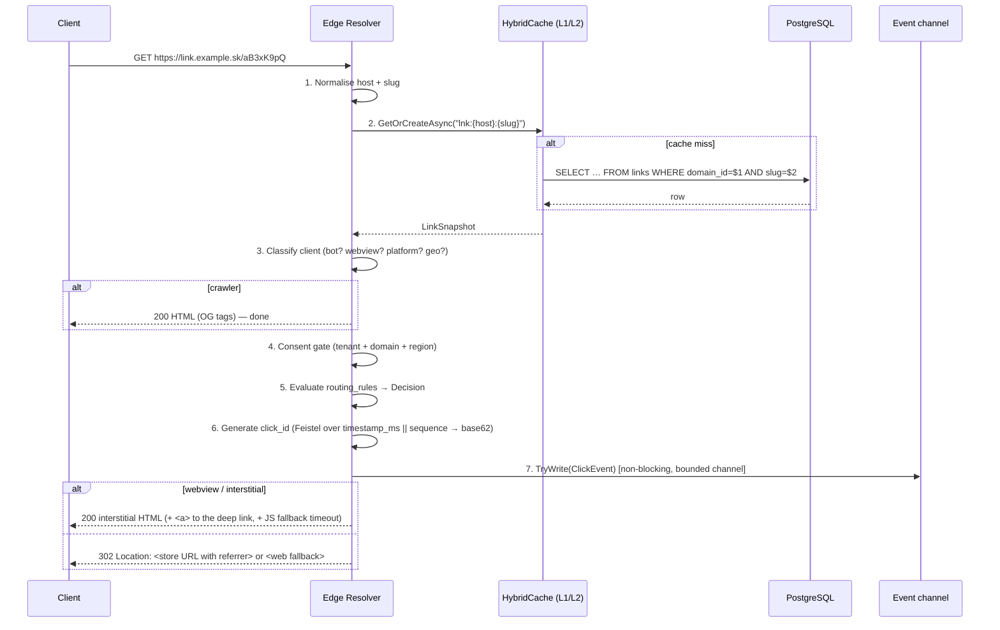
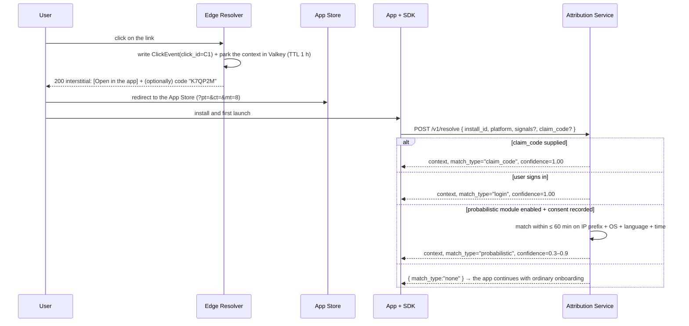
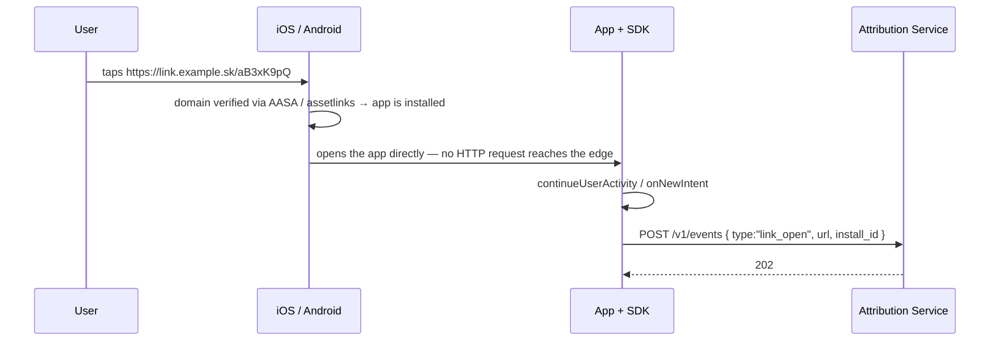

# Request flows

**What this is:** the four sequences of [§B.6](../zadanie.md#b6-tok-requestu) — a click, an Android install, an iOS install, and a direct open — with the latency budget and the one partition-pruning detail that decides whether attribution stays fast after six months.
**Who it is for:** engineers touching the edge pipeline or the attribution service, and SDK integrators who want to know what the server expects of them.

## 1. Click resolution ([§B.6.1](../zadanie.md#b61-rozlíšenie-kliku))



Step 2 is one query on a covering index ([data-model.md](data-model.md#the-covering-index)); step 3 uses UA parsing plus reverse DNS for crawler verification and GeoIP from a memory-mapped MaxMind file — **no third-party call on the hot path** ([NFR-14](../zadanie.md#a5-nefunkčné-požiadavky)); step 5 is the rule engine of [routing-rules.md](routing-rules.md); step 7 never blocks — under load the event is dropped and counted in `dle_click_events_dropped_total` ([observability.md](observability.md)) rather than delaying the response. The response shape per client class is [ADR-0009](../adr/0009-http-response-shape-never-301.md).

The "webview / interstitial" branch is taken for an in-app webview only when the matched rule's action is `app_or_store`. A `web` or `store_only` rule is answered with a `302` inside a webview too, and a link created without `routing_rules` has a single `web` default rule, so it never shows an interstitial ([routing-rules.md](routing-rules.md#action-then)). The interstitial's "open in app" anchor is a custom-scheme URL, never a Universal Link / App Link, or is absent when the app has no custom scheme.

### Latency budget (cache hit)

| Step | Budget |
|---|---|
| Normalisation | 0.2 ms |
| Cache lookup (L1, or L2 on a cold replica) | 0.5 ms |
| Classification (UA parsing + GeoIP from the MMAP file) | 1.5 ms |
| Rule evaluation | 0.3 ms |
| Response generation | 1.0 ms |
| Kestrel overhead | ~2 ms |
| **Total** | **~5.5 ms p50**, headroom to the 8 ms target of [NFR-01](../zadanie.md#a5-nefunkčné-požiadavky) |

A cache miss adds one PostgreSQL round trip and is budgeted separately: p99 ≤ 120 ms ([NFR-02](../zadanie.md#a5-nefunkčné-požiadavky)). The budget has been designed and unit-tested per step; it has **not** been measured end to end under load — the k6 profile in [performance.md](performance.md) has not run, and cannot pass as written ([../../tests/load/README.md](../../tests/load/README.md)).

## 2. Deferred deep link — Android, deterministic ([§B.6.2](../zadanie.md#b62-deferred-deep-link--android-deterministický))

```mermaid
sequenceDiagram
    participant U as User
    participant E as Edge Resolver
    participant G as Google Play
    participant A as App + SDK
    participant S as Attribution Service
    participant P as PostgreSQL

    U->>E: click on the link
    E->>P: write ClickEvent(click_id=C1)
    E-->>U: 302 play.google.com/…&referrer=dl_cid%3DC1%26utm_source%3D…
    U->>G: install
    G->>A: first launch
    A->>A: InstallReferrerClient.getInstallReferrer()
    A->>S: POST /v1/resolve { install_id, referrer, platform }
    S->>P: SELECT … WHERE click_id='C1' AND occurred_at BETWEEN t0 AND t1
    S->>P: INSERT installs; INSERT attributions(match_type='install_referrer', confidence=1.00)
    S-->>A: { deeplink_path:"/promo/autumn", campaign:…, match_type:"install_referrer", confidence:1.0 }
    A->>A: navigate to the target screen
```

The referrer string is built from the rule's `referrer_template` (default `dl_cid={click_id}&utm_source={utm_source}&utm_medium={utm_medium}&utm_campaign={utm_campaign}`, capped at 500 encoded characters — [routing-rules.md](routing-rules.md#store-urls-and-the-install-referrer)). This is strategy S1 of [ADR-0008](../adr/0008-deferred-deep-linking-strategies.md): deterministic, confidence 1.00, no friction.

**Status (2026-09-24): off by default.** `dl_cid` is written into the Play referrer only when the tenant's `consent_mode` is `full` **and** the click itself carries attribution consent. The only click-time consent signal the edge reads is a query parameter on the short URL — `dl_consent=all` (or TCF-style `gdpr=0`), i.e. consent asserted by whoever built the link; the interstitial collects none. Under the default `aggregate_only`, `{click_id}` is dropped from the referrer and `/v1/resolve` answers `none` with reason `consent_missing`. When the flow does match, the response carries the link-level `deeplink_path`, not the one of the routing rule that matched the click. See [Known gaps](../../README.md#known-gaps).

## 3. Deferred deep link — iOS, no determinism from the platform ([§B.6.3](../zadanie.md#b63-deferred-deep-link--ios-bez-determinizmu-z-platformy))



This is the most important design compromise in the product: nothing is promised on iOS that cannot be kept. Three deterministic paths (S3 claim code, S2 login, and S0 direct open below) and one honestly labelled probabilistic one, off by default.

**Status (2026-09-24): no working deterministic path.** The edge never issues or shows a claim code (the interstitial is rendered without one) and parks no context in Valkey; `POST /v1/claim-codes` exists, but nothing on the click path calls it. Login matching reads a click field that nothing writes. Of the branches above, only the probabilistic one (off by default, consent required) and `none` can happen today. See [Known gaps](../../README.md#known-gaps).

### Partition pruning: `click_id` embeds its timestamp

`click_events` is range-partitioned by `occurred_at` ([data-model.md](data-model.md#the-partitioned-click-stream)). A query `WHERE click_id = 'C1'` **with no time predicate cannot prune partitions**; with 180 days of retention it searches up to 180 indexes, and the cost grows linearly with the age of the installation — it will not show in a demo and will show after half a year of production. Therefore the `click_id` carries an **encrypted timestamp**: the same keyed Feistel construction as the slug ([ADR-0007](../adr/0007-slug-generation-keyed-feistel-base62.md)) applied to `timestamp_ms || sequence`. The attribution service decrypts it and queries `occurred_at BETWEEN t0 − 5 min AND t0 + 5 min`, which touches one or two partitions. Without this the design carries a silent performance debt; with it, the lookup is bounded regardless of retention.

## 4. Direct open — the most common case, and the one that gets forgotten ([§B.6.4](../zadanie.md#b64-priame-otvorenie-najčastejší-prípad-ktorý-sa-zabúda))



When the app is installed the OS opens it **without any request to the edge**. The SDK therefore **must** report the open. Without that call: the click is never counted, re-engagement campaigns are unmeasurable, and statistics are systematically under-reported for exactly the most successful campaigns. This is strategy S0 — fully deterministic, `match_type: "direct_open"`.

**Status (2026-09-24): the app gets no link context.** It receives only the short URL (`https://link.example.sk/aB3xK9pQ`). The SDK plane has only `POST /v1/resolve`, `POST /v1/events` and `POST /v1/claim-codes`; nothing expands a slug into its `deeplink_path` and parameters, and SDK keys cannot call `/api/v1/links`. The app therefore cannot open the target screen unless the operator uses human-readable slugs that the app parses itself; both sample apps route on the URL path and accept only `/promo/…` or `/p/…`. See [Known gaps](../../README.md#known-gaps).

## Where the flows are verified

| Flow | Verified in CI (as of 2026-09-24) | Not yet |
|---|---|---|
| 1 Click resolution | 404 / 410 / 302 paths through `WebApplicationFactory` (security suite); classifier and rule engine in the domain tier (≥ 90 % coverage); resolve against PostgreSQL and Valkey in the integration suite | latency under load (the k6 profile has not run and cannot pass as written); real-device behaviour (8-device matrix pending) |
| 2 Android deferred | `/v1/resolve` contract and security tests; matcher unit tests; the Android SDK compiles and passes its unit tests | end to end through Play is manual; off by default (see the status above) |
| 3 iOS deferred | as above; claim-code and login matching unit-tested on the server side; the iOS SDK compiles and passes its unit tests | no working deterministic path from the click (see the status above) |
| 4 Direct open | `/v1/events` contract tests | SDK reporting on real devices; the app gets no link context (see the status above) |
