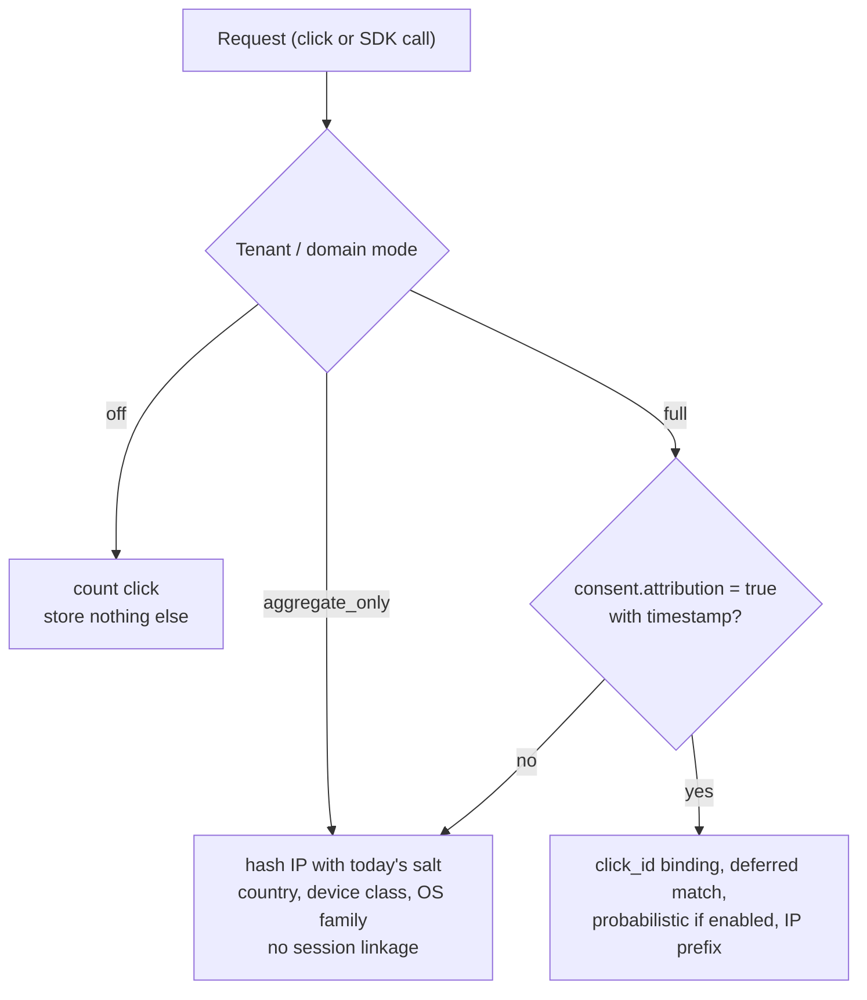

# Privacy model

**What this is:** the legal frame this engine is designed around ([§E.6](../zadanie.md#e6-súkromie-a-ochrana-údajov-privacy-by-design)), the three consent modes with their legal bases, what is stored for how long, and who is controller and who is processor.
**Who it is for:** the compliance officer or DPO evaluating a deployment, and the engineer who has to explain why a field is not stored.

> This document describes how the software behaves and which legal reasoning it was built on. It is not legal advice; the DPIA template and the regulatory map are the places where your own assessment goes.

## The legal frame the design rests on

### GDPR

- **An IP address is personal data** — *Breyer*, C-582/14. The engine therefore treats every request as carrying personal data and decides at the edge, before anything is written, what may be derived from it.
- **Pseudonymised data is not personal data for every recipient** — *EDPS v SRB*, C-413/23 (4 September 2025): whether a recipient holds personal data depends on that recipient's realistic means of re-identification. For this system: the **operator of the instance** holds the master secret and the daily salt and is always bound by GDPR; a **recipient of aggregated or pseudonymised postbacks** (a webhook consumer receiving `click_id` and a country) may not be. Transparency is not lifted by that nuance: recipients must be named at the point of collection ([§E.6.1](../zadanie.md#e61-právny-rámec--čo-skutočne-platí)).

### ePrivacy Article 5(3) — stricter than GDPR, and the one that governs this product

The final **EDPB Guidelines 2/2023** on the technical scope of Art. 5(3) (adopted 16 October 2024) state that storing or reading information on a user's terminal equipment needs consent regardless of the technology, and list explicitly:

| Technique named by the Guidelines | Where it appears in a deep-linking product |
|---|---|
| **Tracking through URL parameters and "link decoration"** | The click id in the referrer (`dl_cid=…`), UTM parameters carried through the store — **the core mechanism of this engine** |
| Pixel tracking | Not used |
| Tracking based on the IP address alone | IP-based probabilistic matching |
| Fingerprinting and persistent identifiers | Device signals (`language`, `screen`, `tz_offset`), `install_id` |

The "strictly necessary" exemption does **not** cover marketing attribution. The practical consequence the specification draws, and the software implements: *"we do not use cookies, so we do not need consent"* is not available. **Consent is an input to the system**, not a policy document beside it.

## The three consent modes

A mode is set per tenant (`consent_mode` on `POST /api/v1/tenants`), can be overridden per domain (`consent_mode_override`), and is capped by the deployment (`Dle:Privacy:ConsentMode`, `Dle:Privacy:IpStorage`). It is a product feature with a legal basis each, not a code switch ([§E.6.2](../zadanie.md#e62-tri-režimy-prevádzky-produktová-funkcia-nie-prepínač-v-kóde)).

| Mode | What happens | Legal basis | What you can measure |
|---|---|---|---|
| **`off`** | No identifiers stored from clicks (but see the `install_id` note below the table). A click counter per link; no IP, no user-agent detail, no `click_id` binding | Legitimate interest / operational statistics (Art. 6(1)(f) GDPR); nothing read from or stored on the terminal beyond what serving the redirect requires | Volume only |
| **`aggregate_only`** *(default)* | IP hashed immediately with a **daily-rotated salt** (K9) and never stored raw; country, device class and OS family stored; **no click-to-install linkage**, no deferred matching (but see the `install_id` note below the table) | Legitimate interest — document the balancing test (LIA) in the DPIA | Campaign level |
| **`full`** | `click_id` bindings, deferred deep linking, the probabilistic module (if enabled), IP prefix | **Consent** under ePrivacy Art. 5(3), recorded with a timestamp and auditable | Individual-level attribution |

**`install_id` in every mode.** The Android and iOS SDKs create `install_id` at initialisation and send it with every resolve and event regardless of consent, and the server stores the install and event rows in every consent mode, `off` included. The web SDK keeps it in memory only until attribution consent is given. See [README — Known gaps](../../README.md#known-gaps).

How consent reaches the engine:

- **SDKs** send `consent: { analytics, attribution, ts }` with `POST /v1/resolve` and `/v1/events`. The web SDK takes consent from the host page (the `consent` option, then `setConsent()`); it does not read a TCF string.
- **Clicks** carry no structured consent. The only click-time signals the edge reads are on the request itself: `dl_consent=all|analytics|none` or TCF-style `gdpr=0` on the short URL — consent asserted by whoever built the link — and a `Sec-GPC: 1` opt-out. The interstitial collects none.
- **Without a recorded consent the signals are not processed and not written** — they are dropped before storage, which is a different guarantee from "written, then deleted later" (TC-145, TC-146). The exception is `install_id` (above). `Dle.Domain.Privacy.ConsentGate` is the single decision point and is covered by tests.
- The probabilistic module is off by default (`Dle:Attribution:Probabilistic:Enabled=false`), requires consent even when on (`RequireConsent=true`), and matches within **60 minutes**, not 7 days, because beyond a day a fingerprint match is more likely wrong than right ([§A.2.5](../zadanie.md#a25-presnosť-probabilistického-párovania--čísla)).

## What is stored, and for how long

| Data | `off` | `aggregate_only` | `full` | Retention |
|---|---|---|---|---|
| Click count per link | yes | yes | yes | aggregates: 730 days (`Dle:Privacy:Retention:AggregatedDays`) |
| IP address | no | HMAC-SHA-256 hash under a salt that changes every 24 h. Hashes from different days do not match, but each day's salt is derived from the master secret, so the operator (whoever holds that secret) can recompute any past salt and link them | prefix (per `IpStorage` ceiling) | raw/hashed events: 30 days (`Dle:Privacy:Retention:RawDays`, read by the control plane's retention job; the `90` in the edge's `appsettings.json` is not read) |
| User-agent | no | parsed families only (browser, OS, device class) — never the full string | same | as events |
| Referrer | no | host only | host only | as events |
| Query parameters | no | allowlist only | allowlist only | as events |
| Country | no | yes, from an **offline** GeoIP file — no third-party call on the resolve path (NFR-14) | yes | as events |
| `click_id` ↔ install binding | no | no | yes | not deleted automatically: the retention job does not cover `attributions` |
| Device signals (`language`, `screen`, `tz_offset`) | no | no | only with consent, only while the probabilistic module is on | 60-minute matching window, then as events |
| `install_id` | yes (see the note under the modes table) | yes (same) | yes | SDK events: as events. The `installs` row: not deleted automatically — the retention job does not cover it |
| Consent record (`analytics`, `attribution`, `ts`) | — | — | yes, as evidence | as long as the data it justifies |

The retention job runs automatically and its runs are audited ([§E.6.3](../zadanie.md#e63-ďalšie-opatrenia)); on PostgreSQL the click stream is partitioned by day and old partitions are dropped, not row-deleted ([deploy/README — pg_partman](../../deploy/README.md#pg_partman-and-click_events-retention)).

## Data minimisation — what the engine refuses to keep

- No full user-agent, no full referrer, no unlisted query parameters, ever — this is enforced in the edge's event writer, not in a retention job.
- No advertising identifier, no clipboard read, no fingerprinting in any SDK; the iOS SDK ships a privacy manifest that says so.
- **No third-party call on the resolve path**, GeoIP included — enforced by the Kubernetes NetworkPolicy in Profile B and testable in Profile A.
- **The immutable audit log never contains end-user identifiers** (FR-246 vs Art. 17): it records operator, action, object and time only. Erasure therefore only ever touches the click stream and attribution records, where there is no legal duty of retention. This is a design constraint enforced by tests, not a procedure.

## Data-subject rights

| Right | How |
|---|---|
| Erasure (Art. 17) | Planned ([§E.6.3](../zadanie.md#e63-ďalšie-opatrenia)), not implemented: there is no erasure endpoint by `install_id` or by IP hash. Until there is, erasure by `install_id` is SQL work: delete the matching rows of `installs` and `sdk_events` (column `install_id`, scoped by `app_id`); the install's `attributions` rows go with it (`ON DELETE CASCADE`), and their `click_id` identifies the matched row in `click_events` if that must go too. No tool computes a subject's `ip_hash` for a given day; raw events, `ip_hash` included, are dropped after `RawDays` anyway. The audit log is unaffected by design |
| Access / portability (Art. 15, 20) | `GET /api/v1/exports/tenant` for the tenant's data (it includes `installs` and `attributions`, not the click or SDK event streams). There is no per-subject export; extract a subject's rows by `install_id` in SQL |
| Objection (Art. 21) | Switch the tenant or domain to `aggregate_only`/`off`; revoke consent through the SDK (`consent.attribution=false`) — subsequent attribution signals are dropped; `install_id` and the install row are not (see above) |

## Controller and processor — self-hosted versus hosted

| Deployment | Who is controller | Who is processor | Paperwork |
|---|---|---|---|
| **Self-hosted** (the only supported shape today) | The operating organisation | **Nobody else.** The software vendor has no access to the instance, no telemetry, no call-home | No DPA with the vendor; the DPIA and RoPA templates in this directory are filled in by the operator |
| Hosted by a third party on the operator's behalf | The organisation whose links they are | The hosting party | A DPA under Art. 28 is mandatory; the hosting party's sub-processors must be listed |
| Webhook recipients | Depends on what they receive and whether they can re-identify (C-413/23) | — | Name them in the privacy notice; keep payloads pseudonymous |

This is the reason the project exists as self-hosted software ([README — Why this exists](../../README.md#why-this-exists)): the operator is the controller, and no third party ever sees a click.

## What still needs a decision on your side

1. Which mode each tenant runs in, and where the consent signal comes from on the web (CMP integration).
2. The legitimate-interest assessment for `aggregate_only` — a template section is in [dpia-template.md](dpia-template.md).
3. Whether the probabilistic module is enabled at all. The specification's position, and the README's: it is a module, it is off, and turning it on requires recorded consent from the person being matched.
4. The retention values, if 30 / 730 days do not match your policy.

Related: [regulatory-map.md](regulatory-map.md) · [dpia-template.md](dpia-template.md) · [ropa-template.md](ropa-template.md) · [security-overview.md](security-overview.md).
