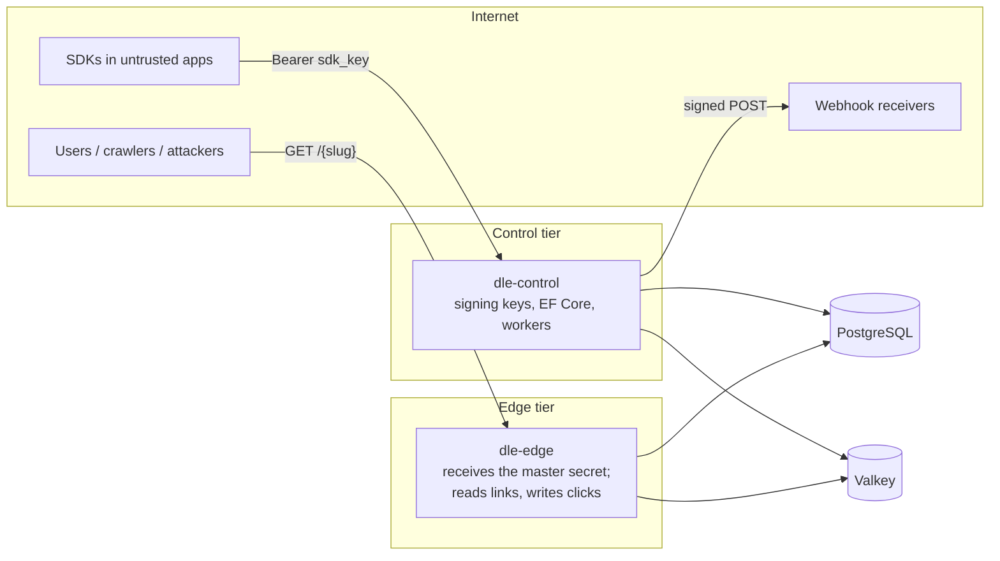

# Security overview

**What this is:** the threat register (STRIDE, T-01…T-17) with its OWASP Top 10:2025 mapping, the redirector abuse pipeline, the cryptographic inventory K1…K9 (the CBOM in prose), and the post-quantum position — stated as the specification states it.
**Who it is for:** a security reviewer, a customer's procurement questionnaire, and the engineer deciding whether a change touches a mitigation.

Source sections: [§E.2.2](../zadanie.md#e22-register-hrozieb), [§E.3](../zadanie.md#e3-ochrana-proti-zneužitiu-redirektora), [§E.4.1](../zadanie.md#e41-inventár-kryptografických-prvkov-povinný-artefakt--cbom), [§E.5](../zadanie.md#e5-post-quantum-architektúra). Verification status of the code these mitigations live in: [README — Where this stands](../../README.md#where-this-stands). Where the code does not yet do what the specification asks, the rows below say so; the gaps are listed in [README — Known gaps](../../README.md#known-gaps).

## Trust boundaries

The edge is meant to hold no signing keys (T-15), but today it receives the master secret, from which the control plane's webhook signing key and the key that encrypts stored webhook secrets also derive ([Known gaps](../../README.md#known-gaps)). It has no egress except PostgreSQL, Valkey and DNS (NFR-14). Tenant isolation is the EF Core global query filter, fed by an ambient tenant scope, plus explicit `tenant_id` predicates in the Dapper, analytics and raw-SQL paths (T-09). There is no PostgreSQL row-level security. A known defect breaks isolation when a request carries an SDK key of one tenant and an API key of another. Until it is fixed, do not host mutually untrusted tenants on one instance ([Known gaps](../../README.md#known-gaps)).

## Threat register (STRIDE) with OWASP Top 10:2025

OWASP Top 10:2025 changes reflected here: **SSRF is folded into A01** (Broken Access Control); **A03 Software Supply Chain Failures** and **A10 Mishandling of Exceptional Conditions** are new categories.

| ID | STRIDE | Threat | Mitigation in this engine | OWASP 2025 |
|---|---|---|---|---|
| T-01 | Tampering | **Open redirect** — a link targets a phishing page | Target policy at creation and nightly (scheme, resolved IP; reputation sources only once configured, off by default); quarantine (`410`, not deletion, after the edge cache expires); creation rate limits; lower limits for new tenants | A01 (CWE-601) |
| T-02 | Elevation | **SSRF via `target_url`** (`169.254.169.254`, `10/8`, `localhost`) | DNS-rebinding-safe validation: resolve and check the **resulting IP**, not the hostname; block private and link-local ranges; re-check on every metadata fetch (`TargetUrlPolicy`) | A01 |
| T-03 | Spoofing | **App Link hijack** by a malicious app registering the same custom scheme (CVE-2026-26123 pattern) | Never carry sensitive data over a custom scheme; prefer verified App/Universal Links; SDK guidance | MASWE-0029 |
| T-04 | Spoofing | **Subdomain takeover** with a dangling CNAME still serving an AASA | Daily re-verification in the control plane (`DomainVerificationWorker`: DNS, TLS, AASA, assetlinks); a host that stops resolving after it verified is logged as a takeover risk and raised as a `domain.verification_failed` webhook. Registration needs no ownership proof, and nothing deactivates the domain automatically: the operator must (`PATCH /api/v1/domains/{id}`) | A02 |
| T-05 | Tampering | **`click_id` manipulation** in the Play referrer → false attribution | `click_id` is an HMAC-signed short token, verified at `/v1/resolve`; tampered → `match_type: none`, flagged | A08 |
| T-06 | Repudiation | **Click fraud** — bots generate clicks | `Sec-Fetch-*` as a signal, reverse-DNS verification of claimed crawlers, rate limits, separate bot/human counters. UA/IP distribution anomaly detection is not implemented (see step 6 below) | outside the web Top 10; A09 partially |
| T-07 | Information disclosure | **Slug enumeration** | Identical body and timing for unknown and foreign slugs; **separate 404 rate budget** (20/min per /24, shadow-ban); keyed-permutation slugs (ADR-007) | A01 |
| T-08 | Information disclosure | **Personal data in logs** (IP, UA, full URL) | EF Core 10 literal redaction; log scrubber; `Authorization`, referrer and query string never logged at `info` | A09 |
| T-09 | Elevation | **Cross-tenant leakage** | Named query filter in EF Core 10 fed by an ambient tenant scope + explicit `tenant_id` predicates in the Dapper, analytics and raw-SQL paths + cross-tenant HTTP tests. No PostgreSQL RLS. Known defect: an SDK key of tenant A plus an API key of tenant B scopes the request to A and authorises it as B ([Known gaps](../../README.md#known-gaps)) | A01 |
| T-10 | Denial of service | **Flooding the resolve path** | Rate-limiting middleware, bounded channels that drop telemetry rather than block, cache, HPA, WAF in front | outside the web Top 10; OWASP API4:2023 |
| T-11 | Tampering | **XSS in the interstitial** via OG metadata or query parameters | Strict HTML encoding; CSP `default-src 'none'; script-src 'self'`; no `innerHTML`; no inline JS without nonce | A05 |
| T-12 | Tampering | **Deserialisation attack on `routing_rules`** | Schema validation, depth and size limits, `System.Text.Json` source-generated, no polymorphism | A05 |
| T-13 | Spoofing | **Forged webhooks** towards the customer | Dual signature (HMAC-SHA-256 + Ed25519), timestamp with 5-minute tolerance, JWKS endpoint ([webhooks.md](../integration/webhooks.md)) | A08 |
| T-14 | Elevation | **Compromised dependency** (npm / NuGet) | Central Package Management with locked versions, `dotnet restore --locked-mode`, per-project lock files, SBOM in CI (`.github/workflows/sbom.yml`), signed release artefacts and Dependabot with review (both configured; neither has run yet, see [Known gaps](../../README.md#known-gaps)) | **A03 (new)** |
| T-15 | Information disclosure | **Signing-key leak** | Keys come from configuration (`Dle:Crypto:Keys`) or are derived per purpose (HKDF) from the master secret. Not implemented: KMS/HSM, an encrypted key store (the `signing_keys` table is unused) and rotation (`Dle:Crypto:KeyRotationDays` is read only by code nothing calls; the webhook Ed25519 key never rotates). The edge receives the master secret ([Known gaps](../../README.md#known-gaps)) | A04 |
| T-16 | Denial of service | **Fail-open on error** — a validation failure lets everything through | Explicit `default: deny` in the decision branches; tests on the error paths. Known exception: a URL reputation lookup that fails (for example URLhaus without an Auth-Key) counts as safe | **A10 (new)** |
| T-17 | Information disclosure | **Timing side-channel** on API-key and claim-code checks | `CryptographicOperations.FixedTimeEquals`, rate limit, short TTLs | A04 |

Two of these were caught by the test suite rather than by review, and are the reason the suite exists: the NFKC normalisation behind the slug homoglyph defence (T-07/T-11 family) was a silent no-op under `InvariantGlobalization`, and key rotation (T-15) could not retire the bootstrap key — a leaked key stayed valid while the operator saw a successful rotation. Both fixes are in the commit history; the rotation fix lives in `KeyRing.RotateAsync`, which nothing in the running services calls yet.

## The redirector abuse pipeline

A URL shortener that can be abused ends up on blocklists within a year; this pipeline is what decides that ([§E.3](../zadanie.md#e3-ochrana-proti-zneužitiu-redirektora)).

```mermaid
flowchart LR
  subgraph At creation
    A1["1 scheme: http/https only<br/>never javascript:, data:, file:, intent:"] --> A2["2 resolve DNS, check the resulting IP<br/>against private/link-local ranges"]
    A2 --> A3["3 reputation: URLhaus (free),<br/>Web Risk API (paid, commercial use)"]
    A3 --> A4["4 rate limit per tenant and IP;<br/>new tenants lower for 7 days"]
  end
  subgraph Continuously
    B1["5 nightly re-check of active targets<br/>(targets change after creation)"] --> B2["6 anomaly detection: bursts to one domain,<br/>create-and-blast within 5 minutes<br/>(not implemented)"]
  end
  subgraph Reactively
    C1["7 public abuse form — DSA art. 16<br/>(not reachable yet)"] --> C2["8 quarantine: HTTP 410 + explanation page,<br/>not silent deletion"] --> C3["9 SLA: critical reports within 4 hours"]
  end
  A4 --> B1
  B2 --> C1
```

Implementation notes:

- Google Safe Browsing API v5 is licensed for non-commercial use only; a commercial deployment needs the paid **Web Risk API**. **URLhaus** (abuse.ch) is free and unrestricted and is the default source (`Dle:Abuse:UrlHausEnabled`, off until you opt in — it is an outbound call from the control plane, never from the edge). It needs an Auth-Key (`Dle:Abuse:UrlHausAuthKey`); without one every lookup fails and the target is treated as safe. With neither URLhaus nor a local blocklist (`Dle:Abuse:BlocklistPath`) configured — the default — step 3 checks nothing and step 5 re-runs only the scheme and resolved-IP checks. PhishTank is read-only for new participants since 2020.
- Quarantine keeps the record for forensics: `POST /api/v1/admin/links/{id}/quarantine` and `…/release`; the edge answers `410` with the appeal contact from `Dle:Edge:Interstitial:AppealUrl` / `AppealEmail`. Quarantine does not invalidate the edge cache: the link keeps redirecting to its old target for up to `Dle:Edge:Cache:L2Minutes` + `L1Seconds` (10 min 30 s by default).
- The abuse form (`POST /abuse-reports`, 5/h per IP) is meant to be the notice-and-action mechanism under DSA Article 16 — see [regulatory-map.md](regulatory-map.md). It is not reachable from outside today: the control plane serves it, but Caddy (Profile A) and the Helm ingress route that path to the edge, which has no such route, and no page links to it ([Known gaps](../../README.md#known-gaps)).
- Not implemented from [§E.3](../zadanie.md#e3-ochrana-proti-zneužitiu-redirektora) / §E.9: step 6 (anomaly detection) and the captcha on the abuse form.

## Cryptographic inventory (CBOM) — K1…K9

A CycloneDX 1.6 CBOM is generated in CI and attached to every release (`.github/workflows/sbom.yml`); this table is the human-readable version ([§E.4.1](../zadanie.md#e41-inventár-kryptografických-prvkov-povinný-artefakt--cbom)).

| # | Use | v1 algorithm | Artefact lifetime | Post-quantum exposure |
|---|---|---|---|---|
| K1 | TLS at the edge | ECDHE + AES-256-GCM; **hybrid X25519MLKEM768 when the OS / proxy supports it** | seconds | "harvest now, decrypt later" — **medium**, but the content is low-value |
| K2 | Click token (`click_id` signature) | HMAC-SHA-256, truncated to 32 bits | ≤ 90 days | **none** (symmetric; 256-bit → 128-bit under Grover) |
| K3 | Claim code | 30 random bits + TTL (15 min default) + rate limit | minutes | none |
| K4 | Webhook signature | HMAC-SHA-256 **+ Ed25519** | minutes | **yes for Ed25519** (Shor) — the `v3` slot exists for this |
| K5 | API keys | 256 random bits, stored as Argon2id hash | years | none |
| K6 | SDK key | public identifier + bundle/domain binding | years | n/a |
| K7 | **Release artefact signing** | Sigstore / cosign (ECDSA P-256) | **years** | **yes — highest migration priority** |
| K8 | Data at rest | AES-256-GCM (database / disk) | years | none |
| K9 | IP hash salt | HMAC-SHA-256; each 24 h period's salt is an HMAC of the period number under a key derived from the master secret | 24 h per salt, but every past salt can be recomputed by whoever holds the master secret | none |

Signed tokens carry `alg` and `kid` (`dlt1.<alg>.<kid>.<payload>.<signature>`, [§E.4.2](../zadanie.md#e42-formát-podpísaného-tokenu)); the verifier accepts a configured **set** of algorithms, the signer uses exactly one. The exception is `click_id` (K2): a bare truncated HMAC with neither `alg` nor `kid`. Master secret handling: `Dle:Crypto:MasterSecret` (≥ 32 characters, environment only) derives the slug permutation key, the `click_id` keys, the IP salt, the claim-code pepper, the bootstrap token-signing key, the webhook Ed25519 key and the key that encrypts stored webhook secrets. Both the edge and the control plane receive it. Back it up with the database; changing it changes every slug.

Conclusion of the inventory, verbatim in spirit from the specification: post-quantum risk in this system is **concentrated in two places** — long-lived asymmetric signatures (K7, K4) and TLS (K1). The symmetric material is fine. Anyone claiming the whole engine must be rewritten for quantum computers is exaggerating.

## Post-quantum position

Stated as [§E.5.4](../zadanie.md#e54-kritické-stanovisko-k-post-quantum-požiadavke) states it:

1. **The data in transit has no long-term value.** A marketing click captured today and decrypted in 2035 is worth almost nothing to an attacker. Harvest-now-decrypt-later is real here and low priority.
2. **The urgent exposure is release-artefact signing (K7), not click data.** A forged container signature in 2033 is a supply-chain compromise — A03:2025 — and the artefact lives for years. That is the one place PQC has urgent, substantive value in this project.
3. **The value of PQC work today is agility, not algorithms.** With `alg` + `kid` in every signed artefact and the signing layer behind an abstraction, migration later costs days; without them, months and a breaking change.
4. **Deploying pure PQC signatures to production today would be a mistake:** the .NET 10 `MLDsa` / `SlhDsa` / `CompositeMLDsa` APIs are experimental (`SYSLIB5006`), OpenSSL 3.5+ is absent from common LTS distributions, public CAs do not issue ML-DSA certificates, and ANSSI and the EU roadmap both recommend **hybrid** schemes for exactly that reason.
5. **Where PQC has immediate commercial value:** regulated buyers (banks, public sector) — "PQC-ready with a CBOM and a migration plan" is a tender line item the incumbents do not have.

The phased plan ([§E.5.3](../zadanie.md#e53-migračný-plán-fázovaný-s-odôvodnenou-prioritou)):

| Phase | What | Status here |
|---|---|---|
| 0 — v1 | `alg` + `kid` everywhere; hybrid TLS key exchange where the proxy supports it (Caddy / OpenSSL 3.5+ — a configuration line); CBOM in CI; two-slot webhook signature with a reserved `v3` | Implemented (`Dle.Crypto`, `WebhookSignature`); `Dle:Crypto:HybridPqEnabled=false` |
| 1 — v2 (2027) | `MLDsa` / `CompositeMLDsa` behind `ISigner` (BouncyCastle first, BCL when it matures); `v3=<ML-DSA-65>` on webhooks; **hybrid signing of release artefacts** — the earliest hard obligation under CNSA 2.0 (2030) | Not started |
| 2 — v3 (2028–2030) | Default `Ed25519+MLDSA65`; hybrid certificate chain when a public CA offers it; revisit against final NIST IR 8547 and HQC | Not started |

Regulatory timeline the plan is anchored to: NIST FIPS 203/204/205 (August 2024); NIST IR 8547 draft — RSA/ECC deprecated after 2030, disallowed after 2035; CNSA 2.0 — software signing PQC-only from 2030; EU Coordinated Implementation Roadmap (June 2025) — high-risk systems by end of 2030, the rest by 2035, hybrid schemes emphasised; BSI — classical key exchange only until end of 2031; ANSSI — no qualification without PQC support from 2027.

## SSDLC controls in this repository

| Control | Where |
|---|---|
| Build with warnings as errors, locked restore | `.github/workflows/ci.yml` |
| CodeQL, dependency and secret scanning | `.github/workflows/codeql.yml`, `security.yml` |
| SBOM + CBOM per release | `.github/workflows/sbom.yml`, `release.yml` |
| Security and integration test suites (enumeration timing, cross-tenant access, SSRF policy, fail-closed paths, signature verification) | `tests/` — green in CI; counts are in the CI summary |
| Daily domain / target re-verification | `DomainVerificationWorker` and `UrlReputationWorker` in the control plane (every 24 h by default). `.github/workflows/nightly.yml` re-verifies one configured instance from CI and has never run: GitHub reads schedules from the default branch, which is still `master` with only the initial commit |
| Disclosure policy | `SECURITY.md` at the repository root |

Release gates: no open critical or high findings, SBOM and CBOM attached, migrations tested with rollback on a copy of production ([§D.7](../zadanie.md#d7-akceptačné-kritériá-pre-release)); the checklist with evidence fields is [operations/release-checklist.md](../operations/release-checklist.md).
