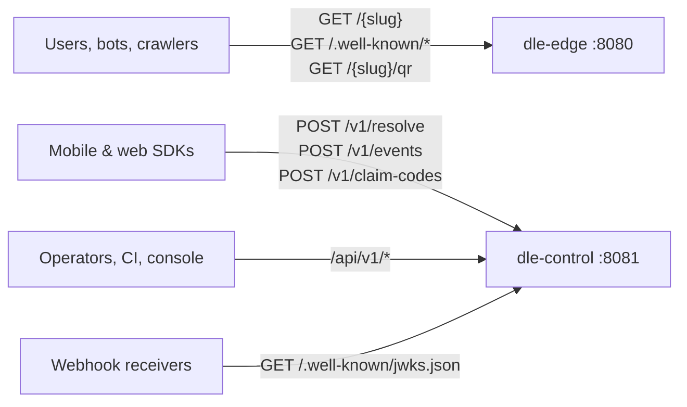

# HTTP API reference

**What this is:** the endpoint map of both hosts, one `curl` per endpoint, the error contract (RFC 9457 problem types), `Idempotency-Key` semantics and the rate-limit table.
**Who it is for:** integrators writing against the API directly, and reviewers checking the implementation against [§B.7](../zadanie.md#b7-api-kontrakt). The live, always-current reference is the OpenAPI 3.1 document at `/scalar/v1` on the control plane.

## Conventions

| Topic | Rule |
|---|---|
| Wire JSON | `snake_case` everywhere — request, response, problem documents, webhook payloads |
| Versioning | In the path (`/api/v1`, `/v1`). A field may be added; an existing field never changes meaning within a major version |
| Timestamps | RFC 3339, UTC (`2026-09-11T10:00:00Z`) |
| Identifiers | Tenants, domains, apps, keys, webhooks: UUID. Links: an opaque string id; the slug is separate and is what appears in the URL |
| Paging | Cursor-based; `page_size` default 50, maximum 200 (`Dle:Control:DefaultPageSize` / `MaxPageSize`) |
| Redirect shape | A resolved link answers `302` or a `200` interstitial — **never `301`** (ADR-009). Everything cacheable about a link is cached server-side, never in the browser's permanent redirect cache |

## Two hosts



Behind Caddy (Profile A) or the Ingress (Profile B) both are one origin; the table below shows the routes as the reverse proxy exposes them.

## Edge — public data plane (`:8080`)

Spec: [§B.7.1](../zadanie.md#b71-verejné-data-plane). No authentication; rate-limited by client address.

| Method | Path | Answers |
|---|---|---|
| GET | `/{slug}` | `302` to the routed target, `200` interstitial when an `app_or_store` rule matches on a phone or in an in-app webview (a `web` rule is a `302` there too), `200` OG page for crawlers, `404` unknown / foreign slug (same body and timing for both, T-07), `410` quarantined or expired |
| GET | `/{slug}/qr?format=svg&size=512` | `200 image/svg+xml` (or `png`) |
| GET | `/.well-known/apple-app-site-association` | `200 application/json`, generated per host, no redirect |
| GET | `/.well-known/assetlinks.json` | `200 application/json`, generated per host, no redirect |
| GET | `/healthz`, `/readyz` | Liveness / readiness (internal) |

```bash
curl -sI https://go.example.com/aB3xK9pQ                         # 302 Location: https://…
curl -s  https://go.example.com/aB3xK9pQ -A "Slackbot-LinkExpanding 1.0"   # 200, <meta property="og:title" …>
curl -sI "https://go.example.com/aB3xK9pQ?_dl=preview"           # FR-166 — full pipeline, no click recorded
curl -so qr.svg "https://go.example.com/aB3xK9pQ/qr?format=svg&size=512"
curl -s  https://go.example.com/.well-known/apple-app-site-association | jq .
curl -s  https://go.example.com/.well-known/assetlinks.json | jq .
```

The edge never calls a third party while answering — no GeoIP service, no reputation API, nothing (NFR-14). With PostgreSQL down it serves what is in cache and answers `503` for what is not.

## Control — SDK endpoints (`:8081`, `/v1`)

Spec: [§B.7.2](../zadanie.md#b72-sdk-api). Authentication: `Authorization: Bearer <sdk_key>` — the SDK key is a public identifier bound to a bundle id / package name / web origin (K6), issued with `POST /api/v1/apps/{id}/sdk-keys`.

These three endpoints are the whole SDK plane. None of them expands a slug into its `deeplink_path` and parameters, and an SDK key cannot call `/api/v1/links`: an app opened directly by a Universal Link / App Link gets only the short URL (`https://go.example.com/aB3xK9pQ`) and cannot tell which screen it points to, unless the operator uses readable slugs the app parses itself. `dle-control` has no CORS support either, so a browser page on another origin cannot call these endpoints (the preflight fails; see [sdk-web.md](sdk-web.md)). Both are listed under [Known gaps](../../README.md#known-gaps).

### `POST /v1/resolve`

Called once per installation, on first launch. Returns the deferred context, or an honest `none`. The Android `install_referrer` match below needs the tenant in consent mode `full`, a click that carried attribution consent (`dl_consent=all` or `gdpr=0` on the short URL, i.e. asserted by whoever built the link; the interstitial collects none) and `consent.attribution: true` in this request. In the default mode `aggregate_only` the click id is left out of the Play referrer and the answer is `none` ([Known gaps](../../README.md#known-gaps)).

```bash
curl -s -X POST https://go.example.com/v1/resolve \
  -H "Authorization: Bearer dlk_…" -H "Content-Type: application/json" \
  -d '{
    "install_id": "9f2c0e1a-…",
    "platform": "android",
    "app_version": "3.4.1",
    "os_version": "15",
    "referrer": "dl_cid%3DaB3xK9pQ%26utm_source%3Dfb",
    "claim_code": null,
    "login_key": null,
    "signals": null,
    "consent": { "analytics": true, "attribution": true, "ts": "2026-09-11T10:00:00Z" }
  }'
```

```json
{
  "matched": true,
  "match_type": "install_referrer",
  "confidence": 1.0,
  "click_id": "aB3xK9pQ",
  "link": { "id": "…", "deeplink_path": "/promo/autumn", "campaign": "autumn26", "title": "Autumn promo" },
  "params": { "utm_source": "fb", "utm_campaign": "autumn26" },
  "expires_in": 0
}
```

`match_type` ∈ `install_referrer` · `login` · `claim_code` · `direct_open` · `probabilistic` · `none`. `signals` is only read when the tenant is in consent mode `full`, the probabilistic module is enabled, and `consent.attribution` is `true` with a timestamp — otherwise it is dropped before it reaches storage, not stored-then-deleted ([§E.6.2](../zadanie.md#e62-tri-režimy-prevádzky-produktová-funkcia-nie-prepínač-v-kóde)). A tampered `click_id` in the referrer (the token is HMAC-signed, T-05) yields `match_type: none`.

### `POST /v1/events`

Batched, at most **100 events** per call, answered `202 Accepted`. `link_open` is the event that makes direct opens countable — the OS hands an installed app the link without any HTTP request to the engine ([§B.6.4](../zadanie.md#b64-priame-otvorenie-najčastejší-prípad-ktorý-sa-zabúda)).

```bash
curl -s -X POST https://go.example.com/v1/events \
  -H "Authorization: Bearer dlk_…" -H "Content-Type: application/json" \
  -d '{
    "install_id": "9f2c0e1a-…",
    "platform": "ios",
    "app_version": "3.4.1",
    "events": [
      { "type": "link_open",  "url": "https://go.example.com/aB3xK9pQ", "ts": "2026-09-11T10:00:00Z" },
      { "type": "conversion", "name": "purchase", "value": 24.9, "currency": "EUR", "ts": "2026-09-11T10:05:00Z",
        "properties": { "sku": "AUTUMN20" } }
    ]
  }'
```

Events dated more than 5 minutes in the future or more than 30 days in the past are discarded per event; the batch is still `202`.

### `POST /v1/claim-codes`

The deterministic iOS path (ADR-008, [§B.6.3](../zadanie.md#b63-deferred-deep-link--ios-bez-determinizmu-z-platformy)): exchanges a fresh click for a six-character, single-use code meant to be shown on the interstitial and typed into the app. Only the keyed hash is stored; TTL `Dle:Attribution:ClaimCode:TtlMinutes` (15 in the shipped configuration). Nothing on the click path calls it today: the edge renders the interstitial without a code, so the claim-code path does not work end to end ([Known gaps](../../README.md#known-gaps)). An SDK does not call it either: unlike the other two, it takes an API key with `links:read`, not an SDK key.

## Control — management API (`/api/v1`)

Spec: [§B.7.3](../zadanie.md#b73-control-plane-api-apiv1). Authentication: `Authorization: Bearer <api_key>` (secret shown once at creation, stored as Argon2id — K5). An OIDC bearer token carrying `dle_tenant` and `dle_role` is validated when `Dle:Identity:Oidc` is configured, but its tenant claim (`Dle:Identity:Oidc:TenantClaim`) is never mapped to the claim the control plane reads, so it establishes no tenant and does not work today ([Known gaps](../../README.md#known-gaps)).

### Authentication and scopes

An API key has a `role` and optional `scopes`. Scopes observed in the implementation: `admin`, `links:read`, `links:write`, `domains:read`, `domains:write`, `apps:read`, `apps:write`, `analytics:read`, `keys:read`, `keys:write`, `tenants:read`, `tenants:write`. A valid credential without the needed scope gets `403 …/forbidden`; a missing, malformed or expired one gets `401 …/unauthorized`. Verification is constant-time (T-17) and rate-limited (10/min per IP + identifier).

### Endpoint map

| Area | Method | Path | Notes |
|---|---|---|---|
| Tenants | GET | `/tenants/me` | The caller's tenant |
| | GET / POST | `/tenants`, `/tenants/{id}` | Instance operators only — see [deploy/README — First credential](../../deploy/README.md#first-credential) |
| | PATCH / DELETE | `/tenants/{id}` | |
| API keys | GET / POST | `/api-keys` | `POST` returns the secret exactly once |
| | DELETE | `/api-keys/{id}` | Revoke |
| Domains | GET / POST | `/domains`, `/domains/{id}` | |
| | PATCH / DELETE | `/domains/{id}` | |
| | POST | `/domains/{id}/verify` | Runs the 8-point check ([domains.md](../self-hosting/domains.md)) |
| | GET | `/domains/{id}/verifications` | History, incl. the nightly runs |
| Apps | GET / POST | `/apps`, `/apps/{id}` | `POST` response carries `warnings` for an Android app: no signing fingerprint at all, or a `cert_fingerprints` entry missing from the declared `play_signing_fingerprints`. An app that declares only its upload key gets no warning ([Known gaps](../../README.md#known-gaps)) |
| | PATCH / DELETE | `/apps/{id}` | |
| | GET / POST | `/apps/{id}/sdk-keys` | |
| | DELETE | `/apps/{id}/sdk-keys/{key_id}` | |
| Links | GET / POST | `/links` | List with search, tags, cursor paging; create |
| | POST | `/links/bulk` | NDJSON stream, max 10 000 rows, 2 concurrent batches per tenant |
| | GET / PATCH / DELETE | `/links/{id}` | `PATCH` records a revision (up to 50 kept) |
| | POST | `/links/{id}/archive` | Off without removal |
| | GET | `/links/{id}/versions` | Revision history |
| | GET | `/links/{id}/simulate?ua=…&platform=…&country=…&language=…&os_version=…&app_version=…&channel=…&at=…` | What a client would get; no click |
| | POST | `/links/{id}/simulate` | Same, client described in the body |
| | GET / POST / PATCH / DELETE | `/links/templates`, `/links/templates/{id}` | Campaign templates that prefill new links |
| Analytics | GET | `/analytics/clicks`, `/analytics/installs` | Time series (`from`, `to`, `grain`, filters) |
| | GET | `/analytics/breakdown?by=…` | By platform, country, channel, campaign … |
| | GET | `/analytics/funnels` | click → install → conversion |
| | GET | `/analytics/attribution-quality` | The deterministic / probabilistic / unmatched split with confidence distribution |
| | GET | `/analytics/export` | CSV / NDJSON export |
| | GET | `/analytics/stream` | Server-sent events for the live dashboard |
| Exports | GET | `/exports/tenant` | Full tenant data export — the DORA art. 30 exit-plan feature (FR-249) |
| Webhooks | GET / POST | `/webhooks` | `POST` returns `secret` exactly once and `signing_key_id` |
| | DELETE | `/webhooks/{id}` | |
| | POST | `/webhooks/{id}/test` | Sends a signed `webhook.test` and reports the outcome |
| | GET | `/webhooks/deliveries` | Delivery log with attempt, status, `next_attempt_at` |
| Abuse | POST | `/abuse-reports` *(root path on the control plane, anonymous, 5/h per IP)* | DSA art. 16 notice-and-action (FR-245). The shipped Caddy and Helm routes send this path to the edge, which has no such route, so it is unreachable from outside today; no page links to it ([Known gaps](../../README.md#known-gaps)) |
| | GET | `/abuse-reports` | Reports about the caller's links |
| | GET | `/admin/abuse-reports`, POST `/admin/abuse-reports/{id}/decision` | Instance triage |
| | POST | `/admin/links/{link_id}/quarantine`, `…/quarantine/release` | `410` with an explanation page, not deletion ([§E.3](../zadanie.md#e3-ochrana-proti-zneužitiu-redirektora)) |
| Keys | GET | `/.well-known/jwks.json` *(root path, anonymous)* | Public signing keys — `kid`, `alg`, for webhook `v2` verification |

### Examples

```bash
export DLE=https://go.example.com; export KEY=dle_…

# Create a link, safely retryable. An empty (or omitted) routing_rules becomes a single `web` default
# rule: a 302 to target_url for everyone, in-app webviews included; never the store, never an interstitial
curl -s -X POST $DLE/api/v1/links -H "Authorization: Bearer $KEY" -H "Content-Type: application/json" \
  -H "Idempotency-Key: 2026-09-11-autumn-001" \
  -d '{"domain_id":"…","target_url":"https://www.example.com/promo/autumn","deeplink_path":"/promo/autumn",
       "routing_rules":[],"utm":{"utm_campaign":"autumn26"},"tags":["autumn"],"is_active":true}'

# Routing rules, platform-aware: iOS below 17 goes to a web page, other iOS and Android to the app or
# their store, everyone else to the web. Every rule needs an `id`; `platform` is an array; the default
# rule is the one WITHOUT `when` and comes last. `app_or_store` and `store_only` need their own
# `store_url` (the app's store_url is not a fallback). On Android `{click_id}` reaches the Play referrer
# only in consent mode `full` with click-time consent (README — Known gaps).
curl -s -X PATCH $DLE/api/v1/links/<ID> -H "Authorization: Bearer $KEY" -H "Content-Type: application/json" \
  -d '{"routing_rules":[
        {"id":"ios-legacy","when":{"platform":["ios"],"os_version":{"lt":"17"}},
         "then":{"action":"web","url":"https://www.example.com/legacy"}},
        {"id":"ios","when":{"platform":["ios"]},
         "then":{"action":"app_or_store","store_url":"https://apps.apple.com/app/id123456789"}},
        {"id":"android","when":{"platform":["android"]},
         "then":{"action":"app_or_store","store_url":"https://play.google.com/store/apps/details?id=com.example.app",
                 "referrer_template":"dl_cid={click_id}&utm_source={utm_source}&utm_campaign={utm_campaign}"}},
        {"id":"default","then":{"action":"web","url":"https://www.example.com/promo/autumn"}}
      ]}'

# Bulk, NDJSON: one {"ref": …, "link": {…CreateLinkRequest…}} object per line; `ref` is echoed in the
# result line. A bare CreateLinkRequest per line is refused (validation-failed for that row).
# The Idempotency-Key is not bound to the body: use a new key for every different file, or a corrected
# file sent under the old key gets the first batch's summary back for 24 h instead of being imported.
printf '%s\n' \
  '{"ref":"a","link":{"domain_id":"…","target_url":"https://example.com/a"}}' \
  '{"ref":"b","link":{"domain_id":"…","target_url":"https://example.com/b"}}' \
  | curl -s -X POST $DLE/api/v1/links/bulk -H "Authorization: Bearer $KEY" -H "Content-Type: application/x-ndjson" \
         -H "Idempotency-Key: import-2026-09-11" --data-binary @-
# → one line per row: {"ref":"a","ok":true,"id":"…","short_url":"https://…"}
#   or {"ref":"b","ok":false,"error":"https://docs.dle.dev/problems/…","detail":"…"}

# Simulate
curl -s "$DLE/api/v1/links/<ID>/simulate?platform=android&os_version=15&country=SK&channel=in_app_fb" -H "Authorization: Bearer $KEY"

# Verify a domain, read the history
curl -s -X POST $DLE/api/v1/domains/<DOMAIN_ID>/verify -H "Authorization: Bearer $KEY"
curl -s $DLE/api/v1/domains/<DOMAIN_ID>/verifications -H "Authorization: Bearer $KEY"

# SDK key for an app
curl -s -X POST $DLE/api/v1/apps/<APP_ID>/sdk-keys -H "Authorization: Bearer $KEY" -H "Content-Type: application/json" -d '{"name":"prod"}'

# Analytics
curl -s "$DLE/api/v1/analytics/clicks?from=2026-09-01T00:00:00Z&to=2026-09-11T00:00:00Z&grain=day" -H "Authorization: Bearer $KEY"
curl -s "$DLE/api/v1/analytics/attribution-quality?from=2026-09-01T00:00:00Z" -H "Authorization: Bearer $KEY"

# Webhook
curl -s -X POST $DLE/api/v1/webhooks -H "Authorization: Bearer $KEY" -H "Content-Type: application/json" \
  -d '{"url":"https://hooks.example.com/dle","event_types":["attribution.created","link.quarantined"],"is_active":true}'
curl -s -X POST $DLE/api/v1/webhooks/<WH_ID>/test -H "Authorization: Bearer $KEY"

# Public abuse report (no auth). Only dle-control answers it, and the shipped Caddy / Helm routes send
# /abuse-reports to the edge, so it is unreachable from outside today (README — Known gaps).
# From inside the deployment, straight to the control plane:
curl -s -X POST http://dle-control:8081/abuse-reports -H "Content-Type: application/json" \
  -d '{"url":"https://go.example.com/aB3xK9pQ","reason":"phishing","details":"…","reporter_email":"…"}'

# JWKS
curl -s $DLE/.well-known/jwks.json
```

The request-body field lists are the `Create*Request` records in `src/Dle.Domain/Contracts/*.cs`, serialised `snake_case`; `/scalar/v1` renders them with descriptions.

## Errors — RFC 9457 Problem Details

Every error is `application/problem+json` with `type`, `title`, `status`, `detail`, `instance`, plus extensions where noted. The `type` URI is an identifier — integrators branch on it — and is stable within a major version. Source of truth: `src/Dle.Domain/Contracts/ProblemCodes.cs`; the OpenAPI document enumerates the same list.

| `type` (prefix `https://docs.dle.dev/problems/`) | HTTP | When | Extensions |
|---|---|---|---|
| `validation-failed` | 400 | Body or query failed validation | `errors[]` |
| `slug-taken` | 409 | Slug already used on that domain | |
| `slug-invalid` | 400 | Syntactically invalid or reserved slug (`admin`, `api`, `.well-known` …). NFKC-normalised before the check, so homoglyphs are refused | |
| `unsafe-target` | 422 | `errors` names the field that failed — `target_url`, `expired_url` or `routing_rules[i].then.url`. The policy: scheme not `http(s)` — scheme not `http(s)`, resolves to a private / link-local address, or on a blocklist ([§E.3](../zadanie.md#e3-ochrana-proti-zneužitiu-redirektora), T-01, T-02) | |
| `rate-limited` | 429 | A limit in the table below | `Retry-After` header |
| `missing-default-rule` | 400 | Rule set has no catch-all rule (TC-105) | |
| `invalid-routing-rules` | 400 | Rule set otherwise invalid (depth, size, unknown operator …) | `errors[]` |
| `domain-not-verified` | 409 | Operation needs a verified domain (FR-143) | |
| `domain-taken` | 409 | Host already registered, possibly by another tenant | |
| `domain-in-use` | 409 | The host still serves links, so it cannot be deleted (FR-133); delete or move the links first | |
| `idempotency-conflict` | 409 | See below | |
| `unauthorized` | 401 | Credential missing, malformed, expired | |
| `forbidden` | 403 | Valid credential, insufficient scope or wrong tenant | |
| `claim-code-invalid` | 400 | Unknown, consumed or expired claim code (TC-148) | |
| `link-quarantined` | 410 | Link is under an abuse quarantine (TC-103) | |
| `dependency-unavailable` | 503 | PostgreSQL / cache unavailable; retry with backoff | `Retry-After` |
| `write-conflict` | 409 | The link changed between your read and your write (another edit, or an abuse quarantine); read it again and retry | |
| `app-taken` | 409 | An application with this platform and bundle identifier is already registered in the tenant; update it instead | |
| `link-too-large` | 422 | The link's resolve-time fields (target URL, expired URL, title, UTM set, rules, Open Graph) are together larger than the covering resolve index holds (about 2.7 kB after compression); shorten them | |

```json
{
  "type": "https://docs.dle.dev/problems/validation-failed",
  "title": "The request failed validation.",
  "status": 400,
  "detail": "target_url must be an absolute http or https URL.",
  "instance": "/api/v1/links",
  "errors": { "target_url": ["must be an absolute http or https URL"] }
}
```

## `Idempotency-Key`

Writes under `/api/v1` accept an `Idempotency-Key` header (any string ≤ 255 characters, unique per logical operation). The header is honoured, not required.

| Situation | Result |
|---|---|
| First request with the key | Executed; the response (status < 500) is stored for `Dle:Persistence:IdempotencyRetentionHours` (default 24 h) |
| Same key, same method + route + body | The stored response is replayed — nothing runs again |
| Same key, **different** body, or the same key on a different endpoint | `409 idempotency-conflict` — two different requests sharing a key is a client bug, and replaying the first answer would hide it. Bulk imports are the exception, below |
| Same key while the first request is still running | `409 idempotency-conflict` with a "still being handled" detail — retry shortly |
| First request failed with a 5xx (`dependency-unavailable`) | The reservation is released; the next attempt with the same key runs normally |

Bulk imports reserve their key for the whole stream and replay the batch summary on retry. Their key is **not bound to the body** (hashing it would mean buffering the whole stream): a different batch sent under a key already used — including the same file after you fixed it — is not imported and not refused, it gets the first batch's summary (`{"created":…,"failed":…}`) for as long as the key is retained (24 h by default). Use a fresh key for every different file.

## Rate limits and quotas

Defaults from [§E.9](../zadanie.md#e9-rate-limity-a-kvóty--konkrétne-hodnoty); every value is configurable under `Dle:RateLimits:*` ([configuration.md](../self-hosting/configuration.md)). Exceeding a limit yields `429 rate-limited` with `Retry-After`.

| Endpoint | Algorithm | Key | Default | On excess |
|---|---|---|---|---|
| `GET /{slug}` — successful | sliding window | IP /24 (v4) or /48 (v6) | 600 / min | 429 + `Retry-After` |
| `GET /{slug}` — **404 responses** | token bucket | IP /24 | **20 / min**, burst 40 | 429, then the prefix is shadow-banned for 15 min (404 without a DB query) |
| `POST /v1/resolve` | fixed window | `install_id` | 5 / h | 429 — a legitimate SDK calls it once per install |
| `POST /v1/events` | token bucket | `install_id` | 60 / min, burst 120 | 429; the SDKs back off exponentially |
| `POST /api/v1/links` | concurrency + sliding window | API key | 60 / min (new tenant: 10 / min for the first 7 days) | 429 |
| `POST /api/v1/links/bulk` | concurrency | tenant | 2 concurrent batches, ≤ 10 000 rows each | 429 |
| `GET /{slug}/qr` | sliding window | IP | 30 / min | 429 |
| `POST /abuse-reports` | fixed window (no captcha exists) | IP | 5 / h | 429 |
| Authentication (API key, claim code) | token bucket | IP + identifier | 10 / min | 429, constant-time verification |
| `/api/v1` reads / writes (general) | sliding window | API key | 600 / min read, 120 / min write | 429 |

The 404 budget is the important one: it is the primary defence against slug enumeration (T-07) and is kept **separate** from the success budget so that a viral campaign cannot exhaust the anti-enumeration protection.

Quotas (active links, domains, webhooks per tenant, click-stream retention) are soft limits meant for a hosted variant; exceeding one blocks creation, never resolution.
