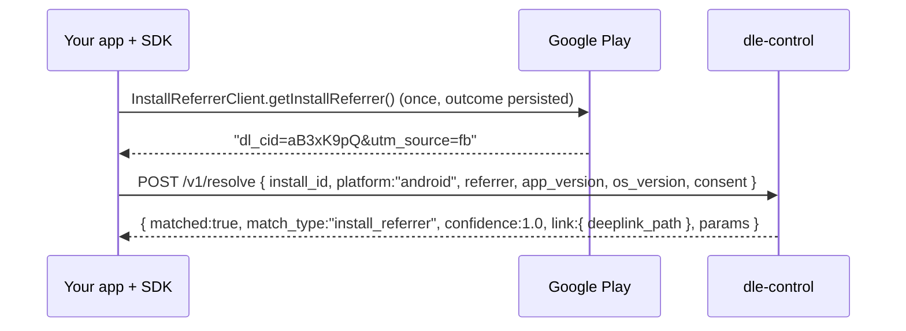

# Android SDK integration

**What this is:** the wire-level view of what the Android SDK does and what your app must do around it.
**Who it is for:** the Android developer integrating `sk.magors.dle:dle-sdk`. The package README at
[`sdk/android/README.md`](../../sdk/android/README.md) has the dependency, initialisation and sample code;
this page explains the protocol underneath.

> The Android SDK compiles and passes its unit tests in CI (`sdk-android.yml`), and has not been run in an
> app on a real device yet. Treat the first release as a candidate. Nothing is published: there is no Maven Central
> artifact and no Gradle wrapper in the repository, so build it from `sdk/android` with Gradle and
> `publishToMavenLocal` (see the README; [Known gaps](../../README.md#known-gaps)).

## What happens on first launch



- **Off by default.** The edge writes `dl_cid` into the Play referrer only when the tenant's consent
  mode is `full` **and** the click itself carries attribution consent. The only click-time signal the
  edge reads is a query parameter on the short URL (`dl_consent=all`, or TCF-style `gdpr=0`), i.e.
  consent asserted by whoever built the link; the interstitial collects none. Under the default
  `aggregate_only` the click id is left out and `/v1/resolve` answers `none`. The diagram above is the
  `full`-mode case ([Known gaps](../../README.md#known-gaps)).
- The referrer is sent **raw**; the server parses it, extracts `dl_cid`, decodes the click id's embedded
  timestamp and looks the click up inside a bounded time window ([architecture/request-flows.md](../architecture/request-flows.md)).
- A referrer without `dl_cid` is an organic install. The SDK still calls `/v1/resolve`; the server answers
  `match_type: "none"`. That is not an error and your onboarding continues normally.
- The result is persisted. Later launches return the cached `DeferredLink` without a request. The
  server enforces the same thing: `/v1/resolve` is rate-limited to 5 calls per hour per `install_id`
  ([api.md](api.md#rate-limits-and-quotas)).

## Direct opens must be reported

When your app is installed and the user taps a verified App Link, Android opens the app directly and
**no request reaches the engine**. Without a report, that click is invisible, and the campaigns that
work best are the ones most under-counted. Hand every incoming `Intent` to `Dle.handleIntent(intent)`
(from `onCreate` and `onNewIntent`); the SDK queues a `link_open` event and the server records an
attribution with `match_type: "direct_open"`, confidence 1.0.

What your app gets on a direct open is the short URL as tapped (`https://link.example.com/aB3xK9pQ`),
not the link's `deeplink_path`: nothing on the SDK plane expands a slug, and an SDK key cannot read
`/api/v1/links`. The app can open the right screen only if the operator uses readable slugs the app
parses itself, as the sample does with `/promo/…` and `/p/…` ([Known gaps](../../README.md#known-gaps)).

Every `ACTION_VIEW` intent with `http`/`https` data is reported (scheme, host and path only). The SDK
has no host list of its own; which hosts reach it is decided by your intent filter. A custom-scheme
intent (`myapp://`) is ignored: the engine never transports anything over a custom scheme, because any
app can register the same scheme (CVE-2026-26123, [§A.2.3](../zadanie.md)).

## Consent

`DleConsent(analytics, attribution)` is persisted and sent as the `consent` object. With
`attribution = false`, or with the probabilistic module disabled in `DleConfig`, the `signals` object is
**omitted from the request body** — not sent empty — and the server refuses to store signals it did not
receive ([compliance/privacy.md](../compliance/privacy.md)). The SDK never reads the clipboard and never
touches the advertising identifier.

The `install_id` is not consent-gated: the SDK creates it when it initialises and sends it with every
resolve and every event batch whatever the consent, and the server stores install and event rows in
every consent mode ([Known gaps](../../README.md#known-gaps)).

## Events

`Dle.trackEvent(DleEvent)` appends to a file-persisted queue that flushes in batches of at most 100 to
`POST /v1/events` (60 per minute, burst 120, per `install_id`). Conversions carry `name`, `value`,
`currency`. Events that require analytics consent are dropped locally when consent is absent.

## App Links setup — the two mistakes that break everything

1. **The fingerprint in `assetlinks.json` must be the Play App Signing certificate**, from Play Console →
   Setup → App signing, not the upload keystore's. With Play App Signing (default since 2021) the APK
   on devices is signed by Google's key. Links verify in your debug build and fail silently in
   production if you register the wrong one. The engine cannot tell the two apart by itself: the
   API warns only when an app declares both `cert_fingerprints` and `play_signing_fingerprints` and they
   differ, so an app registered with only its upload key gets no warning, and the domain verifier does
   not apply the check ([FR-144](../zadanie.md), [Known gaps](../../README.md#known-gaps)).
2. **Propagation is slow.** Android 15+ re-verifies periodically, but a changed `assetlinks.json` can
   take up to seven days to reach devices. Verify on a device with:

```bash
adb shell pm verify-app-links --re-verify sk.customer.app
adb shell pm get-app-links sk.customer.app        # expect: verified
```

Validate the incoming path in your app with the SDK's `DeepLinkAllowlist` before navigating. A deep link
is untrusted input even though the operating system delivered it (OWASP MASTG-TEST-0028).

## Related

[api.md](api.md) · [self-hosting/domains.md](../self-hosting/domains.md) · [sdk-ios.md](sdk-ios.md)
