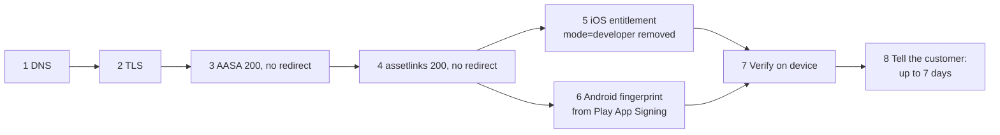

# Adding a link domain — runbook

**What this is:** the eight-point checklist of [Appendix A](../zadanie.md#príloha-a--kontrolný-zoznam-pri-pridávaní-novej-domény) turned into a runbook, with the commands that prove each point and the two traps that account for most "links stopped working" tickets.
**Who it is for:** whoever adds a domain to a tenant, and whoever is on call when Universal Links or App Links stop opening the app.

Every step maps to a check the built-in verifier runs (`POST /api/v1/domains/{id}/verify`, nightly by the domain-verification worker). Run the verifier after every step; a release needs three consecutive green nights for every demo domain ([§D.7 item 7](../zadanie.md#d7-akceptačné-kritériá-pre-release)).



## The checklist

| # | Check | Proof | Verifier code area |
|---|---|---|---|
| 1 | DNS `A`/`AAAA` or `CNAME` points at the engine | `dig +short go.example.com` returns the box / load balancer; no dangling CNAME (T-04) | `dns` |
| 2 | TLS certificate valid, full chain, no mixed content | `openssl s_client -connect go.example.com:443 -servername go.example.com </dev/null 2>/dev/null \| openssl x509 -noout -dates -subject`; `curl -sI https://go.example.com/` has no warnings | `tls` |
| 3 | `GET /.well-known/apple-app-site-association` → `200`, `application/json`, **no redirect**, no query string | see below | `aasa` |
| 4 | `GET /.well-known/assetlinks.json` → `200`, `application/json`, **no redirect** | see below | `assetlinks` |
| 5 | iOS: `applinks:go.example.com` in the app's Associated Domains entitlement; `?mode=developer` **removed before App Store submission** | Xcode → Signing & Capabilities; `codesign -d --entitlements :- App.app \| grep applinks` on the archive | manual |
| 6 | Android: SHA-256 fingerprint taken from **Play Console → Setup → App signing → App signing key certificate**, not from the local keystore | The fingerprint you registered equals the one Play shows; `warnings` on `POST /api/v1/apps` is empty | `assetlinks` (content) |
| 7 | Verified on a device | `adb shell pm get-app-links com.example.app` → `verified`; iOS: tap a link in Notes/Messages and the app opens | manual |
| 8 | The customer has been told: Apple propagation ~7 days, Android 15+ up to 7 days | `propagation_notice` in the verify response is shown in the console and repeated in the ticket | — |

## Steps 3 and 4 — the association files

Both files are generated per host from the tenant's registered apps (`Dle.Domain.WellKnown.WellKnownBuilder`) and served by the edge with an `ETag`. The engine never serves a redirect for them; the failures come from what is in front of it.

```bash
H=go.example.com
for u in http://$H https://$H; do
  for f in apple-app-site-association assetlinks.json; do
    printf '%-70s ' "$u/.well-known/$f"; curl -s -o /dev/null -w '%{http_code} %{content_type} %{redirect_url}\n' "$u/.well-known/$f"
  done
done
# every line: 200 application/json  (and an empty redirect_url)
```

What the content must contain:

- **AASA** — `applinks.details[].appIDs` as `TEAMID.bundle.id`, and `components` (path/query/fragment patterns with `exclude`) rather than the legacy `paths`. `webcredentials` and `appclips` are emitted when the app registers them. Every subdomain needs its own AASA and its own entitlement; nothing is inherited ([§A.2.1](../zadanie.md#a21-apple-universal-links)).
- **assetlinks.json** — one `android_app` statement per package with `sha256_cert_fingerprints`; on Android 15+ the engine also emits `dynamic_app_link_components`, so a routing change can ship without a new app build (FR-142).

Rules for whatever sits in front of the edge — from [deploy/README — Never redirect /.well-known](../../deploy/README.md#never-redirect-well-known):

| Layer | Do | Do not |
|---|---|---|
| Caddy (Profile A) | keep `auto_https disable_redirects`; the `http://` site block serves `/.well-known/*` through | add `redir` or `uri` rewrites in front of the well-known handlers |
| Ingress (Profile B) | keep the separate `<release>-well-known` Ingress with `ssl-redirect=false` | put the two paths behind the main Ingress that forces HTTPS |
| CDN / WAF | exempt `/.well-known/*` from "force HTTPS", "add trailing slash", "www canonicalisation"; cache the association files for minutes at most | cache `jwks.json` and the association files for hours |

Apple fetches through its CDN (`app-site-association.cdn-apple.com`), so the file must be reachable from every IP, not just yours — an IP allowlist on the WAF is a classic silent breakage.

## Step 6 — the Play App Signing trap (FR-144)

Since 2021 new Play apps are signed by Google: the certificate installed on real devices is **Google's app-signing certificate**, not the upload certificate in your keystore. `assetlinks.json` must carry the fingerprint of the certificate that is actually on the device.

| Build | Signing certificate | Fingerprint you need |
|---|---|---|
| Debug build from Android Studio | `~/.android/debug.keystore` | debug key — App Links work on your phone |
| Internal/closed testing via Play | Google app-signing key | **Play Console → App signing → App signing key certificate → SHA-256** |
| Production via Play | Google app-signing key | same as above |
| APK side-loaded from CI | upload key | upload certificate SHA-256 — different again |

The verifier flags a fingerprint that matches a known debug-keystore pattern, and `POST /api/v1/apps` returns it in `warnings`. Register **both** the Play fingerprint and the upload/debug fingerprint if you need links to work on side-loaded builds; `cert_fingerprints` is a list for that reason.

```bash
# What is on the device right now — this is the fingerprint that matters
adb shell pm dump com.example.app | grep -A2 "signatures"           # Android 11+
keytool -printcert -jarfile app-release.apk | grep SHA256            # what a given APK carries
```

## Step 7 — verifying on a device

Android 12+:

```bash
adb shell pm get-app-links com.example.app
#   com.example.app:
#     ID: …
#     Signatures: [AA:BB:…]
#     Domain verification state:
#       go.example.com: verified          ← what you want; "none" or "legacy_failure" means the fingerprint or the file is wrong

adb shell pm verify-app-links --re-verify com.example.app      # force a fresh fetch, then read the state again
adb shell pm set-app-links --package com.example.app 0 all      # reset when experimenting
```

Android 11 and older: `adb shell dumpsys package domain-preferred-apps`. From the outside, Google's checker: `https://digitalassetlinks.googleapis.com/v1/statements:list?source.web.site=https://go.example.com&relation=delegate_permission/common.handle_all_urls`.

iOS: there is no `pm get-app-links` equivalent. Install the build, wait for the device to pull the AASA (immediately on first launch of the app for a fresh install; otherwise on its weekly refresh), long-press a link in Notes — "Open in *App*" must appear. On iOS 18+ Settings → Developer → Universal Links → Diagnostics shows the fetch result per domain. Do not test on the simulator: it does not fetch the AASA the way a device does ([§D.2.2](../zadanie.md#d22-prečo-sa-to-nedá-zautomatizovať)).

## Step 8 — propagation, on both platforms

| Platform | Who fetches | When | Effect |
|---|---|---|---|
| iOS | Apple CDN, then each device from the CDN | CDN within ~24 h; devices roughly weekly and on app install/update | A routing change reaches all users within up to 7 days; `?mode=developer` bypasses the CDN for development only |
| Android 15+ | The device's Domain Verification Agent | On install and periodically, up to 7 days | Same 7-day tail; `pm verify-app-links --re-verify` forces it on a test device only |
| Android 12–14 | Same agent | On install/update; no periodic re-check | A broken file at install time stays broken until the next update |

Consequences the console shows and the operator should repeat to the customer:

1. Register the apps **before** the campaign, not the day of.
2. Do not remove an app from a domain while a campaign is live — devices that already verified keep working; new installs stop.
3. `Dle:Control:AssociationPropagationDays` (default 7) is what the `propagation_notice` and the console banner are computed from.

## When the verifier goes red

| Check | Typical cause | Fix |
|---|---|---|
| `dns` | CNAME to a decommissioned host (T-04) | Fix DNS; the engine deactivates a domain whose ownership is lost, so re-verify to reactivate |
| `tls` | Expired or incomplete chain | Caddy renews automatically; on Kubernetes check cert-manager |
| `aasa` / `assetlinks` **redirect** | A layer in front forces HTTPS or a trailing slash | See the table above; verify with `curl -sI http://…` **and** `https://…` |
| `aasa` / `assetlinks` **content_type** | A CDN rewrote it to `text/plain` or `application/octet-stream` | Exempt the path from content transformation |
| `assetlinks` fingerprint | Local keystore fingerprint (Step 6) | Replace with the Play App Signing fingerprint |
| Green verifier, links still do not open | Propagation (Step 8), or the iOS build shipped with `mode=developer` | Wait, or re-submit without the developer flag |

The nightly run writes to `dle_domain_verification_failures` ([§C.6](../zadanie.md#c6-pozorovateľnosť)); the alert and its first actions are in [operations/runbook.md](../operations/runbook.md).
