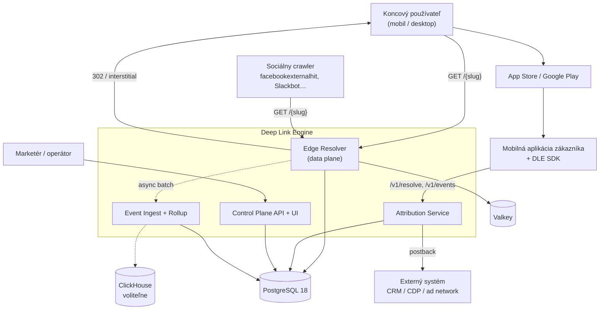
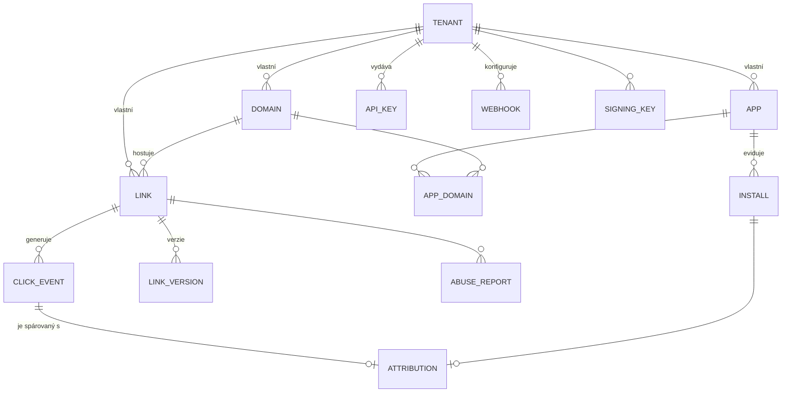
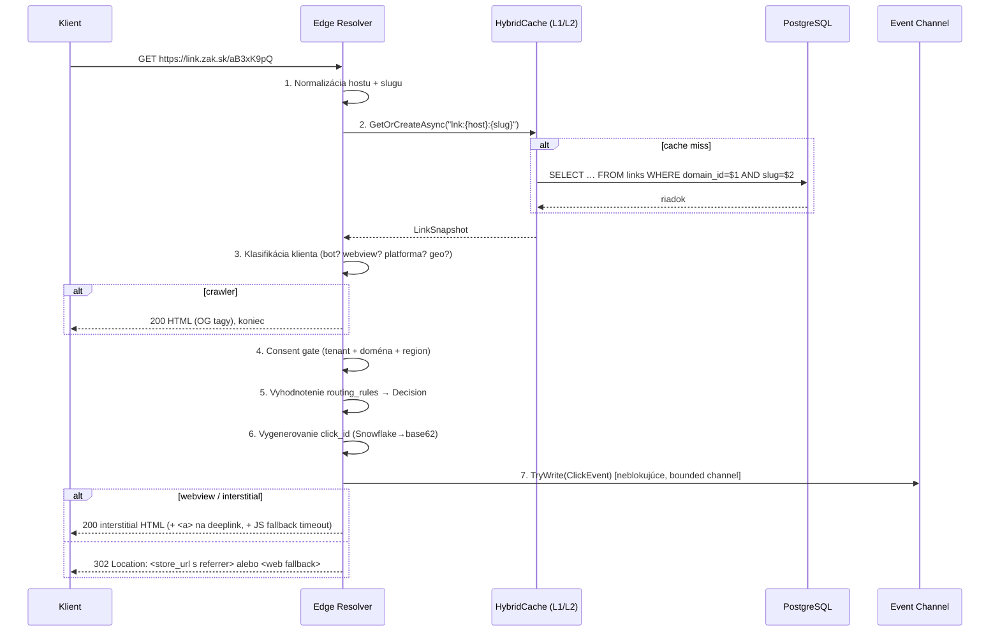
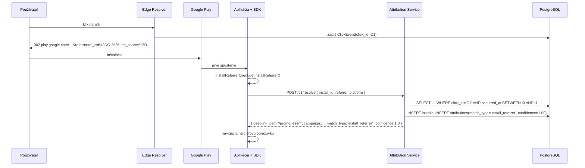
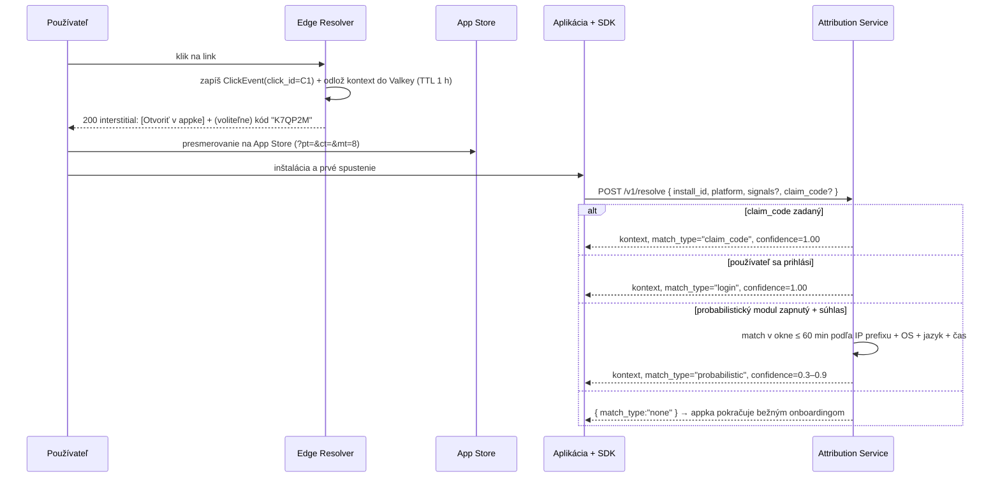
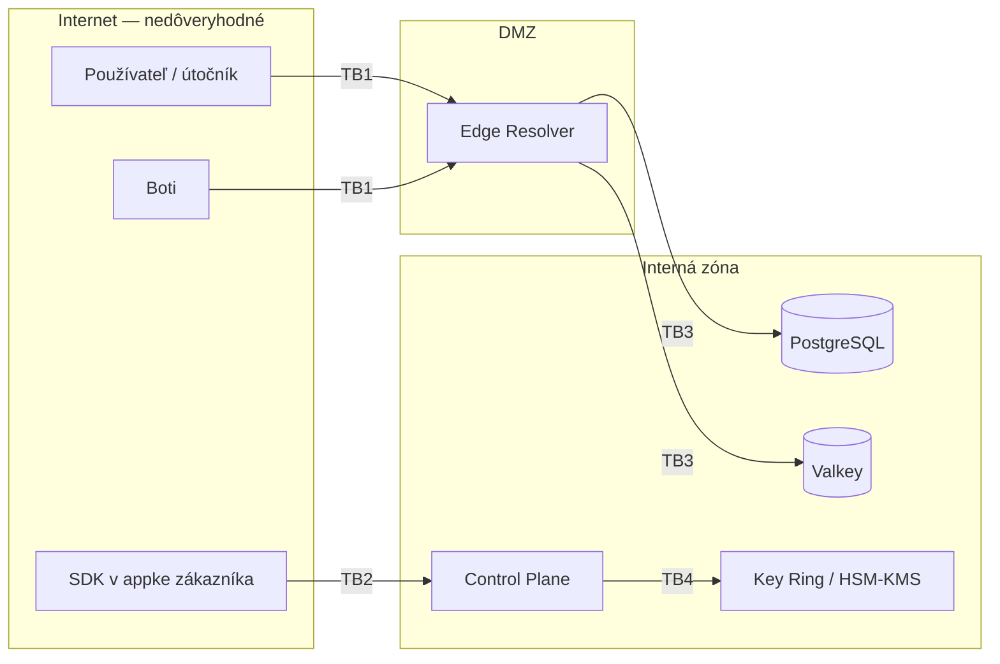

# Deep Link Engine (DLE)
## Komplexné zadanie projektu — open-source engine pre deep linking a atribúciu

**Verzia:** 1.0 (návrh na review)
**Dátum:** 3. september 2026
**Autor zadania:** PRAESTAR (Matej Langsfeld)
**Cieľová platforma:** .NET 10 LTS · ASP.NET Core Minimal APIs · EF Core 10 · PostgreSQL 18
**Pracovný názov:** `DLE` (odporúčam pre OSS release neutrálny názov bez brandu, napr. `relink`; PRAESTAR ako steward projektu — brand v názve OSS produktu znižuje ochotu iných firiem prispievať)

---

## Obsah

- [0. Manažérske zhrnutie a kritické stanovisko](#0-manažérske-zhrnutie-a-kritické-stanovisko)
- [ČASŤ A — Pohľad seniorného analytika](#časť-a--pohľad-seniorného-analytika)
- [ČASŤ B — Pohľad architekta](#časť-b--pohľad-architekta)
- [ČASŤ C — Pohľad developera](#časť-c--pohľad-developera)
- [ČASŤ D — Pohľad testera / QA](#časť-d--pohľad-testera--qa)
- [ČASŤ E — Pohľad bezpečnostného architekta (vrátane post-quantum)](#časť-e--pohľad-bezpečnostného-architekta)
- [ČASŤ F — Rozhodnutia, otvorené otázky, go/no-go](#časť-f--rozhodnutia-otvorené-otázky-gono-go)
- [Prílohy a zdroje](#prílohy-a-zdroje)

---

# 0. Manažérske zhrnutie a kritické stanovisko

## 0.1 Čo sa ide stavať

Serverový engine, ktorý zo **skráteného/značkového odkazu** urobí správne otvorenie mobilnej aplikácie na správnej obrazovke — vrátane prípadu, keď používateľ aplikáciu ešte nemá nainštalovanú (*deferred deep linking*), a vrátane merania, ktorý klik viedol ku ktorej inštalácii (*atribúcia*). Distribuovaný ako open-source, primárne určený na **self-hosting v EU**.

Tri vrstvy produktu:

| Vrstva | Obsah | Kritickosť |
|---|---|---|
| **Link resolution** | značkové domény, slug → cieľ, pravidlá routovania (geo/OS/jazyk/A-B), OG náhľady pre crawlerov, QR | jadro, musí byť v v1 |
| **Deferred deep linking** | prenos kontextu kliku cez inštaláciu do prvého otvorenia appky | hlavná pridaná hodnota, v1 |
| **Atribúcia a analytika** | klikstream, priradenie inštalácie ku kliku, postbacky, reporty | v1 minimálne, v2 do hĺbky |

## 0.2 Kritické stanovisko — prečo to vlastne chceš robiť?

Toto je najdôležitejšia časť dokumentu. Zvyšok je remeselná práca; toto je rozhodnutie o niekoľkých stovkách hodín tvojho života.

**Fakty, ktoré hovoria za:**

1. **Firebase Dynamic Links bol vypnutý 25. 8. 2025.** Google ho zabil úplne — linky vracajú 404, API vracia 400/403. Státisíce aplikácií museli migrovať a Google im ako náhradu odporučil… komerčné MMP (Branch, AppsFlyer, Adjust, Kochava, Singular, Airbridge). Vzniklo reálne vákuum pre bezplatnú/self-hosted alternatívu.
2. **Ceny komerčných hráčov sú netriviálne.** Podľa agregátora reálnych transakcií Vendr je medián ročného kontraktu Branch ~55 000 USD, AppsFlyer ~67 000 USD. Aj „malý" tier vychádza na 15–25 tis. USD/rok. Pre stredne veľkú európsku firmu je to položka, ktorú CFO vidí.
3. **Open-source konkurencia je slabá.** Jediný skutočne zrelý projekt je **Dub** (~25k hviezd, AGPLv3 + komerčný modul), ale je to primárne *link shortener + affiliate tracking*, nie mobilný deferred deep linking. `LinkForty/core` sa o to pokúša (AGPL-3.0, TypeScript), ale má ~23 hviezd — to nie je ekosystém, to je jeden človek. **V .NET svete neexistuje nič.**
4. **EU/GDPR uhol je reálna diera na trhu.** Všetci veľkí hráči sú americkí, dátovo nepriehľadní a ich model stojí na probabilistickom fingerprintingu, ktorý je po finálnych EDPB Guidelines 2/2023 (prijaté 16. 10. 2024) v EÚ právne veľmi problematický. Self-hosted engine, kde zákazník je *controller* a dodávateľ nemá k dátam prístup, je predajný argument, nie marketingová fráza.
5. **Prekrýva sa to s tvojou doménou.** Platby, regulovaní zákazníci, DORA/NIS2 — presne tam, kde „pošli to cez Branch do USA" naráža na compliance. To je tvoja nespravodlivá výhoda, nie generický SaaS nápad.

**Fakty, ktoré hovoria proti — a ktoré si musíš priznať:**

1. **Rozsah je väčší, než vyzerá.** Realistický odhad v1 (viď §C.9): **160–185 človekodní** vrátane SDK a testovacej matice. Pri 50 % kapacite popri SFP je to 12–15 mesiacov kalendárneho času. Nie víkendový projekt.
2. **Najdrahšia časť nie je backend, ale klientská strana a testovanie.** Backend redirect service vieš mať funkčný za 3 týždne. Peklo je v tom, že Universal Links sa v iOS simulátore nedajú poriadne otestovať, in-app prehliadače Facebooku/Instagramu/TikToku sa správajú každý inak, Apple cachuje AASA až týždeň a Android 15 až 7 dní. Toto sú manuálne regresné testy na reálnych zariadeniach, pri každom release, navždy.
3. **Open-source ≠ príjem.** Ak je cieľ zarobiť, OSS je distribučný kanál, nie biznis model. Bez jasného plánu monetizácie (managed hosting / enterprise moduly / podpora) je to portfólio projekt, nie produkt. To je legitímne — ale povedz si to nahlas dopredu.
4. **Kontrolná otázka na ego/FOMO:** Chceš to stavať preto, že je to *zaujímavý technický problém v stacku, ktorý máš rád* (.NET), alebo preto, že máš identifikovaného zákazníka, ktorý za to zaplatí? Ak platí prvé, je to v poriadku — ale potom to nazvi „investícia do reputácie a do referencie" a podľa toho nastav rozsah (skromnejší, rýchlejší, s dôrazom na to, čo dobre vyzerá v repozitári), nie na feature parity s Branchom.

**Odporúčanie:** ísť do toho, ale **s ostro orezaným rozsahom a s explicitným klinom**: *self-hosted, EU-first, consent-first deep link engine pre .NET a regulované prostredia*. Nie „open-source Branch". Feature parity s Branchom je pasca, do ktorej zabijes rok a aj tak prehráš. Detail v [§F.3](#f3-gono-go-odporúčanie).

## 0.3 Kľúčové technické rozhodnutia (zhrnutie)

| # | Rozhodnutie | Voľba | Prečo (skrátene) |
|---|---|---|---|
| ADR-001 | Runtime | **.NET 10 LTS** (GA 11. 11. 2025, podpora do 14. 11. 2028) | Podpora presahuje horizont projektu; .NET 11 je STS s GA až 10. 11. 2026 |
| ADR-002 | Web framework | **Minimal APIs + vertical slices** | Najnižšia réžia na request, natívna validácia v .NET 10, OpenAPI 3.1 |
| ADR-003 | Primárne úložisko | **PostgreSQL 18 (SQL)** | Workload je point-lookup + relačná správa; NoSQL nerieši žiadny reálny problém tohto systému |
| ADR-004 | Prístup k dátam | **EF Core 10 pre control plane, Dapper/Npgsql pre hot path** | ⚠️ **Korekcia tvojho návrhu** — EF Core na resolve ceste je zlý nástroj (viď §B.4) |
| ADR-005 | Cache | **HybridCache (L1) + Valkey (L2)** | Valkey BSD-3 namiesto Redis AGPLv3 — licenčná čistota OSS produktu |
| ADR-006 | Analytika | **Postgres partície (default) → ClickHouse (opt-in)** | Self-hoster nechce druhú databázu na deň 1 |
| ADR-007 | Slug | **Kľúčovaná permutácia sekvencie → base62, 8 znakov** | Bijekcia ⇒ nulová kolízia; neenumerovateľné bez kľúča |
| ADR-008 | Deferred matching | **Deterministicky prvý, probabilistický len ako opt-in s consentom** | ePrivacy čl. 5(3) + EDPB 2/2023; fingerprint > 24 h je horší než hod mincou |
| ADR-009 | Redirect | **Interstitial HTML + 302 podľa kontextu, nikdy 301** | 301 sa cachuje navždy a zabije A/B a časovo obmedzené kampane |
| ADR-010 | Členenie | **Modulárny monolit, 2 nasadzovacie jednotky** | Mikroslužby na 180 MD projekte sú sebapoškodzovanie |
| ADR-011 | Licencia | **AGPL-3.0 + CLA** (odporúčanie) | Chráni pred SaaS-forkom, umožňuje duálne licencovanie neskôr |
| ADR-012 | Native AOT | **Nie v v1** (EF Core AOT nepodporuje) | Voliteľne pre samostatný edge resolver v v2 |
| ADR-013 | Kryptografia | **Crypto-agilita od prvého commitu, hybrid TLS už v v1** | PQC nie je redesign, ale je to dizajnové rozhodnutie, ktoré sa nedá dorobiť lacno |

---

# ČASŤ A — Pohľad seniorného analytika

## A.1 Problémová doména — čo je vlastne deep link

Deep link je URL, ktorá neotvára domovskú stránku aplikácie, ale konkrétny obsah v nej. Znie to triviálne. Nie je, pretože medzi kliknutím a otvorením obrazovky stojí päť nezávislých systémov, z ktorých každý má vlastné pravidlá: prehliadač alebo in-app webview odosielateľskej aplikácie, operačný systém, obchod s aplikáciami, sieťová vrstva a samotná aplikácia.

Tri technicky odlišné scenáre, ktoré sa v praxi nesprávne miešajú do jedného pojmu:

| Scenár | Slovensky | Čo sa deje | Kto to rieši |
|---|---|---|---|
| **Direct deep link** | aplikácia je nainštalovaná | OS zachytí URL a otvorí appku na cieľovej obrazovke; **HTTP request na náš server vôbec nemusí prísť** | OS (Universal Links / App Links) |
| **Deferred deep link** | aplikácia nie je nainštalovaná | používateľ ide do store, nainštaluje, otvorí — a *až potom* sa musí dozvedieť, kam mal ísť | náš engine + SDK |
| **Fallback** | aplikácia neexistuje / desktop / nepodporovaná platforma | otvor web verziu obsahu | náš engine |

Presne túto trojicu ilustrujú obrázky v zadaní. Zásadný dôsledok, ktorý väčšina návrhov prehliadne: **v prvom scenári nedostaneme HTTP request**. Ak sa aplikácia otvorí cez Universal Link priamo, náš server o klike nevie. Bez toho, aby SDK po otvorení nahlásilo URL späť, prídeme o podstatnú časť atribúcie. Toto je funkčná požiadavka, nie detail implementácie (FR-223).

## A.2 Platformové obmedzenia, ktoré určujú dizajn

Toto nie sú „technické poznámky", toto sú tvrdé vstupné podmienky, ktoré rozhodujú o architektúre.

### A.2.1 Apple Universal Links

- Súbor `apple-app-site-association` (bez prípony) na `https://<host>/.well-known/apple-app-site-association`, `Content-Type: application/json`, **žiadne presmerovania**, platný certifikát, dostupný zo všetkých IP.
- Moderná schéma: `applinks.details[].appIDs` + `components` (vzory na path `/`, fragment `#`, query `?`, s `exclude`). Súčasťou môžu byť aj `webcredentials` a `appclips`.
- **Distribúcia cez Apple CDN** (`app-site-association.cdn-apple.com`), nie priamo z nášho servera. Apple si súbor stiahne do 24 hodín; zariadenia si ho po inštalácii obnovujú **približne raz týždenne**. Zmena pravidiel routovania sa teda k používateľom dostane s oneskorením až 7 dní. Pre vývoj existuje `applinks:example.com?mode=developer`, ktorý CDN obchádza — a **musí byť odstránený pred odoslaním do App Store**.
- Každá subdoména potrebuje vlastný AASA a vlastný entitlement — nededí sa.
- Deklarovaná veľkosť limitu 128 kB je široko uvádzaná, ale nie je potvrdená v aktuálnej Apple dokumentácii — berieme ako pracovný limit.

**Dôsledok pre engine:** AASA musí byť **generovaný dynamicky per doména** z konfigurácie tenantov, servírovaný bez redirectov, s validáciou pred publikáciou, a s upozornením v UI, že zmena sa prejaví až do 7 dní.

### A.2.2 Android App Links

- Súbor `assetlinks.json` na `https://<host>/.well-known/assetlinks.json`, opäť bez presmerovaní.
- Kritická pasca: pri **Play App Signing** (default pre nové aplikácie od 2021) je na reálnych zariadeniach relevantný **Googlom podpisovaný certifikát**, nie upload certifikát z lokálneho keystoru. Toto je najčastejšia príčina toho, že App Links fungujú v debug builde a nefungujú v produkcii.
- Android 12+ oddelil verifikáciu od „default handler" statusu; ladenie cez `adb shell pm verify-app-links --re-verify <pkg>` a `pm get-app-links <pkg>`.
- **Android 15+ prináša periodickú re-verifikáciu**, ale propagácia zmien v `assetlinks.json` trvá až 7 dní.
- **Android 15+ podporuje `dynamic_app_link_components`** v `assetlinks.json` — nové pravidlá routovania sa dajú vydať bez nového buildu aplikácie. Toto je funkcia, ktorú komerčné MMP zatiaľ využívajú slabo; pre nás je to diferenciátor (FR-142).

### A.2.3 Vlastné URI schémy (`myapp://`)

Fungujú všade, ale výlučne ako posledný fallback: ktorákoľvek aplikácia si môže zaregistrovať rovnakú schému a OS to nijako nekontroluje. Reálny dôsledok — **CVE-2026-26123** (Microsoft Authenticator, iOS aj Android): škodlivá aplikácia registrovaná na tú istú schému mohla zachytiť jednorazové prihlasovacie kódy. Engine nesmie cez custom scheme nikdy prenášať citlivé údaje.

### A.2.4 Odovzdávanie kontextu cez inštaláciu

| Platforma | Deterministický kanál | Realita |
|---|---|---|
| **Android** | **Play Install Referrer API** (`com.android.installreferrer:installreferrer:2.2`) — `referrer` string prežije inštaláciu, dostupný 90 dní, obsahuje aj `referrerClickTimestampSeconds` a serverové varianty na detekciu podvodu | ✅ Funguje spoľahlivo. Vložíme `dl_cid=<click_id>` do `&referrer=` na Play URL a po inštalácii máme presnú zhodu. **Google nepublikuje maximálnu dĺžku parametra** — držať pod ~500 znakmi. |
| **iOS** | **Neexistuje ekvivalent.** App Store campaign linky (`?pt=&ct=&mt=8`) nesú len kampaň, nie click ID, a okno atribúcie je 24 hodín. | ❌ Toto je jadro problému na iOS. |

Čo na iOS zostalo po ATT:
- **AdAttributionKit** (iOS 17.4+) — postbacky pre inštalácie aj re-engagement, bez potreby ATT súhlasu, ale s „crowd anonymity" tierovaním. Pre re-engagement dostáva postbacky len jedna sieť. Je to nástroj pre ad networks, **nie mechanizmus na prenos deep link kontextu**.
- **SKAdNetwork 4.0** stále beží paralelne, Apple neoznámil koniec.
- **Clipboard matching je mŕtvy** — iOS 16 zaviedol systémový dialóg pri programovom čítaní schránky.
- **Fingerprinting sa aktívne rozpadá** — Safari v iOS 26 zaviedol Advanced Fingerprinting Protection zapnutú by default (šum do Canvas/WebGL/WebAudio, fixné hodnoty screen metrík, unikátny odtlačok per stránka per session).

**Dôsledok:** engine musí na iOS stavať na deterministických vzoroch (viď A.5), nie na fingerprintingu. Kto sľubuje na iOS „presné" deferred deep linky v roku 2026, klame.

### A.2.5 Presnosť probabilistického párovania — čísla

Nezávislé analýzy uvádzajú: ~98 % presnosť v okne do 10 minút (ale to okno pokryje len ~54 % reálnych atribúcií), ~81 % po 7 dňoch elapsed, a **za hranicou 24 hodín sa presnosť blíži k 50/50**. Fingerprint match starší než deň je teda pravdepodobnejšie nesprávny než správny.

**Dôsledok:** engine **nikdy** neprezentuje probabilistickú zhodu ako deterministickú. Každý záznam atribúcie nesie `match_type` a `confidence`. Toto je zároveň dôvod, prečo default okno pre probabilistický match nastavujeme na **60 minút**, nie na 7 dní ako komerční hráči.

### A.2.6 In-app prehliadače a crawlery

- Webview vo Facebooku, Instagrame a TikToku **nespúšťa OS-level zachytenie Universal/App Links pri načítaní stránky** — funguje len skutočný tap na `<a>` element. `window.location.href` z JavaScriptu sa na iOS nepočíta ako user gesture.
- TikTok odstraňuje niektoré query parametre. Facebook pridáva `fbclid`. Android Custom Tabs App Links zachytávajú, holý WebView nie.
- **Sociálne crawlery** (`facebookexternalhit`, `Twitterbot`, `Slackbot`, `LinkedInBot`, Discord) potrebujú HTML 200 s Open Graph tagmi, nie 302. Ak im pošleme redirect, náhľad odkazu bude prázdny.

**Dôsledok:** engine potrebuje **vetvenie odpovede podľa typu klienta** (bot / in-app webview / bežný prehliadač) a **interstitial stránku s reálnym tlačidlom**, nie automatický redirect. Toto je zároveň dôvod, prečo latenčný rozpočet nesmie byť postavený na „jednom 302".

## A.3 Aktéri a prípady použitia

| Aktér | Popis |
|---|---|
| **Operátor inštancie** | tenant admin, vytvára domény, aplikácie, linky |
| **Marketér** | vytvára kampane a linky, číta reporty |
| **Koncový používateľ** | klikne na link, nainštaluje/otvorí appku |
| **Mobilná aplikácia (SDK)** | hlási prvé otvorenie, žiada deferred kontext, hlási eventy |
| **Externý systém** | CRM/CDP/ad network, prijíma postbacky |
| **Crawler / bot** | generuje náhľad odkazu |
| **Útočník** | pokúša sa o open redirect, phishing, enumeráciu, click fraud |

**Prípady použitia (výber jadra):**

- **UC-01 Vytvorenie deep linku** — marketér zadá cieľ v appke, fallback URL, OG metadáta, pravidlá routovania; systém vráti krátku URL + QR.
- **UC-02 Rozlíšenie kliku** — príchod na `https://link.zakaznik.sk/aB3xK9pQ`, klasifikácia klienta, vyhodnotenie pravidiel, odpoveď.
- **UC-03 Priame otvorenie appky** — OS zachytí Universal Link, SDK po štarte nahlási URL na engine (bez tohto je klik neviditeľný).
- **UC-04 Odložené otvorenie (Android)** — klik → Play s `referrer` → inštalácia → SDK číta Install Referrer → engine vráti presný kontext.
- **UC-05 Odložené otvorenie (iOS)** — klik → interstitial → App Store → inštalácia → SDK volá `/v1/resolve` → engine vráti kontext podľa nakonfigurovanej stratégie (claim code / probabilistický match v krátkom okne / prihlásenie).
- **UC-06 Náhľad odkazu pre crawler** — bot dostane HTML 200 s OG tagmi.
- **UC-07 Overenie domény** — operátor pridá doménu, systém vygeneruje AASA/assetlinks a overí dostupnosť a správnosť.
- **UC-08 Analytika kampane** — počty klikov, inštalácií, mier zhody podľa typu, časové rady.
- **UC-09 Postback** — engine odošle podpísaný webhook pri inštalácii/konverzii.
- **UC-10 Nahlásenie zneužitia** — verejný formulár, karanténa linku, notifikácia.

## A.4 Funkčné požiadavky

Označenie: **M** = must (v1), **S** = should (v1.x), **C** = could (v2+).

### Správa liniek
| ID | Požiadavka | Prio |
|---|---|---|
| FR-101 | Vytvoriť/upraviť/archivovať link s cieľovou URL, deep link cestou, fallback URL per platforma | M |
| FR-102 | Vlastný slug alebo automaticky generovaný (8 znakov base62) | M |
| FR-103 | Hromadné vytvorenie liniek (CSV / API batch, ≥ 10 000 v dávke) | S |
| FR-104 | Platnosť linku (od–do), aktivácia/deaktivácia, správanie po expirácii | M |
| FR-105 | OG metadáta per link (title, description, image), fallback na tenant default | M |
| FR-106 | QR kód (SVG/PNG) s voliteľným logom a nastaviteľnou úrovňou korekcie | M |
| FR-107 | Verziovanie linkov a audit zmien | S |
| FR-108 | Šablóny liniek (kampaň → predvyplnené UTM a pravidlá) | S |
| FR-109 | Tagovanie a fulltext vyhľadávanie | S |

### Routovanie
| ID | Požiadavka | Prio |
|---|---|---|
| FR-121 | Pravidlá podľa platformy (iOS/Android/desktop/iné) | M |
| FR-122 | Pravidlá podľa krajiny/regiónu (offline GeoIP, bez volania tretej strany) | M |
| FR-123 | Pravidlá podľa jazyka (`Accept-Language`) | S |
| FR-124 | Pravidlá podľa verzie OS a verzie aplikácie | S |
| FR-125 | A/B rozdelenie s deterministickým bucketovaním podľa click ID | S |
| FR-126 | Časové okná (kampaň beží len v určitom období/hodinách) | S |
| FR-127 | Vyhodnocovanie pravidiel deterministicky, prvé pravidlo vyhráva, s explicitným default | M |
| FR-128 | Prenos a doplnenie click ID parametrov (`gclid`, `fbclid`, `ttclid`, `msclkid`, UTM) do cieľovej URL | M |
| FR-129 | Simulátor pravidiel v UI („čo sa stane pre iPhone 15, iOS 18, SK, cez Instagram") | S |

### Platformová integrácia
| ID | Požiadavka | Prio |
|---|---|---|
| FR-141 | Generovanie a servírovanie `apple-app-site-association` per doména | M |
| FR-142 | Generovanie a servírovanie `assetlinks.json` per doména, vrátane `dynamic_app_link_components` pre Android 15+ | M |
| FR-143 | Validátor domény: dostupnosť, TLS, absencia redirectov, správnosť `Content-Type`, zhoda `appID`/fingerprintu | M |
| FR-144 | Upozornenie na Play App Signing fingerprint (odlišný od upload certifikátu) | M |
| FR-145 | Podpora viacerých domén a subdomén per tenant | M |
| FR-146 | Podpora App Clips (`appclips` sekcia v AASA) | C |

### Odpoveď na klik
| ID | Požiadavka | Prio |
|---|---|---|
| FR-161 | Detekcia botov (UA + reverse DNS pre hlavné crawlery) a odpoveď HTML 200 s OG tagmi | M |
| FR-162 | Detekcia in-app webview a servírovanie interstitial stránky s reálnym `<a>` tlačidlom | M |
| FR-163 | Interstitial musí byť konfigurovateľný (branding tenanta, jazyk, auto-redirect timeout) | S |
| FR-164 | Nikdy nepoužiť HTTP 301 pre link, ktorý môže zmeniť cieľ | M |
| FR-165 | Odpoveď musí byť doručená aj pri výpadku analytickej vrstvy (fail-open na zápis eventu) | M |
| FR-166 | Podpora `?_dl=preview` režimu pre ladenie bez zápisu eventu | S |

### Deferred deep linking a atribúcia
| ID | Požiadavka | Prio |
|---|---|---|
| FR-181 | Vygenerovať `click_id` pri každom klike a preniesť ho do Play referrer parametra | M |
| FR-182 | Endpoint pre SDK: výmena Install Referrer za pôvodný kontext (deterministický match) | M |
| FR-183 | Endpoint pre SDK: probabilistický match v konfigurovateľnom okne (default 60 min), **len ak je povolený a je zaznamenaný súhlas** | M |
| FR-184 | Claim-code stratégia (krátky kód na interstitial, používateľ ho zadá v appke) ako deterministická alternatíva na iOS | S |
| FR-185 | Match cez prihlásenie (reconciliácia anonymného web ID s účtom po logine) | S |
| FR-186 | Každá atribúcia nesie `match_type` a `confidence`; probabilistická sa nikdy neprezentuje ako istá | M |
| FR-187 | Konfigurovateľné atribučné okná per tenant a per kanál | S |
| FR-188 | Deduplikácia inštalácií podľa install ID; ochrana proti opakovanému nárokovaniu | M |

### Analytika a integrácie
| ID | Požiadavka | Prio |
|---|---|---|
| FR-201 | Klikstream: čas, link, krajina, platforma, OS, prehliadač, referrer, výsledok rozhodnutia, latencia | M |
| FR-202 | Agregácie: kliky/inštalácie/konverzie v čase, podľa linku, kampane, krajiny, platformy | M |
| FR-203 | Export CSV/Parquet, dotazovacie API | S |
| FR-204 | Webhooky/postbacky s HMAC podpisom, retry s exponenciálnym backoffom a DLQ | M |
| FR-205 | Rozlíšenie botov a ľudí v štatistikách (bot kliky sa nezapočítavajú do kampaní) | M |
| FR-206 | Real-time stream eventov cez SSE (`TypedResults.ServerSentEvents`) pre dashboard | C |

### SDK a klientská strana
| ID | Požiadavka | Prio |
|---|---|---|
| FR-221 | Android SDK (Kotlin): Install Referrer, App Links handling, event reporting | M |
| FR-222 | iOS SDK (Swift): Universal Links handling, deferred resolve, event reporting | M |
| FR-223 | **SDK musí hlásiť aj priame otvorenia cez Universal/App Link** (inak sú tieto kliky neviditeľné) | M |
| FR-224 | Web SDK (JS) pre smart banner a web fallback | S |
| FR-225 | React Native / MAUI / Flutter wrappery | C |
| FR-226 | SDK offline queue s perzistenciou a retry | S |
| FR-227 | SDK nesmie čítať schránku ani zbierať identifikátory bez explicitnej konfigurácie | M |

### Správa, bezpečnosť, prevádzka
| ID | Požiadavka | Prio |
|---|---|---|
| FR-241 | Multi-tenancia s izoláciou dát na úrovni riadkov | M |
| FR-242 | API kľúče (hashované), roly (owner/admin/editor/viewer), OIDC prihlásenie do UI | M |
| FR-243 | Rate limiting na tvorbu liniek aj na resolve, s oddeleným prísnejším limitom na 404 odpovede (konkrétne hodnoty §E.9) | M |
| FR-244 | Kontrola cieľových URL voči reputačným zoznamom pri vytvorení aj periodicky | M |
| FR-245 | Verejný formulár na nahlásenie zneužitia + karanténa linku | M |
| FR-246 | Audit log všetkých administratívnych operácií, nemenný | M |
| FR-247 | Konfigurovateľná retencia a anonymizácia klikstreamu (default: hash IP po 30 dňoch, drop po 180) | M |
| FR-248 | Consent režimy: `full` / `aggregate_only` / `off` per tenant a per doména | M |
| FR-249 | Export všetkých dát tenanta (portabilita, DORA exit plán) | S |

## A.5 Nefunkčné požiadavky

| ID | Kategória | Požiadavka | Meranie |
|---|---|---|---|
| NFR-01 | Latencia | Resolve p50 ≤ 8 ms, p95 ≤ 25 ms, p99 ≤ 50 ms serverovo (bez sieťovej cesty) pri cache hit | k6/NBomber, OTel histogram |
| NFR-02 | Latencia | Cache miss (Postgres lookup) p99 ≤ 120 ms | ako vyššie |
| NFR-03 | Priepustnosť | ≥ 5 000 req/s na jednu inštanciu (4 vCPU, 8 GB) pri ≥ 95 % cache hit rate | záťažový test |
| NFR-04 | Škálovanie | Horizontálne, bezstavovo; pridanie inštancie bez reštartu ostatných | test |
| NFR-05 | Dostupnosť | 99,9 % pre resolve cestu; control plane 99,5 % | SLO, error budget |
| NFR-06 | Degradácia | Pri výpadku Postgresu musí resolve fungovať z cache; pri výpadku cache z Postgresu; pri výpadku analytiky sa eventy zahadzujú, nie blokuje sa odpoveď | chaos test |
| NFR-07 | RPO/RTO | RPO ≤ 5 min (control plane), RTO ≤ 30 min | DR cvičenie |
| NFR-08 | Objem | 10⁹ liniek, 10¹⁰ klik-eventov s retenciou 180 dní | kapacitný model |
| NFR-09 | Nasadenie | Jeden `docker compose up` pre kompletnú funkčnú inštanciu; Helm chart pre K8s | smoke test |
| NFR-10 | Zdroje | Základná inštancia beží na 2 vCPU / 4 GB RAM / 20 GB disku | test |
| NFR-11 | Portabilita | Žiadna závislosť na proprietárnej cloudovej službe v jadre | code review |
| NFR-12 | Pozorovateľnosť | OpenTelemetry traces/metrics/logs, štruktúrované logy, korelačné ID naprieč SDK↔server | audit |
| NFR-13 | Bezpečnosť | Žiadne kritické/vysoké CVE v závislostiach pri release; SBOM + CBOM súčasťou artefaktu | CI gate |
| NFR-14 | Súkromie | Žiadny odchádzajúci sieťový hovor na tretiu stranu z resolve cesty (vrátane GeoIP) | network policy test |
| NFR-15 | Lokalizácia | Interstitial a UI v EN + SK, príprava na i18n | review |
| NFR-16 | Prístupnosť | Interstitial stránka WCAG 2.2 AA | axe audit |
| NFR-17 | Krypto-agilita | Každý podpísaný artefakt nesie identifikátor algoritmu a `kid`; výmena algoritmu bez zmeny formátu | design review |
| NFR-18 | Licenčná čistota | Žiadna závislosť s licenciou nekompatibilnou so zvolenou licenciou projektu | FOSSA/`dotnet-project-licenses` v CI |

## A.6 Explicitné non-goals (čo NEROBÍME)

Toto je rovnako dôležité ako zoznam požiadaviek. Bez neho sa projekt rozteče.

1. **Nie sme MMP.** Neriešime agregáciu SKAdNetwork/AdAttributionKit postbackov od ad networks, neriešime cross-channel media mix modelling, neriešime fraud scoring reklamných sietí.
2. **Neriešime ad network integrácie** (Meta, Google Ads, TikTok API konektory). V1 len generický webhook.
3. **Nerobíme vlastný CDN/edge runtime.** Kto chce edge, dá si pred engine Cloudflare/Fastly.
4. **Nerobíme fingerprinting ako primárnu stratégiu.** Je to opt-in modul, vypnutý by default, s legálnym varovaním v UI.
5. **Nerobíme e-mail/SMS rozosielanie.** Sme link engine, nie ESP.
6. **Nepodporujeme Android Instant Apps** — Google Play Instant bol vypnutý v decembri 2025.
7. **Nerobíme v v1 vlastný OAuth2 authorization server.** Použijeme OIDC voči existujúcemu IdP; vlastný AS až keď to zákazník zaplatí.

## A.7 Predpoklady a riziká

| ID | Riziko | P | D | Mitigácia |
|---|---|---|---|---|
| R-01 | Apple/Google zmenia pravidlá verifikácie domén a rozbijú routovanie | S | V | Verzionovaný generátor AASA/assetlinks, automatické denné overovanie všetkých domén, alerting |
| R-02 | iOS deferred matching nedosiahne použiteľnú presnosť | V | V | Deterministické stratégie ako default (claim code, login match, App Clip); presnosť sa komunikuje ako `confidence`, nie sa skrýva |
| R-03 | Právne napadnutie fingerprintingu v EÚ | S | V | Modul vypnutý by default, consent gating, DPIA šablóna súčasťou dokumentácie |
| R-04 | Zneužitie na phishing poškodí reputáciu domén | V | V | Reputačné kontroly, rate limiting, karanténa, abuse workflow (§E.3) |
| R-05 | Projekt nezíska komunitu a stane sa údržbovou záťažou | V | S | Orezaný rozsah, jasné non-goals, CI/CD od začiatku, rozhodnutie o monetizácii pred v1 |
| R-06 | Testovanie na reálnych zariadeniach prekročí rozpočet | S | S | Prioritizovaná matica zariadení (§D.2), BrowserStack/Firebase Test Lab, manuálny checklist len na top 8 kombinácií |
| R-07 | EF Core na hot path spôsobí latenciu a znemožní AOT | V | S | ADR-004 — rozdelenie data access ciest (viď §B.4) |
| R-08 | Prekročenie odhadu 2× | V | S | Míľnikové gaty, MVP definované na 60 MD, zvyšok podmienený |

**Predpoklady:**

- P-01: Cieľová skupina má vlastnú mobilnú aplikáciu, do ktorej vie integrovať SDK.
- P-02: Nasadenie je primárne v EU (dátová lokalita, GDPR režim).
- P-03: Prevádzkovateľ inštancie je *controller* v zmysle GDPR; my ako dodávateľ softvéru nie sme spracovateľ, ak nemáme prístup k inštancii.
- P-04: Tím má prístup aspoň k jednému fyzickému iOS a jednému Android zariadeniu pre vývoj.

---

# ČASŤ B — Pohľad architekta

## B.1 Architektonické princípy

1. **Hot path je posvätný.** Resolve cesta má vlastný rozpočet latencie a nesmie v nej byť nič, čo môže zlyhať pomaly — žiadne synchrónne volania tretích strán, žiadny ORM materializujúci grafy objektov, žiadny blokujúci zápis do analytiky.
2. **Control plane a data plane sú oddelené.** Administrácia (CRUD, reporty) a rozlišovanie klikov majú odlišné SLA, odlišné škálovanie a odlišné dátové prístupy. Zdieľajú doménový model, nie kód pre prístup k dátam.
3. **Fail-open na telemetriu, fail-closed na bezpečnosť.** Ak nevieme zapísať klik, používateľ sa aj tak dostane, kam ide. Ak nevieme overiť cieľ, nepresmerujeme.
4. **Nulová vendor-lock závislosť v jadre.** Postgres, Valkey, S3-kompatibilné úložisko. Nič viac.
5. **Súkromie ako konfigurácia, nie ako patch.** Consent režim je vstup do rozhodovacieho pipeline, nie príznak dodatočne kontrolovaný na konci.
6. **Monolit, kým nebolí.** Dve nasadzovacie jednotky (edge + control plane), jedna solution, jedna databáza. Mikroslužby sú na tomto rozsahu čistá strata.

## B.2 Kontextový diagram



## B.3 Komponenty

| # | Komponent | Zodpovednosť | Nasadenie |
|---|---|---|---|
| C-01 | **Edge Resolver** | rozlíšenie slugu, klasifikácia klienta, vyhodnotenie pravidiel, generovanie odpovede, emisia eventu | vlastný proces, N replík, bezstavový |
| C-02 | **Well-Known Server** | dynamické servírovanie AASA a `assetlinks.json` per host | súčasť Edge Resolvera (musí byť na tej istej doméne) |
| C-03 | **Interstitial Renderer** | HTML stránka s tlačidlom, OG tagmi, branding tenanta, i18n | súčasť Edge Resolvera, šablóny cachované |
| C-04 | **Control Plane API** | CRUD linkov, domén, aplikácií, tenantov, kľúčov; reporty | vlastný proces |
| C-05 | **Admin UI** | webové rozhranie | statické SPA servírované Control Plane |
| C-06 | **Attribution Service** | `/v1/resolve`, `/v1/events`, párovanie inštalácií, výpočet `confidence` | súčasť Control Plane procesu (iný rate limit, iná autentifikácia) |
| C-07 | **Domain Verifier** | overovanie dostupnosti a správnosti AASA/assetlinks na doménach zákazníka | background service |
| C-08 | **Event Ingest** | príjem batchov klik-eventov, deduplikácia, obohatenie (GeoIP, UA parsing), zápis | background service |
| C-09 | **Rollup Worker** | periodické agregácie do reportovacích tabuliek, retenčné joby, anonymizácia | background service |
| C-10 | **Webhook Dispatcher** | podpisovanie, odosielanie, retry, DLQ | background service |
| C-11 | **Abuse & Reputation** | kontrola cieľov voči blocklistom, karanténa, abuse workflow | background service + API |
| C-12 | **Key Management** | generovanie, rotácia a distribúcia podpisových kľúčov, JWKS endpoint | knižnica + background service |
| C-13 | **SDK (iOS, Android, Web)** | klientská časť | samostatné repozitáre |

**Nasadzovacie jednotky:** `dle-edge` (C-01…C-03) a `dle-control` (C-04…C-12). Edge sa škáluje podľa trafficu, control podľa počtu operátorov. Background services bežia v control procese s distribuovaným leader election cez Postgres advisory lock (žiadny ďalší systém).

## B.4 Architektonické rozhodnutia (ADR)

### ADR-001 — Runtime: .NET 10 LTS

**Kontext.** Projekt má mať životnosť aspoň 3 roky.
**Rozhodnutie.** .NET 10 (GA 11. 11. 2025), LTS s podporou do **14. 11. 2028**.
**Alternatíva.** .NET 11 — GA až 10. 11. 2026, a je to **STS** s podporou len 2 roky. Pre OSS produkt, ktorý má self-hosteri prevádzkovať roky, je STS zlá voľba.
**Dôsledok.** Píšeme proti .NET 10; upgrade na .NET 12 LTS (predpoklad november 2027) je plánovaná úloha.

### ADR-002 — Minimal APIs + vertical slice architecture

**Rozhodnutie.** Minimal APIs, členenie podľa funkcionality (`Features/Links/CreateLink.cs`), nie podľa vrstiev.
**Prečo.** Najnižšia réžia na request v ASP.NET Core. .NET 10 priniesol natívnu validáciu pre Minimal APIs (`AddValidation()` + `[ValidatableType]` so source generátorom), integráciu s `IProblemDetailsService`, OpenAPI 3.1 vrátane YAML výstupu. Controllers by pridali reflexiu a MVC pipeline bez protihodnoty.
**Dôsledok.** `Microsoft.AspNetCore.OpenApi` + **Scalar** ako UI (Swashbuckle je od .NET 9 mimo šablón a fakticky v útlme).

### ADR-003 — SQL vs NoSQL: PostgreSQL 18 ako primárne úložisko

Toto je rozhodnutie, ktoré si výslovne žiadal, tak ho rozoberiem naplno.

**Aký je vlastne workload?**

| Operácia | Frekvencia | Tvar |
|---|---|---|
| Rozlíšenie slugu | 10⁴–10⁶ / deň, špičkovo tisíce/s | **point lookup podľa jedného kľúča**, 100 % čítanie |
| Zápis klik-eventu | rovnako | append-only, dávkovateľný, tolerantný na stratu |
| CRUD linkov | desiatky–tisíce / deň | relačné, transakčné, s väzbami |
| Reporty | stovky / deň | agregácie nad časovými radmi |
| Párovanie inštalácií | tisíce / deň | lookup + zápis, transakčný |

**Čo by priniesol NoSQL:**

- *DynamoDB*: horizontálne škálovanie zápisov a jednociferné ms latencie pri ľubovoľnej veľkosti. Ale je **proprietárny a AWS-only** — priamy rozpor s požiadavkou self-hosting. Diskvalifikované ako primárne úložisko OSS produktu.
- *Cassandra/ScyllaDB*: to isté, self-hostovateľné, s TWCS kompakciou vhodnou pre TTL event dáta. Cena: topológia clustera, repair, tuning quora. Náš cieľový používateľ je tím, ktorý spustí `docker compose up`.
- *MongoDB*: flexibilná schéma pre heterogénne metadáta. Ale metadáta si vieme uložiť do `jsonb` v Postgrese a mať pritom transakcie a cudzie kľúče.

**Prečo Postgres vyhráva:**

1. **Point lookup nie je dôvod na NoSQL.** Vyhľadanie riadku podľa primárneho kľúča je v Postgrese sub-milisekundová operácia — a aj tak pred ňu dáme cache, takže do DB ide len 1–5 % requestov. Argument „NoSQL je rýchlejšie na kľúč" je pri cache hit rate 95 %+ irelevantný.
2. **Zápisy nie sú problém.** Kliky zapisujeme **dávkovo a asynchrónne** (COPY/binary import), nie po jednom. Postgres zvládne desaťtisíce riadkov za sekundu cez `NpgsqlBinaryImporter`.
3. **Business časť je relačná.** Tenanti, domény, aplikácie, linky, kľúče, audit — to sú entity s väzbami a invariantmi. V schemaless úložisku ich udržíš len disciplínou, ktorú nikto nemá.
4. **PG18 dodal `uuidv7()` natívne** — časovo usporiadané UUID pre event tabuľky, teda sekvenčné vkladanie do B-tree namiesto náhodných page splitov, a možnosť použiť BRIN indexy (rádovo menšie a lacnejšie než B-tree pri append-only dátach).
5. **Deklaratívne partitioning + `pg_partman`** rieši retenciu klikstreamu (denné partície, automatický `DETACH`/`DROP`) bez ďalšieho systému.
6. **Logická replikácia** je hotová cesta, ako neskôr streamovať dáta do ClickHouse bez ETL.

**Rozhodnutie.** PostgreSQL 18 ako jediné povinné úložisko. NoSQL sa v jadre nepoužije. ClickHouse je voliteľná analytická nadstavba, nie závislosť.

> **Poznámka k verziám:** PostgreSQL 18 je aktuálna GA vetva (18.6), PG 19 je v beta fáze. Minimálna podporovaná verzia projektu: **PG 16** (PG 14 končí životnosť 12. 11. 2026), odporúčaná **PG 18** kvôli `uuidv7()`.

### ADR-004 — Prístup k dátam: EF Core pre control plane, Dapper pre hot path

**Toto je korekcia tvojho pôvodného návrhu, a je to najdôležitejšia technická poznámka v celom dokumente.**

Tvoja predstava bola „.NET 10 Minimal API + EF Core engine". Prvá polovica je správna. Druhá je správna **len pre polovicu systému**.

**Prečo EF Core nepatrí na resolve cestu:**

- EF Core aj s `AddDbContextPool` a kompilovanými dotazmi má merateľnú réžiu na materializáciu entít a change tracking. Microsoftov vlastný benchmark ukazuje, že pooling zníži latenciu z ~702 µs na ~350 µs a kompilované dotazy na ~564 µs — to sú stovky mikrosekúnd navyše na operáciu, ktorá má z 8 ms rozpočtu spotrebovať čo najmenej.
- **EF Core má podporu Native AOT (cez prekompiláciu dotazov) označenú Microsoftom ako vysoko experimentálnu a „not yet suited for production use".** Ak je v request pipeline, cesta k produkčnému AOT je prakticky zavretá — a práve edge resolver je komponent, kde by AOT dával najväčší zmysel (rýchly štart pri autoscale, nižšia pamäť).
- Na resolve potrebujeme presne jeden dotaz: `SELECT ... FROM links WHERE domain_id = $1 AND slug = $2`. Toto nepotrebuje ORM.

**Prečo EF Core patrí do control plane:**

- CRUD linkov, domén, aplikácií, tenantov — tam je produktivita dôležitejšia než mikrosekundy.
- EF Core 10 priniesol veci, ktoré priamo využijeme: `LeftJoin`/`RightJoin` operátory, `ExecuteUpdate` nad JSON cestami (inkrementovanie počítadiel bez materializácie entity), pomenované query filtre (multi-tenancy + soft delete vedľa seba), komplexné typy s JSON mapovaním, a redakciu literálov z logov by default.
- Npgsql `10.0.x` má plnú podporu JSONB mapovania a PG18 (vrátane `Guid.CreateVersion7()` → `uuidv7()`).

**Rozhodnutie.**

| Cesta | Technológia | Odôvodnenie |
|---|---|---|
| Resolve (`GET /{slug}`) | **Dapper / raw Npgsql** + `HybridCache` | latencia, AOT-kompatibilita, jeden dotaz |
| Zápis klik-eventov | **`NpgsqlBinaryImporter` (COPY)** v dávkach | priepustnosť |
| Control plane CRUD | **EF Core 10** | produktivita, migrácie, audit |
| Attribution service | **EF Core 10** | transakčné, nízka frekvencia |
| Reporty | **Dapper** nad agregačnými tabuľkami / ClickHouse | tvarované SQL |

**Dôsledok.** Jedna doménová schéma, dva prístupové mechanizmy. EF Core migrácie sú **jediným** zdrojom pravdy o schéme; Dapper dotazy sú pokryté integračnými testami, ktoré zlyhajú pri zmene schémy.

### ADR-005 — Cache: HybridCache + Valkey

**Rozhodnutie.** `Microsoft.Extensions.Caching.Hybrid` (GA od .NET 9, verzia sledujúca platformu) s L1 in-process a L2 **Valkey**.
**Prečo HybridCache.** Zabudovaná ochrana proti cache stampede (súbežné requesty na ten istý kľúč sa zlúčia do jedného dotazu do DB) — presne to, čo potrebuješ pri viruálnom linku. Ďalej tag-based invalidácia (zneplatni všetky linky tenanta pri zmene domény) a jedno API namiesto ručného cache-aside.
**Prečo Valkey a nie Redis.** Redis sa v marci 2024 presunul na RSALv2/SSPL, a od Redis 8 (1. 5. 2025) je späť pod **AGPLv3**. AGPL je pre závislosť OSS produktu, ktorý chceš možno neskôr duálne licencovať alebo ponúkať ako managed službu, právne nepríjemný. **Valkey** je fork posledného BSD Redisu pod Linux Foundation, licencia **BSD-3-Clause**, protokolovo kompatibilný, s podporou AWS/Google/Oracle. Prepnutie späť na Redis je jednoriadková zmena connection stringu.
**Zvážené a odložené: Garnet** (Microsoft Research, MIT, napísaný v .NET, RESP-kompatibilný, sub-300 µs P99.9). Technicky najlepší fit pre .NET stack a má Aspire integráciu. Ale chýba mu verejne doložená produkčná prevádzka. **Odporúčanie: podporiť ako alternatívny provider (je to len `IDistributedCache`), nestavať naň v1.**

### ADR-006 — Analytika: Postgres partície ako default, ClickHouse ako opt-in

**Rozhodnutie.** Klikstream sa primárne ukladá do partitionovanej Postgres tabuľky s BRIN indexmi a `pg_partman` retenciou. Pre inštalácie nad ~50 mil. eventov/mesiac je k dispozícii voliteľný ClickHouse sink (Apache 2.0).
**Prečo.** Self-hoster nechce spravovať dve databázy na prvý deň. Presne túto cestu prešiel aj Dub — začal na Redis sorted sets, prerástol to a prešiel na ClickHouse-based Tinybird s ~100× rýchlejšími dotazmi. Rozdiel je, že my to vieme dopredu a navrhneme abstrakciu (`IClickAnalyticsStore`) od začiatku, aby migrácia nebola prepis.
**Zvážené.** TimescaleDB — duálna licencia (Apache core + TSL pre pokročilé funkcie, ktorá zakazuje ponúkať produkt ako DBaaS). Pre OSS produkt s možným hosted variantom zbytočná komplikácia. DuckDB — výborný na embedded reporting v malých inštaláciách, zaradiť ako tretí voliteľný provider.

### ADR-007 — Generovanie slugov: kľúčovaná permutácia sekvencie → base62, 8 znakov

**Najprv aritmetika, lebo tu sa robí typická chyba.** 8 znakov base62 dáva 62⁸ ≈ 2,18×10¹⁴, teda **~47,6 bitu priestoru**. 64-bitové Snowflake ID sa do 8 znakov **nezmestí** — potrebovalo by 11 znakov. Buď 11-znakový slug, alebo iný zdroj hodnoty. Volíme druhé.

**Rozhodnutie.**

- Interné `links.id` zostáva 64-bitové Snowflake (usporiadanie, sharding, index locality).
- **Slug sa generuje nezávisle:** globálna Postgres sekvencia obmedzená na **47 bitov** (1,4×10¹⁴ hodnôt) → **kľúčovaná Feistelova permutácia** nad 47-bitovým priestorom (4 kolá, round funkcia HMAC-SHA-256 s tajným kľúčom) → base62, presne 8 znakov.
- Vlastný slug je povolený, kontrolovaný unikátnym indexom, a musí byť odlíšiteľný od generovaného tvaru (napr. minimálne 3 alebo aspoň 9 znakov).

**Prečo takto.** Feistelova sieť je **bijekcia** — každá hodnota sekvencie sa mapuje na práve jeden slug, kolízia je konštrukčne nemožná a nepotrebujeme retry pri vytváraní (deterministický čas odozvy). Zároveň je kľúčovaná, takže zo slugu sa nedá odvodiť nasledujúci ani objem vytvorených liniek. Na rozdiel od Hashids/Sqids je to skutočná pseudonáhodná permutácia, nie reverzibilné kódovanie.

**Prečo nie náhodný base62.** Birthday problem: pri 6 znakoch (62⁶ ≈ 5,7×10¹⁰) dosiahneš 1 % pravdepodobnosť kolízie už pri ~34 000 vydaných kódoch. Pri 8 znakoch a 10⁹ linkoch je očakávaný počet kolízií rádovo v tisícoch — zvládnuteľné cez unique constraint + retry, ale je to round-trip navyše. *(Prijateľná zjednodušená alternatíva, ak sa Feistel ukáže ako zbytočná zložitosť: 8 náhodných znakov + unique constraint + retry. Rozhodni pri M1, nie neskôr — mení sa tým formát verejných URL.)*
**Prečo nie čistý sekvenčný čítač.** Triviálne enumerovateľný a prezrádza objem vytvorených liniek.
**Prečo nie Hashids/Sqids.** Nie je to hash, ale reverzibilné kódovanie — Sqids to samo priznáva vo FAQ a schéma bola kryptoanalyticky rozobraná už v 2015. Ako bezpečnostný mechanizmus je to sebaklam.
**Rozhodnutie o ochrane pred enumeráciou.** Enumerácia sa **primárne nerieši dĺžkou slugu, ale prístupovou kontrolou a rate limitingom**: rovnaká odpoveď na neexistujúci aj neautorizovaný link, limit na počet 404 z jednej IP, žiadne analytické dáta prístupné bez autentifikácie. Kľúčovaná permutácia je druhá vrstva, nie jediná.
**Interné ID event tabuliek:** **UUIDv7** (natívne `uuidv7()` v PG18) — časovo usporiadané, BRIN-friendly.

### ADR-008 — Stratégia deferred deep linkingu

**Rozhodnutie.** Engine podporuje **štyri stratégie**, poradie je konfigurovateľné per tenant, default je zoradený od najsilnejšej:

| # | Stratégia | Platforma | Determinizmus | Trenie |
|---|---|---|---|---|
| S1 | **Install Referrer** | Android | ✅ 1.00 | žiadne |
| S2 | **Login reconciliation** | obe | ✅ 1.00 | vyžaduje prihlásenie |
| S3 | **Claim code** | obe (hlavne iOS) | ✅ 1.00 | používateľ prepíše 6-znakový kód |
| S4 | **Probabilistický match** | obe | ⚠️ 0.3–0.9 | žiadne, ale **vyžaduje súhlas a je vypnutý by default** |

Plus **S0 — priame otvorenie**: ak je appka nainštalovaná, Universal/App Link ju otvorí priamo a SDK URL nahlási späť. To je najčastejší a plne deterministický prípad, ktorý sa v diskusiách o „deferred" zabúda.
**Prečo takto.** Právne (ePrivacy čl. 5(3), EDPB Guidelines 2/2023) aj technicky (Safari Advanced Fingerprinting Protection v iOS 26, presnosť pod 24 h) je fingerprinting nespoľahlivý a rizikový. Robiť z neho default by znamenalo postaviť produkt na piesku.
**Dôsledok.** Do UI patrí honest dashboard: *„78 % atribúcií deterministických, 14 % probabilistických (priemerná confidence 0,71), 8 % nespárovaných."* Toto je predajný argument voči MMP, ktoré tento rozdiel systematicky zahmlievajú.

### ADR-009 — Tvar HTTP odpovede

**Rozhodnutie.**

| Typ klienta | Odpoveď | Prečo |
|---|---|---|
| Známy crawler (UA + reverse DNS) | **200 HTML** s OG/Twitter Card tagmi, bez redirectu | boti nespoľahlivo nasledujú 30x a nespúšťajú JS; inak je náhľad prázdny |
| In-app webview (FB/IG/TikTok/LinkedIn) | **200 interstitial HTML** s reálnym `<a>` tlačidlom | Universal Link sa v webview spustí len na skutočný tap; `window.location` nie je user gesture |
| Bežný mobilný prehliadač | **302** na cieľ, alebo interstitial podľa konfigurácie | rýchle |
| Desktop | **302** na web fallback | — |
| **Nikdy** | **301** | trvalé presmerovanie sa cachuje v prehliadači aj CDN a rozbije A/B testy, expirácie a zmenu cieľa |

Maximálne **jeden** redirect hop. Každý ďalší hop pridáva latenciu a riziko straty click ID parametrov.

### ADR-010 — Modulárny monolit

**Rozhodnutie.** Jedna .NET solution, dve nasadzovacie jednotky, jedna databáza, moduly s explicitnými hranicami (`Links`, `Routing`, `Attribution`, `Analytics`, `Abuse`, `Identity`).
**Prečo.** Pri odhade 160–185 MD by mikroslužby spotrebovali 20–30 % rozpočtu na infraštruktúru, ktorú nikto nepotrebuje. Škálovanie, ktoré reálne potrebujeme (edge resolver), je už oddelené.
**Kedy prehodnotiť.** Ak Event Ingest začne dominovať zdrojom, vyčleniť ho ako tretiu jednotku. Hranice modulov sú navrhnuté tak, aby to bola presunutie projektu, nie prepis.

### ADR-011 — Licencia: AGPL-3.0 + CLA

**Rozhodnutie (odporúčanie, nie hotová vec — viď §F.2).** Jadro pod **AGPL-3.0**, prispievatelia podpisujú CLA, ktorá umožňuje duálne licencovanie.
**Prečo.** AGPL bráni tomu, aby niekto vzal kód, postavil naň hosted SaaS a nevrátil nič — presne to je model, ktorý zvolil Dub. CLA je nutná, ak chceš neskôr predávať komerčnú licenciu firme, ktorá AGPL nemôže použiť.
**Protiargument, ktorý si musíš zvážiť:** AGPL odrádza korporátnu adopciu. Veľa firiem má interné pravidlo „žiadny AGPL kód". Ak je cieľom maximálna adopcia a reputácia, **Apache-2.0** je lepšia. Ak je cieľom postaviť z toho biznis, AGPL+CLA. **Toto rozhodni predtým, než napíšeš prvý riadok** — meniť licenciu po prijatí externých príspevkov je bez CLA prakticky nemožné.
**Dôsledok pre závislosti — presnejšie, než sa bežne tvrdí.** AGPL Redis používaný ako samostatná sieťová služba, na ktorú sa aplikácia len pripája, sám o sebe tvoju licenciu nemení; sieťová klauzula AGPL sa vzťahuje na úpravy samotného diela, nie na nezávislých klientov. Reálne problémy sú dva: (a) veľa firiem má plošné interné pravidlo „žiadny AGPL v stacku" a nebude to s tebou rozoberať, (b) ak Redis distribuuješ ako súčasť svojho docker-compose/Helm balíka, hranica je podstatne menej jednoznačná. Valkey (BSD-3) tento rozhovor odstraňuje úplne — preto je to voľba na zníženie právnej neistoty, nie tvrdenie o kontaminácii.

### ADR-012 — Native AOT

**Rozhodnutie.** Nie v v1. Edge resolver navrhnúť **AOT-ready** (Dapper namiesto EF Core, source-generated JSON, žiadna reflexia), ale AOT build zapnúť až vo v2 ako samostatný profil.
**Prečo.** EF Core podporuje AOT len experimentálne (Microsoft to explicitne označuje za nevhodné na produkciu); ak by bol v edge procese, je to slepá ulička. Publikované čísla o prínosoch AOT (napr. štart 450 ms → 50 ms) sú z tretích zdrojov a nie sú pre tento typ workloadu overené — než sa do toho investuje, treba vlastný benchmark.

### ADR-013 — Krypto-agilita od začiatku

Detailne v [§E.5](#e5-post-quantum-architektúra). Zhrnutie rozhodnutia: každý podpísaný artefakt (click token, webhook podpis, API token) nesie v hlavičke `alg` a `kid`; podpisová vrstva je abstrakcia s viacerými providermi; TLS na edge sa nasadzuje s hybridnou výmenou kľúčov už v v1.

## B.5 Dátový model

### B.5.1 Prehľad entít



### B.5.2 Control plane — kľúčové tabuľky (náčrt DDL)

```sql
-- Rozšírenia (v migrácii ako prvé; vyžadujú práva na CREATE EXTENSION)
CREATE EXTENSION IF NOT EXISTS citext;      -- case-insensitive slugy a hostname
CREATE EXTENSION IF NOT EXISTS pg_partman;  -- správa partícií klikstreamu

-- Tenanti a identita ------------------------------------------------------
CREATE TABLE tenants (
    id            uuid PRIMARY KEY DEFAULT uuidv7(),
    slug          citext NOT NULL UNIQUE,
    name          text   NOT NULL,
    status        text   NOT NULL DEFAULT 'active',   -- active|suspended|deleted
    consent_mode  text   NOT NULL DEFAULT 'aggregate_only', -- full|aggregate_only|off
    settings      jsonb  NOT NULL DEFAULT '{}',
    created_at    timestamptz NOT NULL DEFAULT now()
);

-- Domény ------------------------------------------------------------------
CREATE TABLE domains (
    id              uuid PRIMARY KEY DEFAULT uuidv7(),
    tenant_id       uuid NOT NULL REFERENCES tenants(id),
    host            citext NOT NULL UNIQUE,            -- link.zakaznik.sk
    is_default      boolean NOT NULL DEFAULT false,
    tls_status      text NOT NULL DEFAULT 'pending',
    aasa_status     text NOT NULL DEFAULT 'pending',   -- pending|ok|failed
    assetlinks_status text NOT NULL DEFAULT 'pending',
    last_verified_at  timestamptz,
    verification_log  jsonb NOT NULL DEFAULT '[]',
    created_at      timestamptz NOT NULL DEFAULT now()
);

-- Aplikácie ---------------------------------------------------------------
CREATE TABLE apps (
    id                uuid PRIMARY KEY DEFAULT uuidv7(),
    tenant_id         uuid NOT NULL REFERENCES tenants(id),
    platform          text NOT NULL,                   -- ios|android
    bundle_id         text NOT NULL,                   -- com.example.app
    team_id           text,                            -- iOS: ABCDE12345
    cert_fingerprints text[] NOT NULL DEFAULT '{}',    -- Android SHA-256 (Play signing!)
    store_id          text,                            -- id123456789 / package
    custom_scheme     text,
    min_app_version   text,
    appclip_bundle_id text,
    UNIQUE (tenant_id, platform, bundle_id)
);

-- Linky -------------------------------------------------------------------
CREATE TABLE links (
    id             bigint PRIMARY KEY,                 -- Snowflake
    tenant_id      uuid   NOT NULL REFERENCES tenants(id),
    domain_id      uuid   NOT NULL REFERENCES domains(id),
    slug           citext NOT NULL,
    title          text,
    target_url     text   NOT NULL,                    -- web fallback
    deeplink_path  text,                               -- /product/123
    routing_rules  jsonb  NOT NULL DEFAULT '[]',       -- viď B.5.4
    og_meta        jsonb  NOT NULL DEFAULT '{}',
    utm            jsonb  NOT NULL DEFAULT '{}',
    campaign_id    uuid,
    tags           text[] NOT NULL DEFAULT '{}',
    is_active      boolean NOT NULL DEFAULT true,
    starts_at      timestamptz,
    expires_at     timestamptz,
    expired_url    text,
    quarantined_at timestamptz,                        -- abuse
    created_by     uuid,
    created_at     timestamptz NOT NULL DEFAULT now(),
    updated_at     timestamptz NOT NULL DEFAULT now(),
    CONSTRAINT uq_links_domain_slug UNIQUE (domain_id, slug)
);

-- Kritický index pre hot path (pokrývajúci, aby sa čítalo len z indexu).
-- ZÁMERNE bez WHERE: resolve dotaz nemá predikát na quarantined_at, takže
-- parciálny index by planner nepoužil — a navyše musíme nájsť aj karanténované
-- linky, aby sme vedeli vrátiť 410 namiesto 404 (TC-103).
CREATE INDEX ix_links_resolve
    ON links (domain_id, slug)
    INCLUDE (target_url, deeplink_path, routing_rules, og_meta,
             is_active, starts_at, expires_at, quarantined_at, tenant_id);
```

> **Poznámka k plánovaču:** `INCLUDE` robí index pokrývajúcim, ale *Index Only Scan* funguje len pri dobre udržiavanej visibility map. Nastav `autovacuum_vacuum_scale_factor = 0.02` na tabuľke `links` a v teste over cez `EXPLAIN (ANALYZE, BUFFERS)`, že sa index-only scan skutočne používa — inak latenčný rozpočet z §B.6.1 neplatí.

### B.5.3 Data plane — eventy (partitionované)

```sql
CREATE TABLE click_events (
    id             uuid        NOT NULL DEFAULT uuidv7(),
    occurred_at    timestamptz NOT NULL,
    tenant_id      uuid        NOT NULL,
    link_id        bigint      NOT NULL,
    click_id       text        NOT NULL,          -- verejné, ide do referrer
    ip_hash        bytea,                          -- HMAC(IP, denný salt) — nie surová IP
    ip_prefix      inet,                           -- /24 v4, /48 v6, len pri consent=full
    ua_family      text,
    os_family      text,
    os_version     text,
    device_class   text,                           -- phone|tablet|desktop|bot|unknown
    country        char(2),
    region         text,
    language       text,
    referrer_host  text,
    channel        text,                           -- in_app_fb|in_app_ig|browser|crawler|…
    decision       text        NOT NULL,           -- app_open|store_ios|store_android|web|interstitial|blocked
    ab_bucket      smallint,
    consent_mode   text        NOT NULL,
    is_bot         boolean     NOT NULL DEFAULT false,
    latency_ms     smallint,
    extra          jsonb       NOT NULL DEFAULT '{}',
    PRIMARY KEY (occurred_at, id)
) PARTITION BY RANGE (occurred_at);

-- pg_partman: denné partície, pre-create 7 dní dopredu, retention 180 dní
CREATE INDEX ix_click_events_brin ON click_events USING brin (occurred_at);
CREATE INDEX ix_click_events_clickid ON click_events (click_id);
CREATE INDEX ix_click_events_link ON click_events (link_id, occurred_at DESC);
```

```sql
CREATE TABLE installs (
    id              uuid PRIMARY KEY DEFAULT uuidv7(),
    tenant_id       uuid NOT NULL,
    app_id          uuid NOT NULL REFERENCES apps(id),
    install_id      text NOT NULL,                 -- SDK-generovaný, per inštalácia
    first_open_at   timestamptz NOT NULL,
    raw_referrer    text,
    platform        text NOT NULL,
    app_version     text,
    UNIQUE (app_id, install_id)
);

CREATE TABLE attributions (
    id             uuid PRIMARY KEY DEFAULT uuidv7(),
    tenant_id      uuid NOT NULL,
    install_id     uuid NOT NULL REFERENCES installs(id),
    click_id       text,
    link_id        bigint,
    match_type     text NOT NULL,   -- install_referrer|login|claim_code|probabilistic|direct_open|none
    confidence     numeric(3,2) NOT NULL,   -- 1.00 pre deterministické
    matched_at     timestamptz NOT NULL DEFAULT now(),
    window_seconds int,
    evidence       jsonb NOT NULL DEFAULT '{}',   -- čo presne rozhodlo (auditovateľnosť!)
    UNIQUE (install_id)                            -- jedna inštalácia = jedna atribúcia
);

-- Jeden klik smie byť pripísaný najviac jednej inštalácii (TC-144).
-- Cudzí kľúč na click_events nie je možný (partitionovaná tabuľka s kompozitným PK),
-- integritu preto vynucuje tento index + transakčná kontrola v service vrstve.
CREATE UNIQUE INDEX uq_attributions_click
    ON attributions (click_id) WHERE click_id IS NOT NULL;
```

**Poznámka k `evidence`:** každá atribúcia musí byť spätne vysvetliteľná. Pri spore („prečo si tento install pripísal tejto kampani?") je toto jediná obrana. Pri probabilistickom matchi obsahuje zoznam zhodných signálov a ich váhy.

### B.5.4 Schéma pravidiel routovania (`links.routing_rules`)

Pravidlá sú **dáta, nie kód** — vyhodnocujú sa deterministicky, prvé zhodné vyhráva, existuje povinný `default`.

```json
[
  {
    "id": "r1",
    "when": {
      "platform": ["ios"],
      "os_version": { "gte": "17.0" },
      "country": ["SK", "CZ"]
    },
    "then": {
      "action": "app_or_store",
      "deeplink_path": "/promo/jesen",
      "store_url": "https://apps.apple.com/app/id123456789?pt=1234&ct=jesen26&mt=8",
      "interstitial": "auto"
    }
  },
  {
    "id": "r2",
    "when": { "platform": ["android"] },
    "then": {
      "action": "app_or_store",
      "deeplink_path": "/promo/jesen",
      "store_url": "https://play.google.com/store/apps/details?id=com.example",
      "referrer_template": "dl_cid={click_id}&utm_source={utm_source}&utm_campaign={utm_campaign}"
    }
  },
  {
    "id": "default",
    "then": { "action": "web", "url": "https://www.example.com/promo/jesen" }
  }
]
```

Podporované predikáty v `when`: `platform`, `os_version` (`gte`/`lt`), `app_version`, `country`, `region`, `language`, `channel` (in-app prehliadač), `time_window`, `ab` (percentuálne rozdelenie s deterministickým bucketovaním `hash(click_id) % 100`).

**Validácia:** JSON Schema, kontrolovaná pri zápise (Postgres `CHECK` cez `jsonb_matches_schema` alebo aplikačná validácia + test). Pravidlá bez `default` sa neuložia.

## B.6 Tok requestu

### B.6.1 Rozlíšenie kliku



**Latenčný rozpočet (cache hit):** normalizácia 0,2 ms · cache 0,5 ms · klasifikácia (UA parsing + GeoIP z MMAP súboru) 1,5 ms · pravidlá 0,3 ms · generovanie odpovede 1,0 ms · réžia Kestrelu ~2 ms → **~5,5 ms p50**, rezerva do 8 ms.

**Poznámka k GeoIP:** MaxMind GeoLite2 v MMAP režime, načítaný do pamäte, aktualizovaný background jobom. **Žiadne volanie tretej strany na hot path** (NFR-14).

### B.6.2 Deferred deep link — Android (deterministický)



### B.6.3 Deferred deep link — iOS (bez determinizmu z platformy)



> **Kritický implementačný detail k partíciám.** `click_events` je partitionovaná podľa `occurred_at`. Dotaz `WHERE click_id = 'C1'` **bez časového predikátu nedokáže orezať partície** a s rastúcou retenciou prehľadáva až 180 indexov — náklad rastie lineárne s vekom inštalácie a prejaví sa až po pol roku prevádzky. Preto `click_id` nesie v sebe zašifrovanú časovú pečiatku (rovnaká Feistelova konštrukcia ako slug, aplikovaná na `timestamp_ms || sequence`), z ktorej attribution service odvodí `occurred_at BETWEEN t0 - 5 min AND t0 + 5 min`. Bez toho je to tichý výkonový dlh.

**Toto je najdôležitejší dizajnový kompromis celého produktu.** Nesľubujeme na iOS to, čo sa nedá splniť. Namiesto toho ponúkame tri deterministické cesty a jednu čestne označenú pravdepodobnostnú.

### B.6.4 Priame otvorenie (najčastejší prípad, ktorý sa zabúda)

Ak je appka nainštalovaná, iOS/Android otvorí appku **bez** HTTP requestu na náš server. SDK preto pri `onNewIntent` / `continueUserActivity` **musí** odoslať `POST /v1/events { type:"link_open", url, install_id }`. Bez toho:
- klik sa nezapočíta,
- re-engagement kampane sú nemerateľné,
- štatistiky budú systematicky podhodnotené presne pri najúspešnejších kampaniach.

## B.7 API kontrakt

### B.7.1 Verejné (data plane)

| Metóda | Cesta | Popis | Auth |
|---|---|---|---|
| GET | `/{slug}` | rozlíšenie linku | žiadna |
| GET | `/.well-known/apple-app-site-association` | AASA pre daný host | žiadna |
| GET | `/.well-known/assetlinks.json` | Digital Asset Links pre daný host | žiadna |
| GET | `/{slug}/qr?format=svg&size=512` | QR kód | žiadna, rate-limited |
| GET | `/healthz`, `/readyz` | health | interná |

### B.7.2 SDK API

```
POST /v1/resolve
Authorization: Bearer <sdk_key>
Content-Type: application/json

{
  "install_id": "9f2c…",            // SDK-generované UUID, per inštalácia
  "platform": "android",
  "app_version": "3.4.1",
  "os_version": "15",
  "referrer": "dl_cid%3DaB3xK9pQ%26utm_source%3Dfb",   // Android
  "claim_code": null,
  "signals": {                       // len ak consent=full a probabilistic zapnutý
    "language": "sk-SK",
    "screen": "1080x2400",
    "tz_offset": 120
  },
  "consent": { "analytics": true, "attribution": true, "ts": "2026-09-03T10:00:00Z" }
}

200 OK
{
  "matched": true,
  "match_type": "install_referrer",
  "confidence": 1.0,
  "click_id": "aB3xK9pQ",
  "link": { "id": "…", "deeplink_path": "/promo/jesen", "campaign": "jesen26" },
  "params": { "utm_source": "fb", "utm_campaign": "jesen26", "promo": "AUTUMN20" },
  "expires_in": 0
}
```

```
POST /v1/events        # dávkovo, max 100 eventov
{ "install_id": "…", "events": [
    { "type": "link_open", "url": "https://link.zak.sk/aB3xK9pQ", "ts": "…" },
    { "type": "conversion", "name": "purchase", "value": 24.9, "currency": "EUR", "ts": "…" }
]}
→ 202 Accepted
```

### B.7.3 Control plane API (`/api/v1`)

| Metóda | Cesta | Popis |
|---|---|---|
| POST/GET/PATCH/DELETE | `/links`, `/links/{id}` | CRUD |
| POST | `/links/bulk` | dávkové vytvorenie (NDJSON stream) |
| GET | `/links/{id}/simulate?ua=…&country=SK` | simulátor pravidiel |
| POST/GET | `/domains`, `/domains/{id}/verify` | domény a overenie |
| POST/GET | `/apps` | aplikácie |
| GET | `/analytics/clicks`, `/analytics/installs`, `/analytics/funnels` | reporty |
| POST/GET | `/webhooks`, `/webhooks/{id}/test` | postbacky |
| GET | `/.well-known/jwks.json` | verejné kľúče na overenie podpisov |
| POST | `/abuse-reports` | nahlásenie (verejné, s captcha) |

Chyby: **RFC 9457 Problem Details** cez `IProblemDetailsService`. Idempotencia zápisov cez hlavičku `Idempotency-Key`. Verziovanie cestou (`/v1`), OpenAPI 3.1 + Scalar UI.

### B.7.4 Webhook (postback)

```
POST https://zakaznik.sk/hooks/dle
DLE-Signature: t=1756900000,
               v1=<base64 HMAC-SHA256>,
               v2=<base64 Ed25519>,
               kid=k_2026_09
DLE-Alg: HS256+Ed25519
Content-Type: application/json

{ "event": "attribution.created", "id": "…", "occurred_at": "…", "data": { … } }
```

Dvojitý podpis (symetrický pre jednoduchosť + asymetrický pre nezávislé overenie treťou stranou) je zároveň **prípravou na hybridný post-quantum podpis** — v2 slot sa neskôr rozšíri o `v3=<ML-DSA-65>`. Viď §E.5.

## B.8 Topológia nasadenia

**Profil A — jeden server (default pre self-hosting):**
```
docker compose:
  caddy (TLS, HTTP/2+3)  →  dle-edge (2 repliky)  ┐
                            dle-control (1)        ├→ postgres:18
                                                   └→ valkey:8
Zdroje: 2 vCPU / 4 GB / 20 GB.  Zvládne ~1 000 req/s.
```

**Profil B — produkčný klaster:**
```
CDN/WAF  →  Ingress  →  dle-edge (HPA 3–20 podov, AOT-ready)
                     →  dle-control (2 pody)
            Postgres primary + 2 read replicas (edge číta z repliky)
            Valkey cluster (3 shardy)
            ClickHouse (voliteľne)
            OTel collector → Prometheus/Grafana/Tempo
```

**Poznámka k viacerým regiónom:** linky sú globálne, ale klikstream je regionálny. Odporúčaný vzor: read-only repliky liniek v regiónoch, zápis eventov lokálne s asynchrónnou konsolidáciou. Nie v v1.

---

# ČASŤ C — Pohľad developera

## C.1 Štruktúra riešenia

```
dle/
├─ Directory.Build.props            # spoločné vlastnosti, TreatWarningsAsErrors, AnalysisLevel
├─ Directory.Packages.props         # Central Package Management (CPM)
├─ src/
│  ├─ Dle.Edge/                     # ASP.NET Core Minimal API — data plane
│  │  ├─ Program.cs
│  │  ├─ Resolution/                # pipeline: Normalize → Lookup → Classify → Consent → Route → Respond
│  │  ├─ Clients/                   # UA parsing, bot detekcia, GeoIP
│  │  ├─ Rendering/                 # interstitial, OG HTML (pre-kompilované šablóny)
│  │  ├─ WellKnown/                 # AASA, assetlinks
│  │  └─ Telemetry/                 # bounded Channel<ClickEvent> + batch writer
│  ├─ Dle.Control/                  # ASP.NET Core Minimal API — control plane + attribution
│  │  ├─ Features/Links/…           # vertical slices
│  │  ├─ Features/Domains/…
│  │  ├─ Features/Attribution/…
│  │  ├─ Features/Analytics/…
│  │  ├─ Features/Abuse/…
│  │  └─ Workers/                   # DomainVerifier, RollupWorker, WebhookDispatcher, RetentionWorker
│  ├─ Dle.Domain/                   # entity, hodnotové objekty, pravidlá routovania, žiadne závislosti
│  ├─ Dle.Persistence/              # EF Core DbContext, konfigurácie, migrácie
│  ├─ Dle.Persistence.Fast/         # Dapper dotazy hot path + NpgsqlBinaryImporter
│  ├─ Dle.Crypto/                   # ISigner/IVerifier, JWKS, rotácia, PQC providery
│  ├─ Dle.Analytics.Postgres/       # IClickAnalyticsStore implementácia
│  ├─ Dle.Analytics.ClickHouse/     # voliteľná implementácia
│  └─ Dle.Admin.Web/                # SPA (React/Vite) — statické assety
├─ sdk/
│  ├─ android/ (Kotlin)
│  ├─ ios/     (Swift Package)
│  └─ web/     (TypeScript)
├─ tests/
│  ├─ Dle.UnitTests/
│  ├─ Dle.IntegrationTests/         # Testcontainers: Postgres + Valkey
│  ├─ Dle.ContractTests/            # OpenAPI + webhook schema
│  ├─ Dle.SecurityTests/            # ZAP baseline, open-redirect fuzz
│  └─ load/                         # k6 skripty
├─ deploy/
│  ├─ docker-compose.yml
│  ├─ helm/
│  └─ aspire/                       # AppHost pre lokálny vývoj
└─ docs/
```

## C.2 Technologický zásobník

| Vrstva | Voľba | Verzia (Sep 2026) | Poznámka |
|---|---|---|---|
| Runtime | .NET | **10.0.x LTS** | podpora do 14. 11. 2028 |
| Web | ASP.NET Core Minimal APIs | 10.0 | `AddValidation()`, OpenAPI 3.1 |
| API docs | `Microsoft.AspNetCore.OpenApi` + `Scalar.AspNetCore` | 10.x / 1.2.x | Swashbuckle nepoužívame |
| ORM (control) | EF Core | **10.0** | `LeftJoin`, JSON complex types, named query filters |
| ADO (hot path) | `Dapper` + `Npgsql` | 2.x / 10.0.x | `NpgsqlBinaryImporter` na COPY |
| DB | PostgreSQL | **18** (min. 16) | `uuidv7()`, partície, BRIN |
| Partície | `pg_partman` | 5.x | denné partície + retencia |
| Cache | `Microsoft.Extensions.Caching.Hybrid` | 10.x | stampede protection, tagy |
| Cache L2 | **Valkey** | 8.x | BSD-3-Clause |
| Analytika (opt) | ClickHouse | 25.x | Apache 2.0 |
| Validácia | vstavaná .NET 10 + FluentValidation pre zložité pravidlá | — | FluentValidation len tam, kde DataAnnotations nestačia |
| Logovanie | `ILogger` + `[LoggerMessage]` source gen; Serilog ako sink | — | zero-alloc na hot path |
| Telemetria | OpenTelemetry SDK + OTLP exporter | 1.x | traces/metrics/logs |
| Messaging | **žiadny broker v v1** — `System.Threading.Channels` + Postgres outbox | — | broker až keď to bude bolieť |
| GeoIP | MaxMind GeoLite2 (MMAP) | — | offline, licencia vyžaduje registráciu — pripraviť aj DB-IP ako alternatívu |
| UA parsing | `UAParser` / vlastný regex set | — | výkonovo kritické, cachovať výsledok podľa hashu UA |
| QR | `QRCoder` | 1.6.x | MIT |
| Testy | `xunit.v3` + Microsoft.Testing.Platform | 4.0.0 | AOT-schopné |
| Integračné testy | Testcontainers for .NET | 4.14.x | Postgres + Valkey |
| Load testy | **k6** (AGPL, zadarmo) | — | ⚠️ **NBomber už nie je zadarmo pre firmy** (licencia v3.0 od 1. 9. 2025) |
| E2E web | Playwright | — | interstitial, admin UI |
| Mobilné E2E | Maestro / Appium + BrowserStack App Live | — | Universal Links sa v simulátore netestujú spoľahlivo |
| Lokálny dev | **Aspire 13.5** | — | orchestrácia Postgres/Valkey/dashboard jedným príkazom |
| Auth | OIDC (`Microsoft.AspNetCore.Authentication.OpenIdConnect`) | — | vlastný AS až v2; ak treba, **OpenIddict** (Apache-2.0), **nie Duende** (platená produkčná licencia) |
| Krypto | `System.Security.Cryptography` (.NET 10) + BouncyCastle ako fallback | — | ML-KEM/ML-DSA/SLH-DSA/Composite ML-DSA sú v .NET 10 (časť pod `SYSLIB5006` ako experimentálne) |

## C.3 Kľúčové implementačné vzory

### C.3.1 Hot path — resolve endpoint

```csharp
// Dle.Edge/Program.cs (výňatok)
var builder = WebApplication.CreateSlimBuilder(args);   // Slim = menej default middleware

builder.Services.AddHybridCache(o =>
{
    o.DefaultEntryOptions = new HybridCacheEntryOptions
    {
        LocalCacheExpiration = TimeSpan.FromSeconds(30),   // L1
        Expiration           = TimeSpan.FromMinutes(10)    // L2 (Valkey)
    };
}).AddSerializerFactory<LinkSnapshotSerializerFactory>();

builder.Services.AddSingleton<ILinkStore, DapperLinkStore>();
builder.Services.AddSingleton<IClientClassifier, ClientClassifier>();
builder.Services.AddSingleton<IRoutingEngine, RoutingEngine>();
builder.Services.AddSingleton<IClickEventSink, ChannelClickEventSink>();
builder.Services.AddHostedService<ClickEventBatchWriter>();

var app = builder.Build();

app.MapGet("/{slug}", async (
        string slug,
        HttpContext ctx,
        HybridCache cache,
        ILinkStore store,
        IClientClassifier classifier,
        IRoutingEngine routing,
        IClickEventSink sink,
        CancellationToken ct) =>
{
    var host = HostNormalizer.Normalize(ctx.Request.Host.Host);

    // Stampede-safe lookup. Pri cache miss ide do DB práve jedno volanie.
    // stav sa odovzdáva explicitne, aby lambda mohla byť `static` (žiadna closure alokácia)
    var link = await cache.GetOrCreateAsync(
        $"lnk:{host}:{slug}",
        (store, host, slug),
        static (s, t) => s.store.FindAsync(s.host, s.slug, t),
        tags: [$"host:{host}"],
        cancellationToken: ct);

    if (link is null || !link.IsServable(TimeProvider.System.GetUtcNow()))
        return Results.NotFound();          // rovnaká odpoveď ako pri neautorizovanom → žiadny oracle

    var client = classifier.Classify(ctx);  // bot? webview? platforma? geo? jazyk?

    if (client.IsCrawler)
        return InterstitialResults.OgPreview(link);           // 200 HTML, žiadny event do kampane

    var consent = ConsentGate.Evaluate(link.Tenant, client);
    var decision = routing.Evaluate(link.RoutingRules, client, consent);
    var clickId = ClickId.New();

    sink.TryWrite(ClickEvent.From(link, client, decision, clickId, consent));  // neblokujúce

    return decision.Kind switch
    {
        DecisionKind.Interstitial => InterstitialResults.Page(link, decision, clickId, client),
        DecisionKind.Store        => Results.Redirect(decision.BuildStoreUrl(clickId), permanent: false),
        DecisionKind.Web          => Results.Redirect(decision.BuildWebUrl(clickId), permanent: false),
        _                         => Results.NotFound()
    };
});
```

Poznámky, ktoré musia byť v code review checklistu:
- `permanent: false` → **302**, nikdy 301 (ADR-009).
- `static` lambda v `GetOrCreateAsync` + stavový objekt → žiadna alokácia closure na request.
- `sink.TryWrite` na bounded channel s `BoundedChannelFullMode.DropWrite` → pri zahltení sa zahodí telemetria, nie odpoveď (NFR-06).
- Žiadny `async` I/O okrem cache/DB.

### C.3.2 Dávkový zápis eventov

```csharp
internal sealed class ClickEventBatchWriter(
    Channel<ClickEvent> channel,
    NpgsqlDataSource ds,
    ILogger<ClickEventBatchWriter> log) : BackgroundService
{
    private const int MaxBatch = 5_000;
    private static readonly TimeSpan MaxWait = TimeSpan.FromMilliseconds(250);

    protected override async Task ExecuteAsync(CancellationToken ct)
    {
        var buffer = new List<ClickEvent>(MaxBatch);
        while (!ct.IsCancellationRequested)
        {
            await DrainAsync(buffer, MaxBatch, MaxWait, ct);
            if (buffer.Count == 0) continue;

            await using var conn = await ds.OpenConnectionAsync(ct);
            await using var writer = await conn.BeginBinaryImportAsync(
                "COPY click_events (id, occurred_at, tenant_id, link_id, click_id, ip_hash, " +
                "ua_family, os_family, country, device_class, channel, decision, consent_mode, " +
                "is_bot, latency_ms, extra) FROM STDIN (FORMAT BINARY)", ct);

            foreach (var e in buffer) { /* WriteRowAsync(...) */ }
            await writer.CompleteAsync(ct);
            buffer.Clear();
        }
    }
}
```

Cieľ: 5 000 riadkov / 250 ms na jednu inštanciu. Pri preplnení kanála sa inkrementuje metrika `dle_click_events_dropped_total` — a to je alert, nie ticho.

### C.3.3 Generovanie AASA

```csharp
app.MapGet("/.well-known/apple-app-site-association", async (
    HttpContext ctx, IDomainConfigStore store, HybridCache cache, CancellationToken ct) =>
{
    var host = HostNormalizer.Normalize(ctx.Request.Host.Host);
    var doc  = await cache.GetOrCreateAsync($"aasa:{host}", host,
                    static (h, t) => store.BuildAasaAsync(h, t),
                    new HybridCacheEntryOptions { Expiration = TimeSpan.FromMinutes(15) }, ct);

    if (doc is null) return Results.NotFound();

    // KRITICKÉ: presne tento content-type, žiadny redirect, žiadny query string
    return Results.Content(doc.Json, "application/json", Encoding.UTF8);
});
```

Vygenerovaný dokument:

```json
{
  "applinks": {
    "details": [{
      "appIDs": ["ABCDE12345.sk.zakaznik.app"],
      "components": [
        { "#": "no_dl", "exclude": true, "comment": "opt-out fragment" },
        { "/": "/.well-known/*", "exclude": true, "comment": "nikdy neotvárať appku na well-known" },
        { "/": "/*", "comment": "všetky ostatné cesty" }
      ]
    }]
  },
  "appclips": { "apps": ["ABCDE12345.sk.zakaznik.app.Clip"] }
}
```

A `assetlinks.json` s Android 15+ dynamickými komponentmi. **Pozor:** cesty sa tu zapisujú rovnakými kľúčmi ako v Apple `components` (`"/"`, `"#"`, `"?"`), nie cez `pathPattern` — to je častá chyba, ktorá zlyhá ticho:

```json
[{
  "relation": ["delegate_permission/common.handle_all_urls"],
  "target": {
    "namespace": "android_app",
    "package_name": "sk.zakaznik.app",
    "sha256_cert_fingerprints": ["14:6D:E9:…:44:E5"]
  },
  "relation_extensions": {
    "delegate_permission/common.handle_all_urls": {
      "dynamic_app_link_components": [
        { "/": "/.well-known/*", "exclude": true },
        { "/": "/*" }
      ]
    }
  }
}]
```

### C.3.4 Krypto-agilný podpis

```csharp
public interface ISigner
{
    string AlgorithmId { get; }        // "HS256" | "Ed25519" | "MLDSA65" | "Ed25519+MLDSA65"
    string KeyId { get; }
    byte[] Sign(ReadOnlySpan<byte> payload);
}

public sealed record SignedToken(string Alg, string Kid, string Payload, string Signature)
{
    public override string ToString() => $"dlt1.{Alg}.{Kid}.{Payload}.{Signature}";
}

// Registrácia: verifier akceptuje všetky historicky platné algoritmy,
// signer používa práve jeden aktuálny → rotácia bez výpadku.
services.AddSingleton<ISigner>(sp => sp.GetRequiredService<IKeyRing>().CurrentSigner);
services.AddSingleton<IVerifier, MultiAlgorithmVerifier>();
```

Detail post-quantum stratégie v [§E.5](#e5-post-quantum-architektúra).

## C.4 Konfigurácia

Konfigurácia cez `IOptions<T>` s validáciou pri štarte (`ValidateOnStart`). Kľúčové prepínače:

```yaml
Dle:
  Edge:
    Interstitial: { Enabled: true, AutoRedirectMs: 1200, Branding: tenant }
    BotDetection: { ReverseDnsVerify: true, CacheTtlMinutes: 60 }
    GeoIp:        { Provider: MaxMindMmap, Path: /data/GeoLite2-City.mmdb }
  Attribution:
    Strategies: [ install_referrer, login, claim_code ]   # probabilistic NIE je v defaulte
    Probabilistic:
      Enabled: false
      WindowMinutes: 60
      MinConfidence: 0.55
      RequireConsent: true
  Privacy:
    ConsentMode: aggregate_only          # full | aggregate_only | off
    IpStorage: hash_only                 # none | hash_only | prefix | full
    IpSaltRotationHours: 24
    Retention: { RawDays: 30, AggregatedDays: 730 }
  Crypto:
    SigningAlgorithm: "Ed25519"
    HybridPqEnabled: false               # v2 → true (Ed25519 + ML-DSA-65)
    KeyRotationDays: 90
```

**Feature flags** cez `Microsoft.FeatureManagement` — každý rizikový modul (probabilistický matching, ClickHouse sink, PQC podpisy) musí byť vypnuteľný bez redeploy.

## C.5 Zodpovednosti SDK

| Zodpovednosť | Android | iOS | Web |
|---|---|---|---|
| Vygenerovať a perzistovať `install_id` | ✅ | ✅ | ✅ (localStorage) |
| Čítať Install Referrer pri prvom štarte | ✅ | — | — |
| Zachytiť App Link / Universal Link a **nahlásiť ho** | ✅ | ✅ | — |
| Zavolať `/v1/resolve` pri prvom štarte | ✅ | ✅ | — |
| Offline fronta eventov s retry | ✅ | ✅ | ✅ |
| Smart banner / web fallback | — | — | ✅ |
| **Nesmie** čítať schránku | ✅ | ✅ | ✅ |
| **Nesmie** volať required-reason API bez deklarácie v `PrivacyInfo.xcprivacy` | — | ✅ | — |

SDK musí byť **tenké** (< 100 kB), bez tranzitívnych závislostí a bez vlastného networkingu nad rámec `URLSession`/`OkHttp`. Každá závislosť v SDK je závislosť v aplikáciách zákazníkov.

## C.6 Pozorovateľnosť

Metriky (OTel, prefix `dle_`):

| Metrika | Typ | Popis |
|---|---|---|
| `dle_resolve_duration_seconds` | histogram | latencia, tagy: `outcome`, `cache`, `channel` |
| `dle_resolve_total` | counter | tagy: `decision`, `platform`, `is_bot` |
| `dle_cache_hit_ratio` | gauge | L1 a L2 osobitne |
| `dle_click_events_dropped_total` | counter | **alert pri > 0** |
| `dle_attribution_total` | counter | tag `match_type` |
| `dle_attribution_confidence` | histogram | distribúcia confidence |
| `dle_domain_verification_failures` | gauge | koľko domén má rozbité AASA/assetlinks — **alert** |
| `dle_webhook_delivery_duration_seconds` | histogram | + `dle_webhook_dlq_size` |
| `dle_abuse_blocked_total` | counter | zablokované ciele |

Traces: `resolve` span s child spanmi `lookup`, `classify`, `route`, `render`. Korelácia SDK ↔ server cez `traceparent` hlavičku posielanú SDK.

## C.7 Definition of Done

Zmena je hotová, keď:
1. Kód má unit testy pre doménovú logiku a integračný test pre endpoint (Testcontainers).
2. Prešiel `dotnet format` + analyzátory (`TreatWarningsAsErrors=true`, `AnalysisLevel=latest-Recommended`).
3. Nezhoršil latenciu resolve cesty (benchmark gate v CI, tolerancia +5 %).
4. Má OpenAPI popis a XML komentáre (`GenerateDocumentationFile`).
5. Má záznam v CHANGELOG a, ak mení schému, migráciu + rollback poznámku.
6. Bezpečnostné kritériá z §E.8 sú splnené (SAST bez nových nálezov, žiadna nová vysoká CVE).
7. Ak sa dotýka routovania alebo well-known súborov: prešiel manuálnym testom na reálnom iOS aj Android zariadení.

## C.8 CI/CD

```
PR:      build → analyzátory → unit → integračné (Testcontainers) → SAST (CodeQL)
         → SCA (dependency scan) → licenčná kontrola → benchmark gate
main:    + kontraktové testy → build kontajnerov (multi-arch) → SBOM (CycloneDX)
         → CBOM (kryptografická inventarizácia) → podpis artefaktov (Sigstore/cosign)
release: + záťažový test (k6, profil z §D.5) → ZAP baseline → publikácia (GHCR + Helm)
         → SBOM/CBOM priložené k release
nightly: overenie všetkých registrovaných domén (AASA/assetlinks) + upstream CVE feed
```

## C.9 Míľniky a odhad prácnosti

| Míľnik | Obsah | Odhad (MD) |
|---|---|---|
| **M0 — Skeleton** | solution, CI, Aspire AppHost, Postgres schéma, EF migrácie, health | 8 |
| **M1 — Resolve MVP** | slug lookup, cache, klasifikácia klienta, pravidlá, 302/interstitial, OG pre botov | 22 |
| **M2 — Well-known** | generovanie AASA/assetlinks, validátor domén, background verifier | 12 |
| **M3 — Klikstream** | channel + COPY writer, partície, retencia, základné agregácie | 14 |
| **M4 — Control plane** | CRUD linkov/domén/aplikácií, API kľúče, RBAC, OpenAPI+Scalar | 20 |
| **M5 — Atribúcia** | `/v1/resolve`, install referrer match, claim code, login match, `evidence` | 18 |
| **M6 — SDK Android** | referrer, app links, event queue, ukážková appka | 14 |
| **M7 — SDK iOS** | universal links, deferred resolve, event queue, ukážková appka | 16 |
| **M8 — Admin UI** | linky, domény, dashboard, simulátor pravidiel | 24 |
| **M9 — Bezpečnosť a abuse** | rate limiting, reputačné kontroly, karanténa, abuse workflow, podpisy | 16 |
| **M10 — Testovanie a release** | záťaž, device matica, dokumentácia, Helm, prvý release | 18 |
| | **SPOLU v1** | **182 MD** |
| M11 (v1.1) | ClickHouse sink, webhooky retry/DLQ, probabilistický modul (opt-in) | +22 |
| M12 (v2) | PQC hybridné podpisy, AOT edge profil, App Clips, RN/MAUI wrappery | +30 |

**Kritické čítanie odhadu:** 182 MD je ~9 osobo-mesiacov pri plnom nasadení. Pri 50 % kapacite popri SFP hovoríme o **12–15 mesiacoch kalendárneho času** do v1. Ak je toto neprijateľné, jediná rozumná redukcia je **vypustiť iOS SDK a Admin UI z v1** (M7 + M8 = 40 MD) a dodať ich ako v1.1 — dostaneš funkčný Android-first engine s API-only ovládaním za **142 MD**. Redukovať bezpečnosť alebo testovanie sa nedá, tam sa dlh vracia s úrokmi.

---

# ČASŤ D — Pohľad testera / QA

## D.1 Testovacia stratégia

Toto nie je bežná webová aplikácia. **Najdrahšia a najkrehkejšia časť systému je mimo nášho kódu** — v operačných systémoch, obchodoch s aplikáciami a in-app prehliadačoch tretích strán, ktoré sa menia bez ohlásenia. Testovacia stratégia to musí reflektovať: veľa lacných automatizovaných testov na našej strane, malá ale nekompromisná manuálna matica na strane platforiem.

```
        ┌──────────────────────────────┐
        │  Manuálna device matica (8)  │  ← pred každým release, neautomatizovateľné
        ├──────────────────────────────┤
        │  E2E (Playwright, Maestro)   │  ~40 testov
        ├──────────────────────────────┤
        │  Kontraktové + integračné    │  ~200 testov (Testcontainers)
        ├──────────────────────────────┤
        │  Unit (doména, pravidlá,     │  ~600 testov
        │  klasifikácia, krypto)       │
        └──────────────────────────────┘
   Priečne: záťažové (k6), bezpečnostné (ZAP, fuzz), chaos
```

Ciele pokrytia: doménová logika (routing engine, klasifikátor, atribučný matcher, krypto) **≥ 90 %**; zvyšok ≥ 70 %. Pokrytie nie je cieľ, je to detektor dier.

## D.2 Matica zariadení a prostredí

Toto je najdôležitejšia tabuľka celej QA časti a zároveň najväčšia skrytá nákladová položka projektu.

### D.2.1 Povinná manuálna matica pred release (8 kombinácií)

| # | Zariadenie / OS | Kontext otvorenia | Čo overujeme |
|---|---|---|---|
| 1 | iPhone, iOS 18 | Safari, tap na link | Universal Link otvorí appku; SDK nahlási otvorenie |
| 2 | iPhone, iOS 26 | Safari, appka NEnainštalovaná | interstitial → App Store → po inštalácii deferred kontext |
| 3 | iPhone, iOS 18/26 | **Instagram in-app browser** | interstitial sa zobrazí, tlačidlo otvorí appku |
| 4 | iPhone | **Správy (iMessage)** | link sa nezobrazí ako obyčajný text, náhľad má OG dáta |
| 5 | Android 15, Chrome | tap na link | App Link otvorí appku bez „výberu aplikácie" |
| 6 | Android 15, appka NEnainštalovaná | Play → inštalácia | Install Referrer doručí `dl_cid`, atribúcia je deterministická |
| 7 | Android 16 | **Facebook in-app browser** | interstitial, custom tab, App Link |
| 8 | Desktop (Win/mac, Chrome + Safari) | tap na link | web fallback, žiadny pokus o otvorenie appky |

Plus **crawler kontrola** (automatizovateľná): `facebookexternalhit`, `Twitterbot`, `Slackbot`, `LinkedInBot`, `Discordbot`, `WhatsApp` — HTTP 200 s OG tagmi.

### D.2.2 Prečo sa to nedá zautomatizovať

- **Universal Links sa v iOS simulátore nesprávajú ako na zariadení.** AASA sa v simulátore načítava inak a `mode=developer` mení chovanie.
- **In-app prehliadače sa nedajú skriptovať.** Neexistuje spoľahlivý spôsob, ako programovo otvoriť link vnútri Instagramu tak, aby to zodpovedalo reálnemu toku.
- **Verifikácia domén je časovo oneskorená** — Apple CDN do 24 h + zariadenia ~týždenne; Android 15 až 7 dní. Test „zmeň pravidlo a over" trvá dni, nie minúty.

**Praktický dôsledok:** vyhradiť 1 deň manuálneho regresného testovania pred každým release, s písomným checklistom a fotodokumentáciou. Zariadenia buď fyzické (min. 1× iPhone, 1× Android), alebo BrowserStack App Live / Firebase Test Lab (~50–200 EUR/mesiac). Toto je fixný prevádzkový náklad projektu.

## D.3 Testovacie scenáre (výber kritických)

### Rozlišovanie liniek
| ID | Scenár | Očakávaný výsledok |
|---|---|---|
| TC-101 | Existujúci aktívny link, iOS, appka nenainštalovaná | interstitial alebo 302 na App Store s `pt`/`ct` |
| TC-102 | Neexistujúci slug | 404, **rovnaká odpoveď a rovnaký čas** ako pri linku iného tenanta (žiadny timing oracle) |
| TC-103 | Link v karanténe (abuse) | 410 Gone s vysvetľujúcou stránkou, žiadny redirect |
| TC-104 | Expirovaný link s nastaveným `expired_url` | 302 na `expired_url` |
| TC-105 | Link bez `default` pravidla | **nesmie sa dať uložiť** (validácia pri zápise) |
| TC-106 | `facebookexternalhit` UA | 200 HTML s OG tagmi, **žiadny** záznam do kampaňových štatistík |
| TC-107 | UA sa vydáva za `Googlebot`, ale reverse DNS nesedí | správa sa ako bežný klient, označené `is_bot=false`, `spoofed_bot=true` |
| TC-108 | 10 000 rôznych slugov za sekundu z jednej IP | rate limit sa aktivuje, legitímna prevádzka nie je ovplyvnená |
| TC-109 | Slug s Unicode / homoglyfmi | normalizácia, žiadny prienik do iného tenanta |
| TC-110 | Query parametre v požiadavke | prenesené do cieľa podľa konfigurácie, `click_id` doplnené |

### Well-known súbory
| ID | Scenár | Očakávaný výsledok |
|---|---|---|
| TC-121 | GET AASA na overenej doméne | 200, `application/json`, žiadny redirect, validné podľa Apple schémy |
| TC-122 | AASA na doméne bez iOS aplikácie | 404 (nie prázdny JSON — prázdny JSON Apple akceptuje a zablokuje si ho na týždeň) |
| TC-123 | assetlinks.json s upload certifikátom namiesto Play signing | validátor **musí** vyhodiť varovanie |
| TC-124 | Doména s HTTP→HTTPS redirectom na well-known | validátor označí ako `failed` s konkrétnym dôvodom |
| TC-125 | Zmena pravidiel → regenerácia AASA | cache invalidovaná do 15 min, UI zobrazí upozornenie o 7-dňovej propagácii |

### Atribúcia
| ID | Scenár | Očakávaný výsledok |
|---|---|---|
| TC-141 | Android: klik → install → referrer obsahuje `dl_cid` | `match_type=install_referrer`, `confidence=1.00` |
| TC-142 | Android: referrer bez `dl_cid` (organická inštalácia) | `match_type=none`, appka pokračuje normálne |
| TC-143 | Rovnaké `install_id` volá `/v1/resolve` druhýkrát | idempotentné, žiadna druhá atribúcia |
| TC-144 | Dva rôzne `install_id` s rovnakým `click_id` | druhý dostane `match_type=none` (jeden klik = jedna inštalácia) |
| TC-145 | Probabilistický modul vypnutý, klient pošle `signals` | signály sa **zahodia a nezapíšu**, odpoveď `match_type=none` |
| TC-146 | Probabilistický modul zapnutý, ale `consent.attribution=false` | rovnako — žiadne spracovanie signálov |
| TC-147 | Probabilistický match po 90 minútach pri okne 60 min | `match_type=none`, nie „slabá zhoda" |
| TC-148 | Claim code zadaný po expirácii (TTL 1 h) | jasná chyba, možnosť vygenerovať nový |
| TC-149 | Priame otvorenie cez Universal Link | SDK nahlási `link_open`, vznikne `match_type=direct_open` |

### Bezpečnosť (viď aj §E)
| ID | Scenár | Očakávaný výsledok |
|---|---|---|
| TC-161 | Vytvorenie linku s `target_url` = `javascript:alert(1)` | odmietnuté |
| TC-162 | `target_url` na internú adresu (`http://169.254.169.254/`, `http://10.0.0.1`) | odmietnuté (SSRF/metadata endpoint) |
| TC-163 | `target_url` na doménu z blocklistu | odmietnuté, zaznamenané |
| TC-164 | Otvorený redirect cez query parameter (`/{slug}?to=evil.com`) | parameter ignorovaný, nikdy neriadi cieľ |
| TC-165 | Webhook s pozmeneným telom | podpis neprejde overením |
| TC-166 | API kľúč iného tenanta na cudzí link | 404 (nie 403 — neprezrádzame existenciu) |
| TC-167 | Manipulácia `click_id` v referrer parametri | nespárované, zaznamenané ako `tampered` |

## D.4 Nástroje

| Typ | Nástroj | Poznámka |
|---|---|---|
| Unit | xUnit v3 (4.0.0) + Microsoft.Testing.Platform | AOT-schopné |
| Property-based | FsCheck / CsCheck | najmä pre routing engine a normalizáciu URL |
| Integračné | Testcontainers 4.14 (Postgres 18, Valkey 8) | reálne DB, žiadne in-memory providery |
| Kontraktové | OpenAPI schema diff + webhook JSON Schema | breaking change gate |
| E2E web | Playwright | interstitial, admin UI, WCAG cez axe |
| Mobilné E2E | Maestro (rýchlejší setup než Appium) | základné flow v emulátore/simulátore |
| Reálne zariadenia | BrowserStack App Live / Firebase Test Lab | manuálna matica |
| Záťaž | **k6** (AGPL) | ⚠️ NBomber vyžaduje od 1. 9. 2025 platenú licenciu pre firemné použitie |
| Bezpečnosť | OWASP ZAP baseline, CodeQL, `dotnet list package --vulnerable`, Trivy | v CI |
| Fuzzing | SharpFuzz na parser URL/UA a na deserializáciu `routing_rules` | nightly |
| Chaos | Toxiproxy (latencia/výpadok Postgresu a Valkey) | pred release |

## D.5 Záťažový profil

```javascript
// tests/load/resolve.js  (k6)
export const options = {
  scenarios: {
    steady:  { executor: 'constant-arrival-rate', rate: 2000, timeUnit: '1s',
               duration: '10m', preAllocatedVUs: 200 },
    spike:   { executor: 'ramping-arrival-rate', startTime: '10m',
               stages: [{ target: 12000, duration: '30s' },
                        { target: 12000, duration: '2m' },
                        { target: 2000,  duration: '1m' }] },
  },
  thresholds: {
    'http_req_duration{scenario:steady}': ['p(95)<25', 'p(99)<50'],
    'http_req_failed': ['rate<0.001'],
  },
};
```

Rozdelenie prevádzky v teste: 80 % „hot" liniek (top 100), 15 % náhodné existujúce, 5 % neexistujúce (test 404 cesty a rate limitingu). 12 % requestov s crawler UA. Cieľ: cache hit rate ≥ 95 %, `dle_click_events_dropped_total` = 0.

## D.6 Chaos a odolnosť

| Scenár | Očakávané správanie |
|---|---|
| Postgres nedostupný | resolve funguje z cache (L1+L2) pre cachované linky; nové linky vracajú 503; control plane vracia 503; **žiadny 500** |
| Valkey nedostupný | resolve funguje z L1 + Postgresu s vyššou latenciou; metrika `cache_l2_down` |
| Analytická vrstva nedostupná | eventy sa zahadzujú po naplnení buffera, resolve nie je ovplyvnený, alert |
| Disk plný | zápis eventov zlyhá, resolve funguje, alert |
| GeoIP súbor chýba/poškodený | `country=null`, pravidlá závislé na geo padnú na `default`, alert |
| 10× nárast prevádzky | HPA doškáluje, latencia p99 nesmie prekročiť 200 ms počas škálovania |

## D.7 Akceptačné kritériá pre release

1. Všetkých 8 kombinácií manuálnej matice prešlo s dôkazom.
2. Záťažový test splnil prahy z §D.5.
3. Žiadne otvorené kritické/vysoké bezpečnostné nálezy.
4. SBOM aj CBOM vygenerované a priložené.
5. Migrácie otestované na kópii produkčnej DB vrátane rollbacku.
6. Dokumentácia self-hostingu overená nezávislou osobou od nuly na čistom stroji (test „prvých 30 minút").
7. Všetky demo domény prešli nočnou verifikáciou AASA/assetlinks 3 dni po sebe.

---

# ČASŤ E — Pohľad bezpečnostného architekta

## E.1 Bezpečnostný kontext

Deep link engine je z bezpečnostného hľadiska **trojnásobne exponovaný**:

1. **Je to redirektor.** Každý redirektor je v podstate stroj na obchádzanie reputačných filtrov. Naša doména požičiava dôveryhodnosť cudziemu obsahu.
2. **Je to vstupný bod do mobilnej aplikácie.** Deep link je nedôveryhodný vstup, ktorý appka historicky spracúva ako dôveryhodný, lebo „prišiel od OS".
3. **Spracúva správanie ľudí.** Klikstream s IP a device signálmi je osobný údaj s prísnym právnym režimom.

Referenčné rámce: **OWASP Top 10:2025**, **OWASP MASVS/MASTG** (MASVS-PLATFORM, MASTG-TEST-0028, MASWE-0029), **CWE-601**, **NIST SSDF**, **ENISA/EU PQC roadmap**.

> **Poznámka k rámcu:** OWASP vydal novú edíciu **Top 10:2025** a mapovanie sa oproti 2021 zmenilo. SSRF už nie je A10, ale je zlúčené do **A01:2025 Broken Access Control**. Injection kleslo na **A05:2025**. Novinkou je **A03:2025 Software Supply Chain Failures** a **A10:2025 Mishandling of Exceptional Conditions**. Dokumentácia projektu musí citovať 2025, nie 2021.

## E.2 Threat model (STRIDE)

### E.2.1 Dôveryhodnostné hranice



**TB2 je najpodceňovanejšia hranica:** SDK beží na zariadení používateľa. Jeho kľúč sa dá vytiahnuť z APK/IPA. Preto **SDK kľúč nesmie mať žiadne oprávnenie na zápis do konfigurácie** — len `resolve` a `events`, oboje rate-limitované a s validáciou na strane servera.

### E.2.2 Register hrozieb

| ID | STRIDE | Hrozba | Dopad | Mitigácia | OWASP 2025 |
|---|---|---|---|---|---|
| T-01 | T | **Open redirect** — cieľ linku ukazuje na phishing | poškodenie domény, blacklist | reputačné kontroly pri vytvorení + periodicky, blocklisty, karanténa, rate limit na tvorbu, KYC pre nových tenantov | A01 (CWE-601) |
| T-02 | E | **SSRF cez `target_url`** — link na `169.254.169.254`, `10.0.0.0/8`, `localhost` | únik cloud credentials | DNS rebinding-safe validácia: rezolvovať a kontrolovať **výslednú IP**, nie len hostname; blokovať privátne rozsahy; kontrolovať pri každom fetchi metadát | A01 |
| T-03 | S | **Hijack App Linku škodlivou aplikáciou** (rovnaká custom schéma) | krádež tokenov, ako CVE-2026-26123 | nikdy neposielať citlivé dáta cez custom scheme; preferovať verifikované App/Universal Links; SDK guidance | MASWE-0029 |
| T-04 | S | **Prevzatie subdomény** so zavesenou AASA (dangling CNAME) | prevzatie routovania | nočná kontrola DNS + vlastníctva; automatické zneplatnenie domény pri strate kontroly | A02 |
| T-05 | T | **Manipulácia `click_id`** v Play referreri → falošná atribúcia | skreslenie výplat partnerom | `click_id` je podpísaný krátky token (HMAC), nie surové ID; overenie pri `resolve`; príznak `tampered` |A08 |
| T-06 | R | **Click fraud** — bot generuje kliky | falošné reporty, platby | `Sec-Fetch-*` hlavičky ako signál, reverse DNS pre botov, rate limity, detekcia anomálií v distribúcii UA/IP, oddelené počítadlá bot/human | *mimo web Top 10; A09 čiastočne (detekcia)* |
| T-07 | I | **Enumerácia slugov** | únik existencie kampaní | rovnaká odpoveď a čas pre neexistujúci aj cudzí link, rate limit na 404 z jednej IP (§E.9), kľúčovaná permutácia slugov (ADR-007) | A01 |
| T-08 | I | **Únik osobných údajov v logoch** (IP, UA, celé URL) | GDPR incident | EF Core 10 redakuje literály by default; vlastný log scrubber; zákaz logovania `Authorization`, referrera a query stringu na `info` úrovni | A09 |
| T-09 | E | **Únik medzi tenantmi** | vážny | RLS v Postgrese + povinný `tenant_id` v každom dotaze + testy, ktoré to overujú; named query filters v EF Core 10 |A01 |
| T-10 | D | **Zahltenie resolve cesty** | výpadok | rate limiting middleware, bounded channels, cache, autoscaling, WAF | *mimo web Top 10; OWASP API4:2023* |
| T-11 | T | **XSS v interstitial stránke** cez OG metadáta alebo query parametre | krádež relácie | striktné HTML kódovanie, CSP `default-src 'none'; script-src 'self'`, žiadny `innerHTML`, žiadny inline JS bez nonce | A05 |
| T-12 | T | **Deserializačný útok na `routing_rules`** | RCE/DoS | JSON Schema validácia, limity hĺbky a veľkosti, `System.Text.Json` bez polymorfizmu | A05 |
| T-13 | S | **Falšovanie webhookov** smerom k zákazníkovi | podvodné konverzie | dvojitý podpis (HMAC + Ed25519), timestamp + tolerancia 5 min, JWKS endpoint | A08 |
| T-14 | E | **Kompromitovaná závislosť** (npm/NuGet) | úplná kompromitácia | CPM s uzamknutými verziami, `dotnet restore --locked-mode`, SBOM, podpisovanie artefaktov, Dependabot + review | **A03 (nové!)** |
| T-15 | I | **Únik podpisových kľúčov** | falšovanie tokenov | kľúče v KMS/HSM alebo aspoň v šifrovanom store; rotácia à 90 dní; oddelenie edge (nepotrebuje podpisovať) od control plane | A04 |
| T-16 | D | **Fail-open v chybovom stave** — pri chybe validácie prejde všetko | obchádzanie kontrol | explicitné `default: deny` vo všetkých rozhodovacích vetvách; testy na chybové cesty | **A10 (nové!)** |
| T-17 | I | **Timing side-channel** pri overovaní API kľúčov a claim kódov | uhádnutie kódu | `CryptographicOperations.FixedTimeEquals`, rate limit, krátke TTL |A04 |

## E.3 Ochrana proti zneužitiu redirektora

Toto rozhoduje o tom, či produkt prežije prvý rok, alebo skončí na blacklistoch.

**Pri vytvorení linku:**

1. Syntaktická validácia schémy (len `http`/`https`; nikdy `javascript:`, `data:`, `file:`, `intent:`).
2. Rezolúcia DNS a kontrola **výslednej IP** proti privátnym a link-local rozsahom (ochrana pred SSRF a DNS rebindingom).
3. Kontrola voči reputačným zdrojom. **Pozor na licencie:** Google Safe Browsing API (v5) je obmedzené na nekomerčné použitie — pre komerčné nasadenie treba **Web Risk API** (platené). Zadarmo a bez obmedzení: **URLhaus (abuse.ch)**. PhishTank je stále dostupný na čítanie (Cisco Talos), ale registrácia nových prispievateľov je od 2020 zatvorená.
4. Rate limit na tenanta a na IP; nový tenant má nižší limit, kým neprejde overením.

**Priebežne:**

5. Nočná re-kontrola cieľov aktívnych liniek (ciele sa menia po vytvorení — to je klasický trik).
6. Detekcia anomálií: náhly nárast liniek smerujúcich na jednu doménu, linky vytvorené a masívne rozposlané do 5 minút.

**Reaktívne:**

7. Verejný `/abuse` formulár (FR-245) — okrem hygieny to plní aj **DSA čl. 16** (mechanizmus notice-and-action pre hostingové služby), ktorý sa na link shortener s používateľským obsahom veľmi pravdepodobne vzťahuje.
8. Karanténa linku (HTTP 410 + vysvetľujúca stránka), nie tiché mazanie — aby bolo možné forenzne dohľadať.
9. SLA na reakciu: kritické nahlásenie do 4 hodín.

## E.4 Kryptografická architektúra

### E.4.1 Inventár kryptografických prvkov (povinný artefakt — CBOM)

| # | Použitie | v1 algoritmus | Životnosť artefaktu | PQ riziko |
|---|---|---|---|---|
| K1 | TLS na edge | ECDHE + AES-256-GCM, **hybrid X25519MLKEM768 ak OS podporuje** | sekundy | „harvest now, decrypt later" — **stredné**, ale obsah je nízkohodnotný |
| K2 | Click token (`click_id` podpis) | HMAC-SHA-256 | ≤ 90 dní | **žiadne** (symetrická, 256-bit ⇒ 128-bit po Groverovi) |
| K3 | Claim code | náhodných 30 bitov + TTL 1 h + rate limit | 1 hodina | žiadne |
| K4 | Webhook podpis | HMAC-SHA-256 **+ Ed25519** | minúty | **áno pre Ed25519** (Shor) |
| K5 | API kľúče | náhodných 256 bitov, uložené ako Argon2id hash | roky | žiadne |
| K6 | SDK kľúč | verejný identifikátor + doménová/bundle väzba | roky | n/a |
| K7 | Podpis release artefaktov | Sigstore/cosign (ECDSA P-256) | **roky** | **áno — najvyššia priorita migrácie** |
| K8 | Šifrovanie údajov v pokoji | AES-256-GCM (DB/disk) | roky | žiadne |
| K9 | IP hash salt | HMAC-SHA-256, denná rotácia | 24 h | žiadne |

**Záver inventarizácie:** v tomto systéme je post-quantum riziko **koncentrované do dvoch miest** — asymetrické podpisy s dlhou životnosťou (K7, K4) a TLS (K1). Symetrická kryptografia je v poriadku. Kto by tvrdil, že celý engine treba prepísať kvôli kvantovým počítačom, preháňa.

### E.4.2 Formát podpísaného tokenu

```
dlt1.<alg>.<kid>.<base64url(payload)>.<base64url(signature)>
```

- `alg` ∈ { `HS256`, `Ed25519`, `MLDSA65`, `Ed25519+MLDSA65` (composite), `SLHDSA128s` }
- `kid` — identifikátor kľúča, umožňuje rotáciu bez výpadku
- Verifier akceptuje **množinu** platných algoritmov (zoznam v konfigurácii), signer používa práve jeden
- Payload obsahuje `iat`, `exp`, `jti` (replay ochrana cez Valkey s TTL) a `aud`

Toto je celá „krypto-agilita" — a musí byť v kóde od prvého dňa, lebo dorobiť ju do formátu, ktorý je už v obehu, znamená breaking change pre všetkých integrátorov.

## E.5 Post-quantum architektúra

### E.5.1 Regulačný a časový kontext (fakty, nie marketing)

| Zdroj | Míľnik |
|---|---|
| **NIST FIPS 203/204/205** | finalizované august 2024 (ML-KEM, ML-DSA, SLH-DSA). **HQC** vybraný marec 2025 ako záložný KEM, štandard sa očakáva ~2027 |
| **NIST IR 8547** (draft) | RSA/ECC **deprecated po 2030**, **disallowed po 2035** |
| **CNSA 2.0** (NSA) | podpisovanie softvéru/firmvéru: výlučne PQC **od 2030**; webové servery/cloud: **od 2033**; nové akvizície NSS default PQC od 1. 1. 2027 |
| **EÚ** | Odporúčanie Komisie o PQC (11. 4. 2024) + **Coordinated Implementation Roadmap** (23. 6. 2025): národné roadmapy a pilotné projekty **do konca 2026**, vysokorizikové systémy **do konca 2030**, zvyšok **do 2035**; dôraz na **hybridné** schémy a kryptografickú agilitu |
| **BSI (DE)** | klasická výmena kľúčov použiteľná **len do konca 2031**; vysoké nároky → migrácia kľúčovej výmeny do **konca 2030**, podpisov do **2035** |
| **ANSSI (FR)** | od **2027** prestane kvalifikovať bezpečnostné produkty bez podpory PQC; preferuje hybridné schémy |
| **NÚKIB (CZ)** a 18 členských štátov | spoločné vyhlásenie: migrovať čo najskôr, ideálne do 2030. Slovenský ekvivalent je **NBÚ** — vlastnú PQC metodiku zatiaľ nevydal, sledovať |

### E.5.2 Čo je v .NET 10 k dispozícii

| API | Štandard | Stav |
|---|---|---|
| `MLKem` | FIPS 203 | typ nie je označený ako experimentálny, časť členov áno |
| `MLDsa` | FIPS 204 | **experimentálne**, `SYSLIB5006` |
| `SlhDsa` | FIPS 205 | **experimentálne**, `SYSLIB5006` |
| `CompositeMLDsa` | draft IETF LAMPS composite signatures | **experimentálne**, `SYSLIB5006` |

Platformové požiadavky: **OpenSSL 3.5+** na Linuxe (Debian 13, Alpine 3.22+, Ubuntu 25.10, RHEL/Alma 10.1+ — **nie** Ubuntu 24.04 LTS ani RHEL 9 s default OpenSSL), Windows CNG s PQC podporou (Windows 11 24H2+/Server 2025). Kestrel deleguje TLS na OS cez `SslStream`, takže dostupnosť PQC v TLS je vlastnosť OS, nie .NET-u. Microsoft medzitým oznámil GA pre ASP.NET/Kestrel/Schannel s TLS 1.3 PQC (júl 2026) a Windows dostal konfigurovateľné hybridné ML-KEM skupiny.

Prehliadače podporujú zatiaľ **len hybridné** módy (`X25519MLKEM768`), nie čisté ML-KEM. Certifikáty s ML-DSA nemajú vydávaciu cestu cez verejné CA.

**Praktický fallback:** **BouncyCastle .NET** poskytuje PQC algoritmy nezávisle od verzie OpenSSL na hostiteľovi — pre OSS produkt, ktorý musí bežať aj na starších LTS distribúciách, je to realistickejšia implementácia než spoliehanie sa na BCL. `LibOQS.NET` existuje, ale je to komunitný wrapper bez produkčných záruk.

### E.5.3 Migračný plán (fázovaný, s odôvodnenou prioritou)

**Fáza 0 — v1 (povinné, minimálne náklady):**

- Krypto-agilita v tokenoch (`alg` + `kid`) — bez toho je všetko ostatné drahé.
- **Hybridná výmena kľúčov v TLS** (`X25519MLKEM768`) zapnutá, ak to OS/reverzná proxy podporuje. Pri nasadení cez Caddy/nginx s OpenSSL 3.5+ je to konfiguračný riadok, nie vývoj. Rieši „harvest now, decrypt later" pre celý traffic.
- **CBOM** (CycloneDX 1.6 podporuje kryptografickú inventarizáciu) generovaný v CI a priložený ku každému release. BSI aj ANSSI zhodne uvádzajú, že bez inventára sa migrovať nedá.
- Dvojslotový podpis webhookov (`v1` HMAC + `v2` Ed25519) — pripravené miesto pre `v3`.

**Fáza 1 — v2 (2027):**

- `MLDsa` / `CompositeMLDsa` provider za `ISigner` (BouncyCastle ako primárna implementácia, BCL keď dozreje).
- Webhooky s tretím slotom `v3=<ML-DSA-65>`; overovači si vyberú.
- **Podpisovanie release artefaktov hybridne** — toto je podľa CNSA 2.0 najskoršia povinnosť (2030) a zároveň jediný artefakt s viacročnou životnosťou.

**Fáza 2 — v3 (2028–2030):**

- Default `Ed25519+MLDSA65`; klasické podpisy len na explicitné vyžiadanie.
- Ak sa objaví verejná CA vydávajúca ML-DSA certifikáty, prejsť na hybridný certifikačný reťazec.
- Revízia podľa finálneho NIST IR 8547 a stavu HQC.

### E.5.4 Kritické stanovisko k post-quantum požiadavke

Požiadal si o návrh „aj pre post-quantum éru". Čestná odpoveď bezpečnostného architekta:

**Áno, riešiť to treba — ale nie tak, ako si to väčšina predstavuje.** Pre tento konkrétny systém platí:

1. **Dáta, ktoré prenášame, nemajú dlhú hodnotu.** Klik na marketingový link zachytený dnes a dešifrovaný v roku 2035 nemá pre útočníka takmer žiadnu cenu. „Harvest now, decrypt later" je tu reálne, ale nízkoprioritné riziko.
2. **Skutočné PQ riziko je v podpisoch s dlhou životnosťou** — konkrétne v podpise release artefaktov (K7). Ak niekto v roku 2033 sfalšuje podpis nášho kontajnera, je to dodávateľský reťazec, teda A03:2025. **To je jediné miesto, kde má PQC v tomto projekte urgentnú vecnú hodnotu.**
3. **Najväčšia hodnota PQC práce dnes nie je v algoritmoch, ale v agilite.** Ak sú `alg` a `kid` v každom podpísanom artefakte a podpisová vrstva je abstrakcia, migrácia neskôr stojí dni. Ak nie sú, stojí mesiace a breaking change.
4. **Nasadzovať dnes čisté PQC podpisy do produkcie by bola chyba** — API sú v .NET označené ako experimentálne (`SYSLIB5006`), OpenSSL 3.5+ nie je na bežných LTS distribúciách, verejné CA ML-DSA certifikáty nevydávajú, a ANSSI aj EÚ roadmap zhodne odporúčajú **hybridné** schémy práve preto, že samotné PQ podpisy sú menej preverené.
5. **Kde má PQC naopak okamžitú komerčnú hodnotu:** ak cieliš na regulovaný segment (banky, verejná správa), tak „PQC-ready s doloženým CBOM a migračným plánom" je položka do tendra a diferenciátor voči Branchu a AppsFlyeru, ktorí to nemajú. **To je lepší dôvod než technická nutnosť** — a je legitímny.

## E.6 Súkromie a ochrana údajov (privacy by design)

### E.6.1 Právny rámec — čo skutočne platí

**GDPR.** IP adresa je osobný údaj (*Breyer*, C-582/14). Rozsudok **EDPS v SRB (C-413/23, 4. 9. 2025)** priniesol dôležitú nuansu: pseudonymizované údaje nemusia byť osobné pre *každého* príjemcu — závisí to od jeho reálnej schopnosti re-identifikácie. Pre nás to znamená: prevádzkovateľ inštancie (ktorý má kľúč) je viazaný GDPR vždy; príjemca agregovaných/pseudonymizovaných postbackov nemusí byť. **Ale transparentnosť sa tým neruší** — príjemcov treba uviesť už pri zbere.

**ePrivacy čl. 5(3) — toto je prísnejšie a dôležitejšie než GDPR.** Finálne **EDPB Guidelines 2/2023** (prijaté 16. 10. 2024) výslovne rozširujú požiadavku súhlasu za rámec cookies na:
- **sledovanie cez parametre v URL a „link decoration"** — teda presne mechanizmus tohto produktu,
- pixel tracking,
- sledovanie na základe samotnej IP adresy,
- fingerprinting a perzistentné identifikátory.

Výnimka „striktne nevyhnutné" sa na marketingovú atribúciu **nevzťahuje**.

**Praktický dôsledok pre návrh:** nemôžeme sa tváriť, že „nepoužívame cookies, teda nepotrebujeme súhlas". Consent musí byť vstup do systému.

### E.6.2 Tri režimy prevádzky (produktová funkcia, nie prepínač v kóde)

| Režim | Čo sa deje | Právny základ | Presnosť |
|---|---|---|---|
| **`off`** | žiadne ukladanie identifikátorov; len počítadlo klikov na link (bez IP, bez UA detailov) | oprávnený záujem / prevádzkové štatistiky | len objem |
| **`aggregate_only`** *(default)* | IP sa okamžite hashuje s denne rotovaným saltom a nikdy neukladá v surovej podobe; ukladá sa krajina, trieda zariadenia, OS rodina; **žiadne krížové spájanie relácií** | oprávnený záujem (posúdiť LIA) | kampaňová úroveň |
| **`full`** | click_id väzby, deferred matching, probabilistický modul, IP prefix | **súhlas** podľa čl. 5(3) ePrivacy, doložený a auditovateľný | atribúcia na úrovni jednotlivca |

Consent sa odovzdáva zo SDK (`consent` objekt s timestampom) a z webu (TC string / vlastný CMP signál). **Bez doloženého súhlasu sa signály nespracujú ani nezapíšu** — nie „zapíšeme a neskôr zmažeme" (TC-145, TC-146).

### E.6.3 Ďalšie opatrenia

- **Retencia:** default 30 dní surové (hashované) záznamy, 730 dní agregácie. Konfigurovateľné, s automatickým retenčným jobom a auditom jeho behu.
- **Minimalizácia:** neukladáme celý User-Agent, len rozparsované rodiny; neukladáme celý referrer, len host; query parametre len z allowlistu.
- **Lokalita:** žiadny odchádzajúci hovor na tretiu stranu z hot path (GeoIP offline). To je zároveň NFR-14.
- **Rola prevádzkovateľa:** pri self-hostingu je zákazník *controller* a dodávateľ softvéru nie je *processor* (nemá prístup). **Toto je predajný argument** — netreba DPA. Pri hosted variante sa rola mení na processor a DPA je povinná. Dokumentácia musí oba scenáre rozlišovať.
- **DPIA:** produkt dodáva **šablónu DPIA** a vzorový záznam o spracovateľských činnostiach. Pri systematickom monitorovaní správania je DPIA prakticky povinná.
- **Práva dotknutých osôb:** endpoint na výmaz podľa `install_id` a podľa hashu IP (v rozsahu, v akom je re-identifikácia možná).
- **Nemenný audit log vs. právo na výmaz (FR-246 × čl. 17 GDPR).** Tieto dve požiadavky si odporujú, ak audit log obsahuje údaje dotknutej osoby. Riešenie je návrhové, nie prevádzkové: **audit log zaznamenáva výlučne aktéra (operátora), akciu, objekt a čas — nikdy identifikátory koncových používateľov.** Výmaz sa tak vždy týka len klikstreamu a atribúcií, kde nie je právna povinnosť uchovávania. Toto musí byť vynútené testom, nie disciplínou.

### E.6.4 Compliance mapa

| Predpis | Vzťah k produktu | Čo z toho vyplýva |
|---|---|---|
| **GDPR** | priamo | právny základ, retencia, DPIA, práva subjektov, role controller/processor |
| **ePrivacy čl. 5(3)** | priamo a prísnejšie | consent gating pre link decoration a fingerprinting |
| **DSA** | pravdepodobne ako hostingová služba | notice-and-action mechanizmus (čl. 16), kontaktný bod. *Obligácie pre online trhoviská sa nevzťahujú.* Odporúčam právne posúdenie. |
| **NIS2** | priamo skôr nie | link engine nie je DNS, trhovisko ani vyhľadávač. **Ale** ak beží u regulovaného zákazníka, dedí jeho povinnosti a ten ich zmluvne prenesie na dodávateľa |
| **DORA** | nepriamo | ak ho použije finančná inštitúcia, čl. 30 vyžaduje zmluvné doložky, právo na audit, exit plán a export dát. **Pripraviť ako produktovú funkciu (FR-249) a predajný argument** |
| **EU AI Act** | nevzťahuje sa | v systéme nie je AI systém v zmysle nariadenia (ak sa nepridá ML fraud scoring — potom prehodnotiť) |

## E.7 Bezpečnostné požiadavky na mobilné SDK

Pretože polovica útokov na deep linky sa odohráva na zariadení, SDK musí presadzovať a dokumentovať:

1. **Validácia deep linku v aplikácii je povinnosť aplikácie, nie enginu.** SDK poskytne allowlist-based parser a v dokumentácii výslovne upozorní: *deep link je nedôveryhodný vstup, aj keď prišiel od OS* (MASTG-TEST-0028).
2. Nikdy neprenášať tokeny, kódy ani PII cez custom scheme (CVE-2026-26123).
3. Android: `android:exported` explicitne; žiadne implicitné intenty na citlivé akcie; ochrana pred „Dirty Stream" vzorom (nikdy nedôverovať názvu súboru od odosielajúcej aplikácie) v ukážkovej appke.
4. iOS: `PrivacyInfo.xcprivacy` s deklaráciou required-reason API; SDK **nesmie** volať API zo zoznamu bez deklarovaného dôvodu.
5. SDK nesmie čítať schránku (iOS 16+ by aj tak zobrazil dialóg a poškodil UX zákazníka).
6. Certificate pinning ako **voliteľná** funkcia (nie default — pinning bez rotačného plánu je výpadok, ktorý sa rieši releasom appky).

## E.8 Bezpečnostné akceptačné kritériá a SSDLC

| # | Kritérium | Overenie |
|---|---|---|
| S-01 | Žiadny endpoint neumožní presmerovanie na cieľ, ktorý neprešiel validáciou pri vytvorení | fuzz + TC-161…164 |
| S-02 | Cross-tenant prístup nie je možný ani pri manipulácii ID | integračné testy s dvoma tenantmi |
| S-03 | Všetky podpisy overené v konštantnom čase | code review + test |
| S-04 | CSP na interstitial bez `unsafe-inline` | automat. kontrola hlavičiek |
| S-05 | Žiadna vysoká/kritická CVE v závislostiach | CI gate (Trivy + `dotnet list package --vulnerable`) |
| S-06 | SBOM (CycloneDX) + **CBOM** pri každom release, artefakty podpísané | CI |
| S-07 | Rate limity funkčné a testované na všetkých verejných endpointoch | k6 scenár |
| S-08 | Žiadne PII v logoch na úrovni `Information` a nižšej | log scrubber test |
| S-09 | Threat model aktualizovaný pri každej zmene architektúry | review gate |
| S-10 | Externý penetračný test pred v1.0 GA | správa + retest |
| S-11 | Zverejnená `SECURITY.md` s kontaktom a 90-dňovým disclosure oknom | repo |
| S-12 | Kľúče rotovateľné bez výpadku, otestované v staging | DR cvičenie |

## E.9 Rate limity a kvóty — konkrétne hodnoty

Dokument inde špecifikuje latenciu na desatiny milisekundy; rate limity bez čísel by boli nekonzistentné. Implementácia cez `Microsoft.AspNetCore.RateLimiting`, hodnoty konfigurovateľné, nasledovné sú **defaulty**:

| Endpoint | Algoritmus | Kľúč | Limit | Pri prekročení |
|---|---|---|---|---|
| `GET /{slug}` — úspešné | sliding window | IP /24 (v4) resp. /48 (v6) | 600 / min | 429 + `Retry-After` |
| `GET /{slug}` — **404 odpovede** | token bucket | IP /24 | **20 / min**, burst 40 | 429 a IP na 15 min do shadow-banu (odpovedá 404 bez DB dotazu) |
| `POST /v1/resolve` | fixed window | `install_id` | 5 / hod | 429 (legitímne SDK volá 1× za život inštalácie) |
| `POST /v1/events` | token bucket | `install_id` | 60 / min, burst 120 | 429, SDK má exponenciálny backoff |
| `POST /api/v1/links` | concurrency + sliding window | API kľúč | 60 / min (nový tenant: 10 / min prvých 7 dní) | 429 |
| `POST /api/v1/links/bulk` | concurrency | tenant | 2 súbežné dávky, max 10 000 riadkov | 429 |
| `GET /{slug}/qr` | sliding window | IP | 30 / min | 429 |
| `POST /abuse-reports` | fixed window + captcha | IP | 5 / hod | 429 |
| Autentifikácia (API kľúč, claim code) | token bucket | IP + identifikátor | 10 / min | 429, konštantný čas overenia |

Limit na 404 je najdôležitejší — je to primárna obrana proti enumerácii slugov (T-07) a musí byť oddelený od limitu na úspešné požiadavky, inak by legitímna špička kampane vypla ochranu.

**Kvóty (soft limits, pre hosted variant):** počet aktívnych liniek na tenanta, počet domén, retencia klikstreamu, počet webhookov. Prekročenie neblokuje resolve — blokuje vytváranie.

---

# ČASŤ F — Rozhodnutia, otvorené otázky, go/no-go

## F.1 Zhrnutie stavu rozhodnutí

| Oblasť | Stav | Poznámka |
|---|---|---|
| Runtime a framework | ✅ rozhodnuté | .NET 10 LTS + Minimal APIs |
| SQL vs NoSQL | ✅ rozhodnuté | PostgreSQL 18; NoSQL v jadre nie |
| EF Core | ⚠️ **upravené oproti zadaniu** | EF Core len control plane; hot path Dapper |
| Cache | ✅ rozhodnuté | HybridCache + Valkey |
| Analytika | ✅ rozhodnuté | Postgres partície, ClickHouse opt-in |
| Deferred stratégia | ✅ rozhodnuté | deterministicky prvý, probabilistický opt-in |
| Členenie | ✅ rozhodnuté | modulárny monolit, 2 nasadzovacie jednotky |
| PQC | ✅ rozhodnuté | agilita v v1, hybridné podpisy v v2 |
| **Licencia** | ❌ **otvorené — rozhodni pred prvým commitom** | AGPL+CLA vs Apache-2.0 |
| **Monetizácia** | ❌ **otvorené** | určuje rozsah aj licenciu |
| Názov a branding | ❌ otvorené | odporúčam neutrálny OSS názov |

## F.2 Otvorené otázky, ktoré musíš rozhodnúť ty

**Q1 — Aký je cieľ projektu?** Toto rozhodnutie determinuje všetko ostatné:

| Cieľ | Licencia | Rozsah v1 | Ako vyzerá úspech |
|---|---|---|---|
| **A. Referencia a reputácia** | Apache-2.0 (maximálna adopcia) | 142 MD, Android-first, API-only | hviezdy, príspevky, prednášky, leady na konzultácie |
| **B. Produkt s príjmom** | AGPL-3.0 + CLA | 182 MD, plný rozsah + hosted variant | prvý platiaci zákazník do 12 mesiacov od v1 |
| **C. Interný nástroj pre konkrétneho klienta** | čo si klient zaplatí | 90 MD, len to, čo klient potrebuje | fakturovaný projekt |

**Moje odporúčanie: C → potom B.** Nájdi jedného zákazníka (ideálne v platbách alebo verejnej správe), ktorý má reálny problém po vypnutí Firebase Dynamic Links a ktorému self-hosting v EU rieši compliance. Postav to *preňho*, s jeho peniazmi, a vydaj jadro ako open-source. To je jediná verzia tohto projektu, kde neriskuješ 9 mesiacov práce na hypotézu.

Ísť rovno do A alebo B bez zákazníka je klasické „postavím to a oni prídu" — a pri produkte, kde konkurencia má 10-ročný náskok a rozpočty v desiatkach miliónov, je pravdepodobnosť, že prídu, nízka.

**Q2 — Máš pre v1 aspoň jednu appku, do ktorej vieš integrovať SDK?** Bez reálnej aplikácie na testovanie je celá klientská polovica projektu slepá. Ak nie, prvý míľnik musí byť „referenčná ukážková aplikácia", nie „SDK".

**Q3 — Kto to bude prevádzkovať a udržiavať o 18 mesiacov?** OSS projekt bez druhého maintainera je jednobodové zlyhanie. Ak odpoveď je „ja", obmedz rozsah tak, aby sa údržba dala zvládnuť za 2 dni mesačne.

**Q4 — Právne posúdenie:** klasifikácia služby podľa DSA (hostingová služba?) a posúdenie oprávneného záujmu pre `aggregate_only` režim. Toto potrebuje právnika, nie architekta. Rozpočtuj ~2 000–4 000 EUR.

## F.3 Go/no-go odporúčanie

**Odporúčam GO — s tromi tvrdými podmienkami:**

1. **Najprv zákazník, potom kód.** Do 6 týždňov nájdi aspoň jednu organizáciu, ktorá potvrdí, že tento problém má a je ochotná ho riešiť. Ak nie, projekt nespúšťaj — alebo ho spusti vedome ako portfólio projekt s rozpočtom max. 40 MD.
2. **v1 = 142 MD, nie 182.** Vypusti iOS SDK a Admin UI. Android-first, API-only. iOS je platforma, kde deferred deep linking aj tak funguje najhoršie, a admin UI vieš na začiatku nahradiť dobrou OpenAPI dokumentáciou a CLI.
3. **Licenciu a monetizáciu rozhodni pred prvým commitom.** Meniť to neskôr je právne aj reputačne drahé.

**Kde vidím najväčšie riziko, že si to sám neuvedomíš:**

- **Podceníš klientskú stranu.** Backend je 60 % dokumentu, ale bude to 40 % problémov. Peklo je v AASA cache, in-app prehliadačoch a v tom, že Apple a Google menia pravidlá bez ohlásenia. Rozpočet na QA a údržbu klientskej strany zdvojnásob oproti prvému inštinktu.
- **Preceníš .NET ako diferenciátor.** „Prvý deep link engine pre .NET" je pravdivé tvrdenie, ale nie kupujúci argument — zákazník kupuje výsledok, nie stack. Tvoj skutočný diferenciátor je **self-hosting + EU compliance + doložiteľná atribúcia**, a to musí byť na prvom mieste v každom README a každej prezentácii.
- **Feature parity s Branchom je pasca.** Zoznam funkcií z §A.4 je úmyselne kratší než ich. Každá pridaná funkcia „lebo to má aj Branch" je čas odobratý z toho, čo Branch nemá.

## F.4 Prvé tri kroky

1. **Týždeň 1–2:** Napíš dvojstranový one-pager (problém, riešenie, prečo self-hosted, prečo teraz) a otestuj ho na 5 firmách, ktoré po auguste 2025 migrovali z Firebase Dynamic Links. Cieľ nie je predať, ale zistiť, či bolesť existuje a kto ju cíti.
2. **Týždeň 3:** Rozhodni Q1–Q3. Zapíš rozhodnutia ako ADR do repozitára ešte pred kódom.
3. **Týždeň 4–6:** Postav M0 + M1 (30 MD) — funkčný resolve s cache, pravidlami a interstitialom. To je demo, ktoré vieš ukázať. Až potom sa rozhodni o zvyšku.

---

# Prílohy a zdroje

## Príloha A — Kontrolný zoznam pri pridávaní novej domény

1. DNS `A`/`AAAA` alebo `CNAME` smeruje na engine.
2. TLS certifikát platný, plne kvalifikovaný reťazec, žiadny mixed content.
3. `GET /.well-known/apple-app-site-association` → 200, `application/json`, **bez redirectu**, bez query stringu.
4. `GET /.well-known/assetlinks.json` → 200, `application/json`, **bez redirectu**.
5. iOS: `applinks:<host>` v entitlemente aplikácie; `mode=developer` odstránený pred submitom.
6. Android: fingerprint z **Play Console → App signing**, nie z lokálneho keystoru.
7. Overenie na zariadení: `adb shell pm get-app-links <pkg>` → `verified`.
8. Upozorniť zákazníka: propagácia zmien Apple ~7 dní, Android 15+ až 7 dní.

## Príloha B — Slovník

| Pojem | Význam |
|---|---|
| **AASA** | `apple-app-site-association` — súbor, ktorým doména potvrdzuje väzbu na iOS aplikáciu |
| **App Link** | Android mechanizmus overeného otvárania `https://` odkazov v aplikácii |
| **Universal Link** | iOS ekvivalent App Linku |
| **Deferred deep link** | prenos kontextu kliku cez inštaláciu do prvého otvorenia aplikácie |
| **Click ID** | jednoznačný identifikátor kliku, prenášaný do store a späť |
| **Install Referrer** | Google Play API, ktoré po inštalácii doručí aplikácii parametre z odkazu na store |
| **AdAttributionKit** | Apple framework (iOS 17.4+) na atribúciu inštalácií a re-engagementu bez IDFA |
| **MMP** | Mobile Measurement Partner — Branch, AppsFlyer, Adjust a spol. |
| **Interstitial** | medzistránka s tlačidlom, ktorá rieši obmedzenia in-app prehliadačov |
| **CBOM** | Cryptographic Bill of Materials — inventár kryptografie v systéme (CycloneDX 1.6) |
| **Crypto-agilita** | schopnosť vymeniť kryptografický algoritmus bez zmeny formátu a bez breaking change |

## Príloha C — Kľúčové zdroje

**Platformy**

- [Apple: Supporting associated domains](https://developer.apple.com/documentation/xcode/supporting-associated-domains)
- [Apple: AdAttributionKit](https://developer.apple.com/documentation/adattributionkit)
- [Apple: App Store Connect campaign links](https://developer.apple.com/help/app-store-connect-analytics/acquisition/campaign-links/)
- [Android: Verify Android App Links](https://developer.android.com/training/app-links/verify-android-applinks)
- [Android: Configure website associations](https://developer.android.com/training/app-links/configure-assetlinks)
- [Android: Unsafe use of deep links](https://developer.android.com/privacy-and-security/risks/unsafe-use-of-deeplinks)
- [Android: Implicit intent hijacking](https://developer.android.com/privacy-and-security/risks/implicit-intent-hijacking)
- [Google Play Install Referrer Library](https://developer.android.com/google/play/installreferrer/library)
- [Google Play Instant — ukončenie](https://developer.android.com/topic/google-play-instant/overview)
- [Firebase Dynamic Links Deprecation FAQ](https://firebase.google.com/support/dynamic-links-faq)

**Platforma .NET**

- [Announcing .NET 10](https://devblogs.microsoft.com/dotnet/announcing-dotnet-10/)
- [ASP.NET Core 10 release notes](https://learn.microsoft.com/en-us/aspnet/core/release-notes/aspnetcore-10.0)
- [What's New in EF Core 10](https://learn.microsoft.com/en-us/ef/core/what-is-new/ef-core-10.0/whatsnew)
- [EF Core — Advanced Performance Topics](https://learn.microsoft.com/en-us/ef/core/performance/advanced-performance-topics)
- [HybridCache is now GA](https://devblogs.microsoft.com/dotnet/hybrid-cache-is-now-ga/)
- [ASP.NET Core Native AOT](https://learn.microsoft.com/en-us/aspnet/core/fundamentals/native-aot)
- [What's new in .NET 10 — libraries (PQC API)](https://learn.microsoft.com/en-us/dotnet/core/whats-new/dotnet-10/libraries)
- [Pure Post-Quantum TLS with ASP.NET Core (Strathweb)](https://www.strathweb.com/2026/03/pure-post-quantum-cryptography-tls-with-asp-net-core/)
- [ASP.NET, Kestrel and Schannel GA with TLS 1.3 PQC](https://techcommunity.microsoft.com/blog/post-quantum-crypto-tech-blog/asp-net-kestrel-and-schannel-ga-with-tls-1-3-post-quantum-cryptography/4536649)
- [Npgsql EF Core 10 release notes](https://www.npgsql.org/efcore/release-notes/10.0.html)

**Dáta a infraštruktúra**

- [PostgreSQL 18 — UUIDv7](https://neon.com/postgresql/postgresql-18/uuidv7-support)
- [pg_partman dokumentácia](https://access.crunchydata.com/documentation/pg-partman/latest/pg_partman/)
- [Redis: návrat k AGPLv3](https://redis.io/blog/agplv3/)
- [Linux Foundation: A Year of Valkey](https://www.linuxfoundation.org/blog/a-year-of-valkey)
- [Microsoft Garnet](https://github.com/microsoft/garnet)
- [Tinybird: Dub.co — 100× rýchlejšia analytika liniek](https://www.tinybird.co/blog/upgrading-short-link-analytics-by-100x-with-steven-tey)

**Bezpečnosť**

- [OWASP Top 10:2025](https://owasp.org/Top10/2025/)
- [OWASP MASTG-TEST-0028 — Testing Deep Links](https://mas.owasp.org/MASTG/tests/android/MASVS-PLATFORM/MASTG-TEST-0028/)
- [CWE-601 — URL Redirection to Untrusted Site](https://cwe.mitre.org/data/definitions/601.html)
- [OWASP Cheat Sheet — Unvalidated Redirects and Forwards](https://cheatsheetseries.owasp.org/cheatsheets/Unvalidated_Redirects_and_Forwards_Cheat_Sheet.html)
- [Microsoft: Dirty Stream attack](https://www.microsoft.com/en-us/security/blog/2024/05/01/dirty-stream-attack-discovering-and-mitigating-a-common-vulnerability-pattern-in-android-apps/)
- [Oversecured: Android deep link vulnerabilities](https://oversecured.com/blog/android-deep-link-vulnerabilities)
- [URLhaus (abuse.ch)](https://urlhaus.abuse.ch/)
- [Google Safe Browsing v4→v5 migrácia](https://developers.google.com/safe-browsing/reference/Migration.From.V4)

**Súkromie a regulácia**

- [EDPB Guidelines 2/2023 — technický rozsah čl. 5(3) ePrivacy (finálne, 10/2024)](https://www.edpb.europa.eu/system/files/2024-10/edpb_guidelines_202302_technical_scope_art_53_eprivacydirective_v2_en_0.pdf)
- [CJEU C-413/23 EDPS v SRB — pseudonymizované údaje](https://www.cliffordchance.com/insights/resources/blogs/talking-tech/en/articles/2025/09/pseudonymized-data-after-edps-v-srb.html)
- [ICO: reakcia na zmenu politiky Google k fingerprintingu](https://ico.org.uk/about-the-ico/media-centre/news-and-blogs/2024/12/our-response-to-google-s-policy-change-on-fingerprinting/)
- [Apple: zmeny pre aplikácie v EÚ (DMA)](https://developer.apple.com/support/dma-and-apps-in-the-eu/)

**Post-quantum**

- [NIST: výber HQC ako piateho algoritmu (03/2025)](https://www.nist.gov/news-events/news/2025/03/nist-selects-hqc-fifth-algorithm-post-quantum-encryption)
- [NIST IR 8547 (draft) — prechod na PQC](https://nvlpubs.nist.gov/nistpubs/ir/2024/NIST.IR.8547.ipd.pdf)
- [EK: Coordinated Implementation Roadmap for the transition to PQC](https://digital-strategy.ec.europa.eu/en/library/coordinated-implementation-roadmap-transition-post-quantum-cryptography)
- [BSI: Migration to Post-Quantum Cryptography](https://www.bsi.bund.de/SharedDocs/Downloads/EN/BSI/Crypto/Migration_to_Post_Quantum_Cryptography.pdf)
- [NÚKIB: spoločné vyhlásenie členských štátov EÚ k PQC](https://nukib.gov.cz/en/infoservis-en/news/2209-eu-member-states-warn-of-the-quantum-threat-and-call-for-the-transition-to-post-quantum-cryptography/)

**Konkurencia a trh**

- [Dub (open-source, AGPLv3)](https://github.com/dubinc/dub)
- [LinkForty/core (open-source, AGPL-3.0)](https://github.com/LinkForty/core)
- [AppsFlyer OneLink — deep linking](https://www.appsflyer.com/products/deep-linking/)
- [Vendr — reálne ceny Branch](https://www.vendr.com/marketplace/branch) · [AppsFlyer](https://www.vendr.com/marketplace/appsflyer)

---

## Poznámka k spoľahlivosti údajov

Dokument je postavený na overovaní voči primárnym zdrojom k 3. 9. 2026. Nasledujúce údaje sa **nepodarilo potvrdiť primárnym zdrojom** a sú v texte použité ako pracovný predpoklad:

- veľkostný limit AASA 128 kB (uvádzané sekundárnymi zdrojmi, nie v aktuálnej Apple dokumentácii),
- maximálna dĺžka parametra `referrer` v Play Store URL (Google ju nepublikuje),
- konkrétne čísla priepustnosti PostgreSQL a prínosu Native AOT pre tento typ workloadu (nutné overiť vlastným benchmarkom),
- presný rozsah „GA" pre PQC TLS v Kestreli/Schanneli (článok Microsoftu z 7/2026 to naznačuje, ale detail scope treba overiť pred nasadením),
- stav finalizácie EDPB Guidelines 01/2025 o pseudonymizácii (citované ako návrh),
- dostupnosť atribučných API pre inštalácie z alternatívnych obchodov v EÚ podľa DMA — otvorená otázka, overiť priamo u Apple pred sľubmi zákazníkom.
